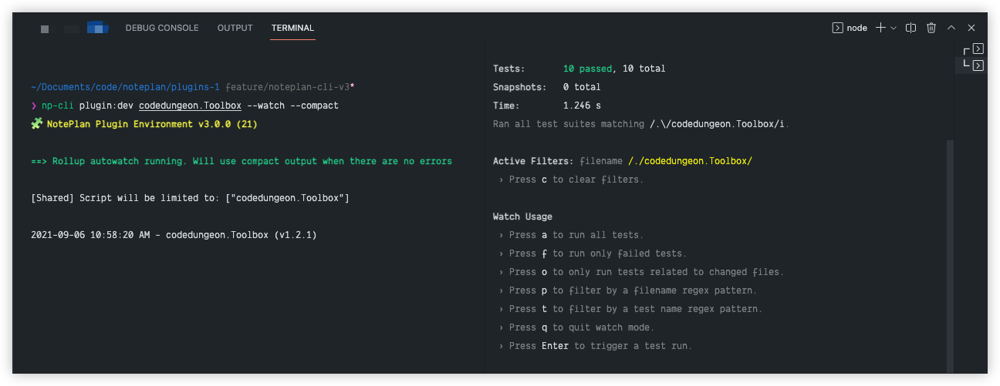

# NotePlan Plugins

## Overview
NotePlan Plugins provides an extensive API for extending default editing and task management and work across all platforms (macOS and iOS).

Each plugin command can be invoked using the [NotePlan Command Bar as pictured below](https://help.noteplan.co/article/65-commandbar-plugins), or by invoking desired plugin command within note by using the `/command` syntax
_NotePlan will auto update the list of possible commands as you type_


💡 _Note: If you have an idea for a plugin, [submit them here](https://feedback.noteplan.co/plugins-scripting) or inquire in the [NotePlan Discord community](https://discord.gg/D4268MT)'s `#plugin-ideas` channel._

**Plugin Documentation and Discord**

💬  If you are a developer and want to contribute and build your plugins, see the [plugin writing documentation](https://help.noteplan.co/article/67-create-command-bar-plugins) and discuss this with other developers on [Discord](https://discord.gg/D4268MT) `#plugin-dev` channel.
📖 If you are a just getting started with JavaScript, you might want to consult this [good modern JavaScript tutorial](https://javascript.info/).

## NotePlan Plugin Development Prerequisites
The following are required for NotePlan Plugin Development (see below for further installation instructions):

- NotePlan 3.0.21 or greater
- node 12.15 or greater
- git 2.3 or greater
- macOS Catalina 10.15.2 or greater (strongly recommend macOS Big Sur 11.5 or greater)
- github `gh` command line tool
- homebrew (if you need to install `node`, or `gh` command line tool)

## Getting Started with NotePlan Plugin Development
The following instructions require [Homebrew](https://brew.sh/), a macOS Package Mananger.

**Step 1: Installing Git**
You can install Git by [downloading](https://git-scm.com/downloads) the installer

**Step 2: Clone NotePlan Plugin Repository**
📖 If you need further instrutions, visit [cloning repositories](https://docs.github.com/en/github/creating-cloning-and-archiving-repositories/cloning-a-repository-from-github/cloning-a-repository)

```bash
git clone https://github.com/NotePlan/plugins.git
```

**Step 3: Install Node (if not installed)**
📖  If you need further instruxtions, visit [node website](https://nodejs.org/en/download/)

```bash
brew install node
```

**Step 4: Install `gh` command line tool**
📖  If you need further instructions, visit the [github cli page](https://github.com/cli/cli)

```bash
brew install gh
```

**Step 5: Initialize Local Development Environment**

Run the following commands from the root of your local GitHub repository for `NotePlan/plugins`.

```bash
npm install && npm run init
```

This will install the necessary npm dependencies and initialize your plugin working directory, including:

 - [eslint](https://eslint.org/) (for checking code conventions, using `.eslintrc` for configuration)
 - [flow](https://flow.org/) (for type checking, using `.flowconfig` for configuration)
 - [babel](https://babeljs.io/) (JavaScript transpiler, using `.babelrc` for configuration)
 - [rollup](https://rollupjs.org/guide/en/) (for bundling multiple source files into a single release, uses `babel` under the hood)

*Note: Each of these configuration files may be overridden if needed by placing a project specific configuration file in you project plugin, however, for consistency with other NotePlan plugins, we encourage to use the defaults wherever possible.*

## Creating your first NotePlan Plugin
Using the NotePlan CLI, perform the following actions:
_Note: You can use either `noteplan-cli` or `np-cli` interchanably (we will be using the short version `np-cli` througout this documentation)_

**Step 1: Create your plugin using NotePlan CLI**
Answer the prompt questions (or supply all the necessary options from command line (see `np-cli plugin:create --help` for details)

`np-cli plugin:create`

**Step 2: Review List of Available Plugins**

`np-cli plugin:info` to see a list of all available commands across all existing NotePlan plugins.

**Step 3: Check if your desired plugin command is available**

You will need to make sure there are no duplicate plugin command names, otherwise NotePlan will activate the first matched command name
`np-cli plugin:info --check <name>` to see if your plugin command is available

**Step 4: Startup Development Process**

`np-cli plugin:dev <your_plugin> --watch` from the root directory to build your plugin in watch mode as you develop so it can be tested in NotePlan.

**Step 5: Start your plugin command develop and test locally**

You can now develop and test your plugin locally,

**Step 6: Create Pull Request (if you wish to make your plugin public)**

At this point, if you would like to make your plugin available to all NotePlan users, you can proceed to [Creating Pull Request](https://docs.github.com/en/github/collaborating-with-pull-requests/proposing-changes-to-your-work-with-pull-requests/creating-a-pull-request) to the NotePlan Plugin Repository

## Common Development Actions
These are the most common commands you will use while developing:

### File Watcher
The default watch command (without any other arguments) command will rebuild _all_ plugins just in case shared files affect another plugin. If you want to focus autowatch on just your plugin, you can pass the plugin folder name to like so:

**np-cli plugin:dev --watch**

`np-cli plugin:dev --watch` from the root of your local `NotePlan/plugins` repository which will bundle all the files in your `/src` directory into single file `scripts.js` and will be copied from your repository directory to your Plugins folder in the running NotePlan data directory for testing.

*Note: The watcher will remain running, _watching_ the NotePlan directory and re-compile whenever changes have been made to your `<your_plugin>/src` JavaScript files.*

**np-cli plugin:dev <your_plugin> --watch**

For example, running `np-cli plugin:dev dwertheimer.TaskAutomations --watch` will perform the same watching operations for the `dwertheimer.TaskAutomations` plugin only.

### Plugin Unit Testing
NotePlan Plugin development uses `jest` test runner.

There are 2 commands available to run testing

```bash
np-cli plugin:test <plugin_name>
```

or

```bash
np-cli plugin:dev <plugin_name> --test
```

And, each command supports `--watch` flag

💡 **Plugin Development Workflow Tip**

A common workflow when using VSCode is to have to integrated terminal panes:

- In first pane, execute `np-cli plugin:dev <plugin_name> --watch`
- In second pane, execute `np-cli plugin:dev <plugin_name> --test --watch`

<h1 align="center">
    
</h1>

## Create Pull Request

Once you are finished editing and testing your plugin, you can [submit a Pull Request](https://docs.github.com/en/github/collaborating-with-pull-requests/proposing-changes-to-your-work-with-pull-requests/creating-a-pull-request) to the NotePlan/plugins repository and it will be reviewed for inclusion. Once it has been approved, it will be available from **NotePlan > Preferences > Plugins** section, enabling it to be installed by other NotePlan users

📖  For more detailed instructions see [Creating Plugin Pull Request](docs/PR_CREATE.md)

## Editor Setup

Use the setup guide for your preferred editor (we prefer Visual Studio Code), and then read the section on Working with Multiple Files.

### Visual Studio Code (recommended)

**Install VSCode Extensions**

1. Install the following extensions for the following tools:
      - `flow` "Flow Language Support" by flowtype
      - `eslint` "ESLint" by Dirk Baeumer
      - `prettier` "Prettier - Code formatter" by Prettier

**Update Settings**

1. Set `prettier` to be the default formatter for js files.
   - You can open the Command Bar using `CMD+SHIFT+P` and then search for `Format Document`.
   - When you do this, you may get asked for a formatter of choice. Choose "Prettier"
   - If it asks you if this should be your default for all JS files, choose Yes.
2. Restart the editor to ensure the plug-ins are working.
   - You should see type errors when you make those
   - You should see lint errors when you format code wrong
   - You should see your code get auto formatted when you save
3. Make sure to open this folder directly in VSCode and not the entire repo as the ESLint plug-in can be annoying about that

### Sublime Text 3 and 4

1. Install the following extensions using Package Control
   - `SublimeLinter` This allows various linters to work
   - `SublimeLinter-eslint`
   - `SublimeLinter-flow`
   - `jsPrettier`
   - `Babel` Syntax definitions for ES6 Javascript and React JSX extensions
2. Configure your packages:
   - Open a `.js` file
   - From the View menu, select Syntax → Open all with current extension as… → Babel → JavaScript (Babel)
   - Open the package settings for `jsPrettier` and add `"auto_format_on_save": true,`

### Linting Code
If you don't have an editor set up to lint as you code, you can run `npm run test` and it will give a list of problems to fix.

### Using Flow
By practice, NotePlan plugins use [flow](https://flow.org/) for static type checking. You can get more information by referencing [NotePlan Flow Guide](https://github.com/NotePlan/plugins/blob/main/Flow_Guide.md)

## Using NotePlan CLI
NotePlan CLI can be used throughout your development process.  For more information about available NotePlan CLI commands, you can use:

```bash
np-cli <command>
or
np-cli <command>
```

The following commands are available:

### plugin:create
Used to create new NotePlan Plugins (see `np-cli plugin:create --help` for available options)

### plugin:dev
Provides development commands (see `np-cli plugin:dev --help` for available options)

### plugin:info
Provides information about the installed NotePlan Plugins (see `np-cli plugin:info --help` for available options)

### plugin:test
Provides testing commands (see `np-cli plugin:test --help` for available options)

### Frequently Used Commands
The common script you will run `npm run autowatch` however, you may need to use any of the following

- `np-cli plugin:dev <plugin> --watch --compact` a less verbose version of `watch` that might be suitable more experienced developers
- `np-cli plugin:info --check <name>` to check if you desired command name is in use by any other NotPlan Plugins
- `npm run typecheck`: typecheck all javascript files with `Flow`. Only files with a `// @flow` comment are checked.
- `npm run fix`: lint and auto-format
- `npm run docs`:  build documentation for javascript files
- `npm run lint`: run ESlint on the entire repo
- `npm run lint-fix`: run ESlint on the entire repo and fix whatever it can automatically fix
- `npm run format`: auto-format all Javascript files using `prettier`


## NotePlan Plugin Support
Should you need support for anything related to NotePlan Plugins, you can reach us at the following:

### Email
If you would prefer email, you can reach us at:

- [NotePlan Info](hello@noteplan.co)

### Discord
Perhaps the fastest method would be at our Discord channel, where you will have access to the widest amount of resources:

- [Discord Plugins Channel](https://discord.com/channels/763107030223290449/784376250771832843)

### Github Issues
This is a great resource to request assistance, either in the form of a bug report, or feature request for a current or future NotePlan Plugin

- [GitHub Issues](https://github.com/NotePlan/plugins/issues/new/choose)

## Contributing

If you would like to contribute to the NotePlan Plugin repository, feel free to submit a [Pull Request] (https://docs.github.com/en/github/collaborating-with-pull-requests/proposing-changes-to-your-work-with-pull-requests/about-pull-requests) for any existing NotePlan Plugin, or any of the support materials.

## Code of Conduct

NotePlan Plugin follows all parameters defined by the [Open Source Guide](https://opensource.guide/code-of-conduct/)

Please refer to our [Contributor Code of Conduct](docs/CODE_OF_CONDUCT.md)

## Security

Please refer to our [Security Policy](docs/SECURITY.md)

## License

Copyright &copy; 2021 NotePlan
