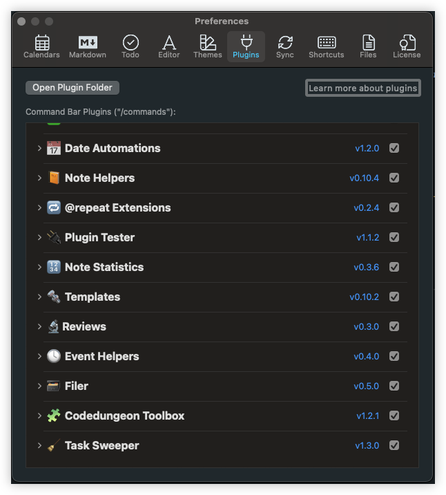

# NotePlan Plugin Configuration

## Overview
NotePlan Plugins use a configuration file `plugin.json` which resides in the root level of your plugin folder (e.g., `codedungeon.Toolbox/plugin.json`) and is used by the NotePlan Plugin Preferences to dsiplay information about your plugin, and the plugin entrypoints and commands.

<h1 align="center">
    
</h1>

## Plugin Configuration File Definition
The following table outlines each of the keys and how they are used

| Key                    | Description                      | Example                                                                        |
| ---------------------- | -------------------------------- | ---------------------------------------------------------------------------- |
| macOS.minVersion       | Minimum macOS Version            | 10.13.0 (this should never be below 10.13.0 [catalina])                      |
| noteplan.minAppVersion | Minimum NotePlan Version         | 3.0.21 (this should never be below 3.0.21)                                   |
| plugin.id              | Plugin Unique ID                 | codedungeon.Toolbox                                                          |
| plugin.name            | Plugin Name                      | 🧩 Codedungeon Toolbox                                                       |
| plugin.description     | Plugin Description               | General Purpose Utility Commands                                             |
| plugin.version         | Plugin Version (follows semver)  | 1.2.1 (see information below about versioning)                               |
| plugin.script          | Plugin Main Entrypoint           | This should always be `script.js`                                            |
| plugin.url             | Plugin "More Info"               | https://github.com/NotePlan/plugins/blob/main/codedungeon.Toolbox/README.md  |
| plugin.commands        | List of Commands                 | _Array of Command Objects (see below for command object definition)_         |

### Plugin Command Object
The `plugin.json` file contains a key labeled `plugin.commands` which is an array of command objects

| Key                  | Description                                    | Example                                                       |
| -------------------- | --------------------------------------------   | ------------------------------------------------------------- |
| name                 | Command Name                                   | convertToHtml                                                 |
| description          | Command Description                            | Convert current note to HTML                                  |
| jsFunction           | You function name (as defined in `index.js`)   | General Purpose Utility Commands                              |
| alias                | An array of alias names which can be used      | ['toHtml','convertNoteToHtml']                                |

## Plugin Versioning
The `plugin.json` file contains a key labeled `plugin.version` which NotePlan uses to determine the current version of a given plugin, and is used to determine if an updated version is available.

❗️ You must follow [semantic versioning](https://semver.org/) when formatting your version numbers.

## NotePlan Plugin Support
Should you need support for anything related to NotePlan Plugins, you can reach us at the following:

### Email
If you would prefer email, you can reach us at:

- [NotePlan Info](hello@noteplan.co)

### Discord
Perhaps the fastest method would be at our Discord channel, where you will have access to the widest amount of resources:

- [Discord Plugins Channel](https://discord.com/channels/763107030223290449/784376250771832843)

### Github Issues
This is a great resource to request assistance, either in the form of a bug report, or feature request for a current or future NotePlan Plugin

- [GitHub Issues](https://github.com/NotePlan/plugins/issues/new/choose)
