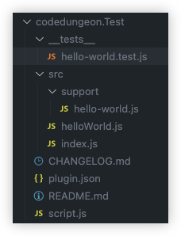
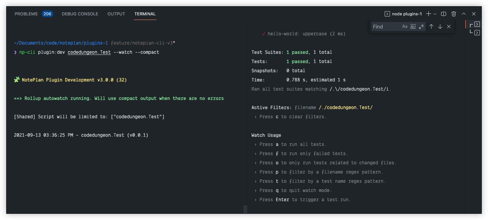

# NotePlan Plugin Testing Framework

## Overview

## Getting Started

**Step 1:** Create new plugin

```bash
np-cli plugin:create <plugin_name>
```

**Step 2:** Execute Test Runner

```bash
np-cli plugin:test <plugin_name> [--watch]

or

np-cli plugin:dev <plugin_name> --test [--watch]
```

### Directory Configuration

<h1 align="center">
    
</h1>

```bash
|____ __tests__
| | |____ hello-world.test.js
|____ src
| |____ support
| | |____ hello-world.js
| |____ helloWorld.js
| |____ index.js
|____ CHANGELOG.md
|____ plugin.json
|____ README.md
|____ script.js

```

## Separation of Concern
When developing NotePlan Plugins, you will have your testable code (also known as unit code) abstracted from the code which interacts with the NotePlan Editor.

In our example above, the code located in `src/support` will be the code that is actually tested when running Jest test runner. You will then find the actual test code (located in `__tests__` directory) will also reference the same `support` module(s)

## Module Test Code
When creating test code, you should have a separate test file for each of your `src/support` modules. In the following example, the `hello-world.test.js` file will contain all the test subjects for `src/support` directory

- Each `*.test.js` file will contain a single test group (contained in the `describe` block)
- Each `*.test.js` file will have one or more test actions (contained in the `test` block, one for each module method)

```js
import helloWorld from '../src/support/hello-world'

describe('codedungeon.Test: hello-world', () => {
  test('hello-world: uppercase', async () => {
    const result = await helloWorld.uppercase('hello world')

    expect(result).toEqual('HELLO WORLD')
  })
})
```

## Commands
There are two different methods for running NotePlan Plugin test runner.

- You can use `np-cli plugin:test <plugin_name>` if you want to work on testing alone
- You can use `np-cli plugin:dev <plugin_name>` if you want to perform testing while developing

#### Using VSCode Integrated Terminal
The following example uses two separate panes using VSCode integrated terimal, running `np-cli <plugin_name> --watch --compact` in left pane, and `np-cli <plugin_name> --test --watch` in right pane

<h1 align="center">
    
</h1>

Basic Execution
Using `npc-cli pugin:test` you can run a single execution of the full test suite for your plugin.

```bash
np-cli plugin:test <plugin_name>

or

np-cli pugin:dev <plugin_name> --test
```

will output

```bash
❯ npc plugin:test codedungeon.Test
 PASS  codedungeon.Test/__tests__/hello-world.test.js
  ✓ codedungeon.Test (2 ms)

Test Suites: 1 passed, 1 total
Tests:       1 passed, 1 total
Snapshots:   0 total
Time:        0.665 s, estimated 1 s
Ran all test suites matching /.\/codedungeon.Test/i.
```

Watch Mode
Using `npc-cli pugin:test --with` you can run your plugin test suite in watch mode, testing will be triggered whenever your test or source code is modified.

As described above, if you have two separate terminal windows (or terminal panes within VSCode) you can have `np-cli plugin:dev <plugin> --watch` in one pane, and your test suite running in the second page.

```bash
np-cli plugin:test <plugin_name> --watch

or

np-cli plugin:dev plugin_name> --test --watch
```

will output

```bash
 PASS  codedungeon.Test/__tests__/hello-world.test.js
  ✓ codedungeon.Test (1 ms)

Test Suites: 1 passed, 1 total
Tests:       1 passed, 1 total
Snapshots:   0 total
Time:        0.435 s, estimated 1 s
Ran all test suites matching /.\/codedungeon.Test/i.

Active Filters: filename /./codedungeon.Test/
 › Press c to clear filters.

Watch Usage
 › Press a to run all tests.
 › Press f to run only failed tests.
 › Press o to only run tests related to changed files.
 › Press p to filter by a filename regex pattern.
 › Press t to filter by a test name regex pattern.
 › Press q to quit watch mode.
 › Press Enter to trigger a test run.
```

## References

[Jest Test Runner](https://jestjs.io/)

## NotePlan Plugin Support
Should you need support for anything related to NotePlan Plugins, you can reach us at the following:

### Email
If you would prefer email, you can reach us at:

- [NotePlan Info](hello@noteplan.co)

### Discord
Perhaps the fastest method would be at our Discord channel, where you will have access to the widest amount of resources:

- [Discord Plugins Channel](https://discord.com/channels/763107030223290449/784376250771832843)

### Github Issues
This is a great resource to request assistance, either in the form of a bug report, or feature request for a current or future NotePlan Plugin

- [GitHub Issues](https://github.com/NotePlan/plugins/issues/new/choose)

## Contributing

If you would like to contribute to the NotePlan Plugin repository, feel free to submit a [Pull Request] (https://docs.github.com/en/github/collaborating-with-pull-requests/proposing-changes-to-your-work-with-pull-requests/about-pull-requests) for any existing NotePlan Plugin, or any of the support materials.

## License

Copyright &copy; 2021 NotePlan
