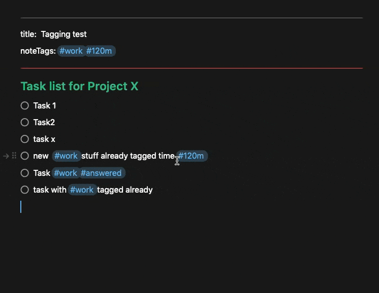

# Task Sorting & Tools Plugin

>**NOTE**: The functions in this plugin were previously part of the "Task Automations" plugin. @eduardme suggested we break out the sorting functions and move them here.

## Latest Updates

See [CHANGELOG](https://github.com/NotePlan/plugins/blob/main/dwertheimer.TaskSorting/CHANGELOG.md) for latest updates/changes to this plugin.

## About This Plugin

Commands for sorting tasks in a note

## Major Sorting functions

- Sorting tasks (by various task fields or simply bringing tasks to the top of the note)

## Other Task Tools

- Marking a task (or multiple) done and creating a follow-up/related task with a link to the done one
- Marking all tasks complete (or incomplete)
- Copying tags/mentions from previous lines when doing multiple task entry

## Sorting Tasks

### /ts - Tasks Sort (Interactively choose sort order and headings style)

This plugin will sort your tasks in the open note in the Editor interactively so you can choose how you want it to work and output

When you run /ts, it will sort the tasks into task types (open|scheduled|completed|cancelled), and it will ask you how you want to sort within those categories and whether you want the output to have the category type headings or not, e.g.:

```text
#### Open Tasks
  - [ ] Open Task
#### Scheduled Tasks
  - [>] Forwarded/Scheduled Task >2030-01-01
#### Completed Tasks
  - [x] Completed Task
#### Cancelled Tasks
  - [-] Cancelled task
```

### /tst - Tasks Sort by Tag

Sort the Tasks in the open note by (the first) #Tag and display with subheadings for each unique tag
[If you want more granular control over whether there are or aren't headings, use /ts]

### /tsc - Tasks Sort by Due Date

Sort the Tasks by Due Date and then Priority
[If you want more granular control over whether there are or aren't headings, use /ts]

### /tstm - Tasks Sort by Tag/Mention

Sort the Tasks in the open note by (the first) #tag (and then by @Mention)
[If you want more granular control over whether there are or aren't headings, use /ts]

### /tsm - Tasks Sort by Mention/Person

Sort the Tasks in the open note by (the first) @Mention and display with subheadings for each unique @mention
[If you want more granular control over whether there are or aren't headings, use /ts]

### /tsd - Task Sort By Default

Sort tasks in note by user setting primary/secondary sort fields
Set the primary and secondary sort order for this default search in plugin preferences

### /tt - Tasks to Top

This command brings all the tasks inside of the currently open note to the top of the note. You can choose whether you want headings (e.g. "Open Tasks", "Sheduled Tasks" etc.) or whether you want just the sorted tasks brought to the top. Note: brings only task lines (not indented underneath)

## Task Sorting Notes

- At this time, the plugin will ignore headings that are attached to the tasks (e.g. tasks indented under root-level #headings). I need to understand/think more about this use case and how to deal with it in sorting.
- Lines are sorted line-by-line. Currently, no provision is made for indented text/content underneath tasks or tasks that are indented themselves under other content. If this is your use case and you can describe how you think it should work very clearly, please contact @dwertheimer on Discord and help me understand this usage.

## Marking All Tasks

### /mat - Mark All Tasks (as completed or open)

This plugin will give you a choice of whether to mark all open tasks as completed or all completed tasks as open.

## Copying Tags/Mentions

### /cta - Copy **all** #tags and @mentions from the previous line

### /cth - Copy **all** #tags and @mentions from the heading the task sits under

### /ctm - Duplicate line for each @mention but change the order so each mention shows up first on its own line (and therefore will be sorted under that @mention heading when using /ts - task sorter)

### /ctt - Duplicate line for each @tag but change the order so each tag shows up first on its own line (and therefore will be sorted under that @mention heading when using /ts - task sorter)

### /cnt copy **all** noteTags from "noteTags" in frontMatter to all task in the current note



## Future Features / Todo List

- Sort tasks via template call
- Sort by task due date
- Bring open tasks to top
