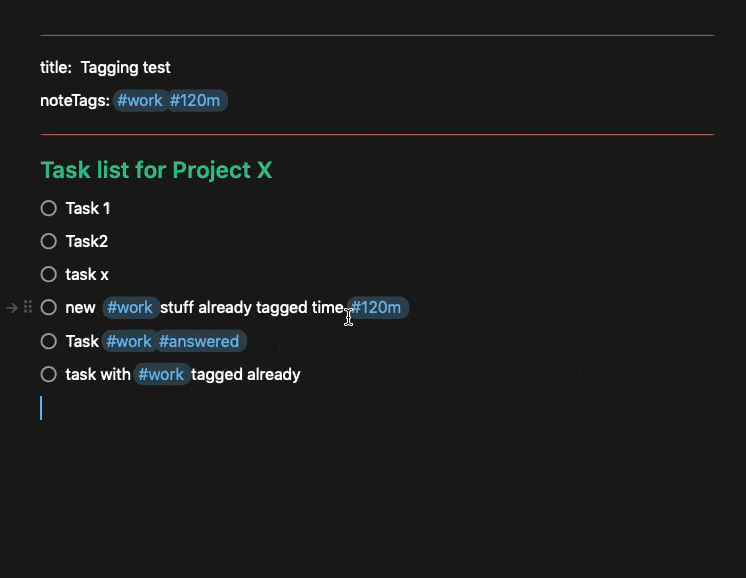

# Task Sorting & Tools Plugin

>**NOTE**: The functions in this plugin were previously part of the "Task Automations" plugin. @eduardme suggested we break out the sorting functions and move them here.

## Latest Updates

See [CHANGELOG](https://github.com/NotePlan/plugins/blob/main/dwertheimer.TaskSorting/CHANGELOG.md) for latest updates/changes to this plugin.

## About This Plugin

Commands for sorting tasks in a note

## Major Sorting functions

- Sorting tasks (by various task fields or simply bringing tasks to the top of the note)

## Other Task Tools

- Marking a task (or multiple) done and creating a follow-up/related task with a link to the done one
- Marking all tasks complete (or incomplete)
- Copying tags/mentions from previous lines when doing multiple task entry

## Understanding Task Type Grouping (Interleaving)

When sorting tasks, the plugin can handle task types in two ways:

### Combined Mode (Recommended - Default)
Groups related task types together and sorts them as one unit:
- **Open Tasks**: `* open` tasks + `+ checklist` items (sorted together by priority)
- **Scheduled Tasks**: `* [>] scheduled` + `+ [>] scheduled checklist` items
- **Completed Tasks**: `* [x] done` + `+ [x] completed checklist` items  
- **Cancelled Tasks**: `* [-] cancelled` + `+ [-] cancelled checklist` items

**Result**: 4 logical groups that make more sense for daily use

**Example output:**
```text
### Open Tasks:
* !!! high priority open task
+ !! medium priority checklist item
* ! low priority open task
+ another checklist item

### Completed Tasks:
* [x] completed task @done(2025-11-06)
+ [x] completed checklist @done(2025-11-06)
```

### Separated Mode (Traditional)
Keeps all 8 task types completely separate:
1. Open tasks (`*`)
2. Checklist items (`+`)
3. Scheduled tasks (`* [>]`)
4. Scheduled checklists (`+ [>]`)
5. Done tasks (`* [x]`)
6. Done checklists (`+ [x]`)
7. Cancelled tasks (`* [-]`)
8. Cancelled checklists (`+ [-]`)

**Result**: 8 separate sections (can be verbose for notes with mixed task types)

### How to Control Task Grouping
- **Interactive (`/ts`)**: Will prompt you to choose each time
- **Quick Commands (`/tsd`, `/tsm`, `/tst`, `/tsc`)**: Set in Plugin Preferences → "Combine Related Task Types?"
- **Via x-callback URL** (command **Sort tasks on the page** only): use `arg4` — `true` to combine related task types, `false` for eight separate groups (see [X-callback URL examples](#x-callback-url-examples))
- **Default**: Combined mode (interleaving enabled)

## Customization Options

### Localize or Rename Task Type Headings
You can customize the text used for each task type heading in Plugin Preferences:

**Headings used when COMBINING task types** (recommended mode):
- **Open Tasks** → includes both `*` tasks and `+` checklist items (e.g., "Tareas Abiertas" in Spanish)
- **Scheduled Tasks** → includes both `* [>]` and `+ [>]` items (e.g., "Tâches Planifiées" in French)
- **Completed Tasks** → includes both `* [x]` and `+ [x]` items (e.g., "已完成" in Chinese)
- **Cancelled Tasks** → includes both `* [-]` and `+ [-]` items

**Additional headings used ONLY in traditional mode** (8 separate sections):
- **Checklist Items** → for `+` items only (e.g., "Lista de Verificación")
- **Scheduled Checklist Items** → for `+ [>]` items only
- **Completed Checklist Items** → for `+ [x]` items only
- **Cancelled Checklist Items** → for `+ [-]` items only

**To customize:**
1. Open Plugin Preferences for Task Sorting
2. Scroll to "Task Type Heading Customization" section
3. Change any heading text as desired
4. Leave blank to use default English headings

### Control Empty Category Headings
Set "Show Empty Task Category Headings?" in Plugin Preferences:
- **Unchecked (recommended)**: Only show headings for categories that have tasks
- **Checked**: Show all category headings even when empty

## Sorting Tasks

### /ts - Tasks Sort (Interactively choose sort order and headings style)

This plugin will sort your tasks in the open note in the Editor interactively so you can choose how you want it to work and output

When you run /ts, it will sort the tasks into task types (open|scheduled|completed|cancelled), and it will ask you how you want to sort within those categories and whether you want the output to have the category type headings or not, e.g.:

#### X-callback URL parameters (**Sort tasks on the page**)

NotePlan passes these in order as `arg0`, `arg1`, … in the URL:

- **`arg0`**: `true` = show the usual questions in NotePlan; `false` = skip prompts and use the other args you supply
- **`arg1`**: Sort order, comma-separated, e.g. `-priority,content`
- **`arg2`**: `true` = add type headings (e.g. “Open Tasks”); `false` = do not add those headings
- **`arg3`**: `true` = add subheadings when sorting by tag or mention; `false` = no subheadings
- **`arg4`**: `true` = combine related types (open tasks and checklists together, etc.); `false` = eight separate groups
- **`arg5`**: `true` = sort within each heading on its own; `false` = treat the whole note as one block (tasks can move to the top of the note)

X-callback links only use **`arg0`–`arg5`**. There is no URL form for passing a note object; see **Templates and plugins** below if you need that.

#### Examples:
```text
# Sort by priority without headings, treating entire note as one unit (moves all open tasks to top)
noteplan://x-callback-url/runPlugin?pluginID=dwertheimer.TaskSorting&command=Sort%20tasks%20on%20the%20page&arg0=false&arg1=-priority,content&arg2=false&arg3=false&arg4=true&arg5=false

# Sort within each heading separately (default behavior)
noteplan://x-callback-url/runPlugin?pluginID=dwertheimer.TaskSorting&command=Sort%20tasks%20on%20the%20page&arg0=false&arg1=-priority,content&arg2=false&arg3=false&arg4=true&arg5=true
```

**New Feature: Task Type Interleaving (Default Behavior)**
- **By default**, tasks are interleaved: compatible task types are combined and sorted together by priority
- Within each priority level, open tasks appear before checklists
- This allows tasks to be sorted by priority first, then by type (open before checklist)

**Sorting behavior (same ideas as `arg5` and `arg4` above):**
- **`arg5` true** (typical): Sort within each heading. Tasks stay under the heading they were under, but order changes inside that section.
- **`arg5` false**: One sort for the whole note; open tasks can move to the very top of the note.
- **Traditional eight-way grouping**: set **`arg4` false** (separate open vs checklist sections, etc.).

```text
#### Open Tasks
  - [ ] Open Task
#### Scheduled Tasks
  - [>] Forwarded/Scheduled Task >2030-01-01
#### Completed Tasks
  - [x] Completed Task
#### Cancelled Tasks
  - [-] Cancelled task
```

### /tst - Tasks Sort by Tag

Sort the Tasks in the open note by (the first) #Tag and display with subheadings for each unique tag
[If you want more granular control over whether there are or aren't headings, use /ts]

### /tsc - Tasks Sort by Due Date

Sort the Tasks by Due Date and then Priority
[If you want more granular control over whether there are or aren't headings, use /ts]

### /tstm - Tasks Sort by Tag/Mention

Sort the Tasks in the open note by (the first) #tag (and then by @Mention)
[If you want more granular control over whether there are or aren't headings, use /ts]

### /tsm - Tasks Sort by Mention/Person

Sort the Tasks in the open note by (the first) @Mention and display with subheadings for each unique @mention
[If you want more granular control over whether there are or aren't headings, use /ts]

### /tsd - Task Sort By Default

Sort tasks in note by user setting primary/secondary sort fields
Set the primary and secondary sort order for this default search in plugin preferences

### /tt - Tasks to Top

This command brings all the tasks inside of the currently open note to the top of the note. You can choose whether you want headings (e.g. "Open Tasks", "Sheduled Tasks" etc.) or whether you want just the sorted tasks brought to the top. Note: brings only task lines (not indented underneath)

### /tsh - Tasks Sort under Heading (choose)

This command will sort the tasks under a heading that you choose.
You can pass the heading as a parameter, or you can choose it interactively.
You can also pass the sort order as a parameter, e.g. (["-priority", "content"]), or you can choose it interactively.
For example, this command will sort all the tasks under the heading "Open Tasks" by priority and then alphabetically by content.

```
noteplan://x-callback-url/runPlugin?pluginID=dwertheimer.TaskSorting&command=Sort%20tasks%20under%20heading%20%28choose%29&arg0=Open%20Tasks&arg1=%5B%22-priority%22%2C%22content%22%5D
```

### X-callback URL examples

**Important:** **Sort tasks on the page** and **Sort tasks under heading (choose)** use different `arg0`, `arg1`, … meanings. Use the parameter list that matches the command in your URL.

#### Sort tasks on the page

Use the full parameter list under **`/ts`** above (`arg0` through `arg5`).

**Combined task types (default style):**
```
noteplan://x-callback-url/runPlugin?pluginID=dwertheimer.TaskSorting&command=Sort%20tasks%20on%20the%20page&arg0=false&arg1=-priority%2Ccontent&arg2=false&arg3=false&arg4=true
```

**Eight separate task-type groups instead:**
```
noteplan://x-callback-url/runPlugin?pluginID=dwertheimer.TaskSorting&command=Sort%20tasks%20on%20the%20page&arg0=false&arg1=-priority%2Ccontent&arg2=false&arg3=false&arg4=false
```

#### Sort tasks under heading (choose)

- **`arg0`**: The heading text to sort under (URL-encoded), e.g. `Open%20Tasks`
- **`arg1`**: How to sort — either a comma-separated list or a JSON array string like `["-priority","content"]`
- **`arg2`**: For normal x-callback links, use `null` or leave it off if your tool allows. (Some automations need this to point at a specific note — see the note below.)
- **`arg3`**: `true` = combine related open/checklist types; `false` = eight separate groups

**Combined task types under that heading:**
```
noteplan://x-callback-url/runPlugin?pluginID=dwertheimer.TaskSorting&command=Sort%20tasks%20under%20heading%20%28choose%29&arg0=Open%20Tasks&arg1=%5B%22-priority%22%2C%22content%22%5D&arg2=null&arg3=true
```

**Eight separate groups under that heading:**
```
noteplan://x-callback-url/runPlugin?pluginID=dwertheimer.TaskSorting&command=Sort%20tasks%20under%20heading%20%28choose%29&arg0=Open%20Tasks&arg1=%5B%22-priority%22%2C%22content%22%5D&arg2=null&arg3=false
```

> **Note for templates and other plugins:** If you run **Sort tasks under heading** from automation while the editor is open, you may need to pass the open note (or editor) as the **third** value so sorting applies to the same note you are editing. Otherwise a pending editor save can undo the sort.

### Templates and plugins (passing `Editor` or a `Note`)

From Templating, Shortcuts, or another plugin you can pass **`Editor`** or a **`Note`** so the command sorts **that** object instead of relying only on whatever `Editor.note` happens to be at that moment (helps avoid a stale save overwriting your sort).

- **Sort tasks on the page** — Add **`Editor` or `Note` as the seventh argument** after the six sort options (prompts, sort fields, headings, subheadings, combine types, sort-in-headings).
- **Tasks Sort by Default** (`/tsd`), **by due date** (`/tsc`), **by @mention** (`/tsm`), **by #tag** (`/tst`), **tag + mention** (`/tstm`), **Tasks to Top** (`/tt`) — **One optional argument:** pass `Editor` or the `Note` to sort. If you omit it, behavior is the same as before (uses the open note in the editor).
- **Sort tasks under heading** — Unchanged: optional **third** argument is still the note or `Editor` (see the x-callback section above).

**Mark tasks** (`/mat`) and the **copy-tag** tools still only use the open editor; they do not take a note override yet.

## Task Sorting Notes

- At this time, the plugin will ignore headings that are attached to the tasks (e.g. tasks indented under root-level #headings). I need to understand/think more about this use case and how to deal with it in sorting.
- Lines are sorted line-by-line. Currently, no provision is made for indented text/content underneath tasks or tasks that are indented themselves under other content. If this is your use case and you can describe how you think it should work very clearly, please contact @dwertheimer on Discord and help me understand this usage.

## Marking All Tasks

### /mat - Mark All Tasks (as completed or open)

This plugin will give you a choice of whether to mark all open tasks as completed or all completed tasks as open.

## Copying Tags/Mentions

### /cta - Copy **all** #tags and @mentions from the previous line

### /cth - Copy **all** #tags and @mentions from the heading the task sits under

### /ctm - Duplicate line for each @mention but change the order so each mention shows up first on its own line (and therefore will be sorted under that @mention heading when using /ts - task sorter)

### /ctt - Duplicate line for each @tag but change the order so each tag shows up first on its own line (and therefore will be sorted under that @mention heading when using /ts - task sorter)

### /cnt copy **all** noteTags from "noteTags" in frontMatter to all task in the current note



## Future Features / Todo List

- Sort tasks via template call
- Sort by task due date
- Bring open tasks to top
