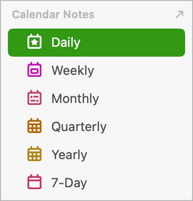
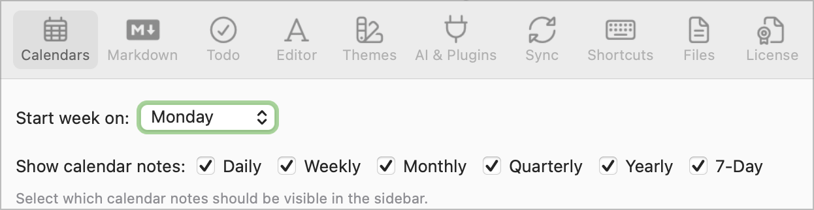

# 💭 Journalling plugin

This plugin helps you write daily, weekly, monthly, quarterly and/or yearly Journals, by speeding up applying your pre-set Templates to your calendar notes, and/or prompting you for review questions that you set in advance.

The commands are:
- **/dayStart**: Apply your 'Daily Note' Template to the currently open daily note (or today's note if you're not editing a daily note)
- **/todayStart**: Apply your 'Daily Note' Template to today's calendar note
- **/weekStart**: Apply your 'Weekly Note' Template to the currently open weekly note (or the current weekly note if you're not editing a weekly note)
- **/monthStart**: Apply your 'Monthly Note' Template to the currently open monthly note (or the current monthly note if you're not editing a monthly note)
- **/dayReview**: Ask journal questions for an end-of-day review, and write answers in the current daily note. See below for details and examples.
- **/weekReview**, **/monthReview**, **/quarterReview** and **/yearReview** all work similarly, asking the appropriately-configured journal questions, and write answers in the currently-open week/month/quarter/year note for that period, or if one of those isn't open, then offers to open the current note for that period.

### Configuration
To use weekly/monthly/quarterly/yearly commands, you first need to have them turned on in **NotePlan Settings** > Calendar pane:



Then you will need to **configure the Plugin**: click the gear button on the 'Journalling' line in the Plugin Preferences panel, and fill in the settings according to which of the following commands you want to use.  (On iOS or iPadOS, you need to use the separate **/Journalling: update plugin settings** command instead.)

## Quickly applying Templates at the start of each Day/Week
The NotePlan website has good [articles on getting started with Templates](https://help.noteplan.co/article/136-templates), and a helpful [Template Gallery](https://noteplan.co/templates), to build from.

For more details of the tag commands you can use in a Template, including a list of events, a quote-of-the-day or summary weather forecast, see the [full Templating Documentation](https://noteplan.co/templates/docs).

??? start-of-day ... after previously setting up a template

### /dayStart & /todayStart commands
These commands make it quicker to apply a Template at the start or end of a day or week. The names of the Templates to use are set in the Plugin Settings pane, referring to Template names stored in the special NotePlan `Templates` folder.  (This command has become less necessary since NotePlan v3., which introduced [auto-inserting of templates into new calendar notes](https://help.noteplan.co/article/229-auto-insert-templates).)

- **/todayStart**: applies your 'Daily Note' Template only to _today's_ calendar note, no matter what note you're editing.
- **/dayStart** appends your 'Daily Note' Template to the _currently open daily note_ (or today's note if you're not editing a daily note). Therefore, be careful using it on another calendar note than today using template tag commands like `<%- date... / formattedDate... %>` or `<%- weather() %>` -> because this renders the TODAY content!

### /weekStart command
This acts very similarly to the /dayStart command above.

### /dayEnd, /todayEnd, /weekEnd commands
These act in the same way as above, but can be tailored to adding items at the end of a day, perhaps like a Habit or Stats summary from the separate [**Habits & Summaries plugin**]().

This is also a quick way of regularly running one or more commands from the separate [**Tidy Up plugin**]().

## Helping with periodic Reviews
There's no right or wrong way to do reviews, and you'll no doubt change what you find helpful over time. But the key is to be taking some time to answer questions to help you pause and review what has and hasn't gone well over the last day/week/month/quarter. Some use it as a way of capturing their main **emotions**; others to track **goals**; others to write a simple **gratitude** journal.

### Using Templates you fill in
One way to do this is to configure an end-of-day/week Template -- for example this [Mental Health Journal](https://noteplan.co/templates/mental-health-journal-template) -- which you then apply to your current note using the /dayEnd or /weekEnd command, and then fill in your responses.

### Interactively
Alternatively, the **/dayReview**, **/weekReview**, **/monthReview**, **/quarterReview**, and/or **/yearReview** commands present you with a set of questions interactively. You first need to configure the sets of questions to ask in the plugin settings. In each case a default set of questions is provided to get you started.  Each setting is explained:

#### Journal Section Heading
The name of an existing markdown heading after which the review answers are added. If it doesn't exist, it is added at the end of the note.

#### Daily / Weekly / Monthly / Quarterly / Year Journal Questions
This string includes both the questions and how to lay out the answers in the note. There are several possible question types:
- `<int>` asks for an integer number
- `<number>` asks for a number (which may include fractional part)
- `<string>` asks for a string
- You can also add bulletpoints with an identifier e.g. `-(thoughts) <string>` where the identifier doesn't get rendered. (The identifier is there to work out which question the user currently is on.)
- `<mood>`select one of the configured moods
- `<subheading>` includes the given string as `### Subheading`.

Other notes:
- You can includes line breaks ('new lines') with `\n` characters.
- If a particular question isn't answered (i.e. no input entered), then that question isn't included in the output.
- If a particular question has already been answered in the note, it won't be asked again, or over-ridden.

#### Moods
A comma-separated list of possible moods to select from.  They don't have to have emoji, but I rather like them.

### Example for /dayReview
The following `reviewQuestions` string:
```
@work(<int>)\n@fruitveg(<int>)\nMood: <mood>\nSignificant Thoughts <subheading>\n- (Thought 1/3) <string>\n- (Thought 2/3) <string>\n
- (Thought 3/3) <string>\nGratitude <subheading>\n- (Gratitude 1/3) <string>\n- (Gratitude 2/3) <string>\n- (Gratitude 3/3) <string>\n
```
after answering the questions, would produce something like this in today's note:

```markdown
## Journal
@work(7)
@fruitveg(4)
Mood: 😇 Blessed

### Significant Thoughts
- Entered thought 1
- Another thought

### Gratitude
- Thankful item 1
- Thankful item 2
- Isn't there lots to be thankful for!
```
Tip: you can also avoid answering like in Thought 3/3 - then there is also no bullet point in the final note.

## Support
If you find an issue with this plugin, or would like to suggest new features for it, please raise a [Bug or Feature 'Issue'](https://github.com/NotePlan/plugins/issues).

If you would like to support my late-night work extending NotePlan through writing these plugins, you can through:

[](https://www.buymeacoffee.com/revjgc)

Thanks!

## History
Please see the [CHANGELOG](CHANGELOG.md).
