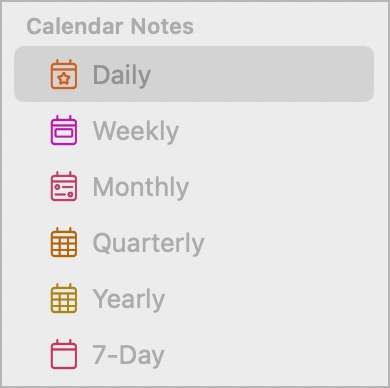

# 💭 Journalling plugin
This plugin helps you write daily, weekly, monthly, quarterly and/or yearly **journals**, by prompting you for review questions that you set in advance. It also speeds up applying a pre-set daily template each day.

This takes advantage of each of these time periods that can be turned on in Preferences > Calendars, and then show in the sidebar:



The commands are:
- **/dayStart**: Apply your 'Daily Note' Template to the currently open daily note (or today's note if you're not editing a daily note)
- **/todayStart**: Apply your 'Daily Note' Template to today's calendar note
- **/weekStart**: Apply your 'Weekly Note' Template to the currently open weekly note (or the current weekly note if you're not editing a weekly note)
- **/monthStart**: Apply your 'Monthly Note' Template to the currently open monthly note (or the current monthly note if you're not editing a monthly note)
- **/dayReview**: Ask journal questions for an end-of-day review, and write answers in the current daily note. See below for details and examples.
- **/weekReview**, **/monthReview**, **/quarterReview** and **/yearReview** all work similarly, asking the appropriately-configured journal questions, and write answers in the currently-open week/month/quarter/year note for that period, or if one of those isn't open, then offers to open the current note for that period.
- **/Journalling: update plugin settings**: This command allows the plugin's settings to be changed on iOS/iPadOS.

Note: the monthly/quarterly/yearly commands only work fully from NotePlan release 3.7.2.

## Configuration
Click the gear button on the 'Journalling' line in the Plugin Preferences panel, and fill in the settings accordingly. Defaults are given for each one, to give you some ideas.

### /dayStart and /todayStart
These commands require the separate [Templating plugin](https://github.com/NotePlan/plugins/tree/main/np.Templating/) to be installed.

They then use your pre-set Template name stored in the special NotePlan `Templates` folder. By default this is set to `Daily Note Template`.

The NotePlan website has good [articles on getting started with Templates](https://help.noteplan.co/article/136-templates). For more details of the tag commands you can use in a Template, including a list of events, a quote-of-the-day or summary weather forecast, see the [Templating Getting Started](https://nptemplating-docs.netlify.app/docs/templating-basics/getting-started).

NB: Be careful with `/dayStart` in another calendar note than today using template tag commands like `<%- date... / formattedDate... %>` or `<%- weather() %>` -> because this renders the TODAY content!

### /dayReview, /weekReview, /monthReview, /quarterReview, and /yearReview
You first need to configure the sets of questions to ask, though a default set is provided to get you started.

Each setting is explained:

#### Journal Section Heading
The name of an existing markdown heading after which the review answers are added. If it doesn't exist, it is added at the end of the note.

#### Daily Journal Questions
This string includes both the questions and how to lay out the answers in the daily note. There are several possible question types:
- `<int>` asks for a integer number
- `<number>` asks for a (floating point) number
- `<string>` asks for a string
- You can also add bulletpoints with an identifier e.g. `-(thoughts) <string>` where the identifier doesn't get rendered. (The purpose of the identifier is to see on which question the user currently is, otherwise one would only have a lot of `-`.)
- `<mood>`select one of the configured moods
- `<subheading>` asks for a subheading (which gets rendered as `### Subheading`) not a question as such.

Other notes:
- You can includes line breaks ('new lines') with `\n` characters.
- If a particular question isn't answered (i.e. no input entered), then that question isn't included in the output.
- If a particular question has already been answered in the note, it won't be asked again, or over-ridden.

#### Weekly / Monthly / Quarterly / Year Journal Questions
These strings include both the questions and how to lay out the answers in the weekly note.  The details are as for Daily Journal Questions, above.

#### Moods
A comma-separated list of possible moods to select from.  They don't have to have emoji, but I rather like them.

## /dayReview Example
The following `reviewQuestions` string:
```
@work(<int>)\n@fruitveg(<int>)\nMood: <mood>\nThoughts <subheading>\n- (Thought 1/3) <string>\n- (Thought 2/3) <string>\n
- (Thought 3/3) <string>\nGratitude <subheading>\n- (Gratitude 1/3) <string>\n- (Gratitude 2/3) <string>\n- (Gratitude 3/3) <string>\n
```
would produce, after answering the questions, like this in today's note:

```markdown
## Journal
@work(7)
@fruitveg(4)
Mood: 😇 Blessed

### Thoughts
- Entered thought 1
- Another thought

### Gratitude
- Thankful item 1
- Thankful item 2
- Isn't there lots to be thankful for!
```
Tip: you can also avoid answering like in Thought 3/3 - then there is also no bullet point in the final note.

## Support
If you find an issue with this plugin, or would like to suggest new features for it, please raise a [Bug or Feature 'Issue'](https://github.com/NotePlan/plugins/issues).

If you would like to support my late-night work extending NotePlan through writing these plugins, you can through:

[](https://www.buymeacoffee.com/revjgc)

Thanks!

## History
Please see the [CHANGELOG](CHANGELOG.md).
