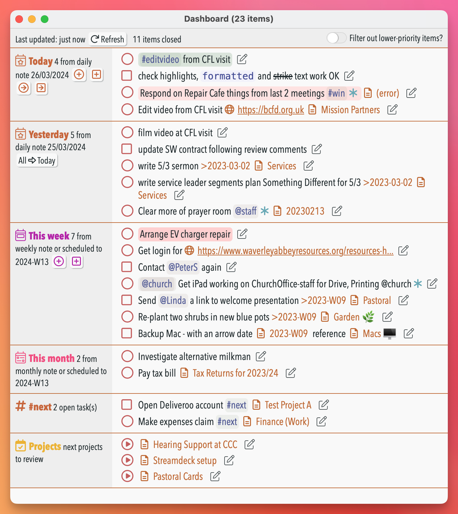
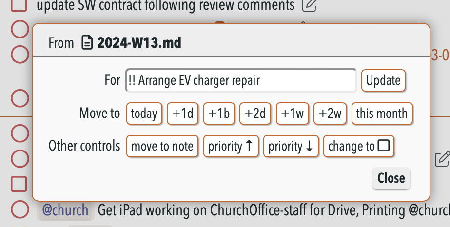
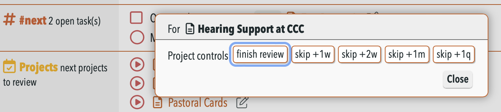

# 🎛 Dashboard plugin


This plugin provides a **dashboard window** that in one place shows a compact list of:
- open tasks and checklists from today's note
- scheduled open tasks and checklists from other notes to today
- similarly for yesterday's note, and the weekly, monthly and quarterly notes too (if used)
- all overdue tasks
- all open tasks and checklists that contain a particular @tag or #mention of your choosing. This can gives "deferred date" functionality (see below).
- next few notes to review (if you use the "Projects and Reviews" plugin)

To open this run the **/show dashboard** command (aliases 'db' or 'sdb'). It automatically picks up the Theme from NotePlan and mimics it as far as possible (you're welcome).

There are many different [Settings](#settings) to tailor what is shown according to your preferences.

[](https://www.buymeacoffee.com/revjgc)

## Interacting with items in the Dashboard
All tasks and checklists shown in the Dashboard view can be marked as **complete** by clicking in its usual open circle or square:


The item is then completed in the NotePlan note, and removed from view in this list. You can also **cancel** the item by pressing **⌘ (command)** button when clicking on the open circle or square.

You can make many more changes by clicking on the **pencil** icon after each task. A dialog box pops up with many **action buttons**:



- `today` moves to today's note
- `+1d` moves to the next day's note
- `+1b` moves to the next business day's note (which ignores weekends)
- `+1w` moves to next week's note etc.
- `this week` moves to this week's note etc.
- `move to note` opens the command bar asking which note + heading you want to move this item to
- `priority ↑` increases the priority of the current item (i.e. the start of the underlying item goes from none -> `!` -> `!!` -> `!!!` -> `>>`)
- `priority ↓` decreasas the priority of the current item (i.e. the start of the underlying item goes from none -> `!` -> `!!` -> `!!!` -> `>>`)
- `change to ◯/◻︎` toggles an item between being a task and a checklist
- `unschedule` unschedules a task (i.e. removes any `>date`). Note: only relevant on tasks in Project notes.
- `complete then` completes an overdue task, but marks it `@done(...)` on the original date, not today.

You also have the ability to update the text of the item itself.

On the daily/weekly/monthly sections there are 'add task' and 'add checklist' icons, to allow you to add a task directly at the start of that current note. A second pair adds tasks and checklists but to the *next day/week/month*.

Other notes:
- _This requires the separate 'Shared Resources' plugin to be installed_.
- The Dashboard doesn't use NotePlan's normal editor, but a more flexible HTML-based display. Behind the scenes it cleverly translates your current NotePlan theme into its CSS equivalent. (You're welcome.)
- The plugin cannot work effectively on an **iPhone**-sized device, so it is disabled there.  On an **iPad** windows can't float in the same way as they can on macOS, so it's less useful, but it still works.
- The display is responsive: switching from narrow to normal to multi-column layout depending how wide you set it.
- The items are shown sorted first by greatest priority, and then by increasing time (where there is a time block).
- It de-dupes items that would appear twice in a list where the lines are sync'd together.
- There's a UI toggle "Filter out lower-priority items?". If this is on, then items without any extra priority in calendar files will be hidden until there are no remaining priority items that haven't been completed. Priority items are currently indicated by having `>>`, `!!!``, `!!`` or `!`` at the beginning of the item.
- you can use the '#Tags' section to create a "deferred date" function. To do this tag something as (for example) `#next` and then date it with a day in the future.On that future date, it will show up in this `#next` section. (Thanks to @george65 for spottig this use case.)

### Project section
If you use the [Projects & Reviews Plugin](https://github.com/NotePlan/plugins/tree/main/jgclark.Reviews), the Dashboard will show up to the first 6 projects ready for review. It reads this from the hidden list thats updated every time its **/project lists** command is run, or you **/finish project review** on a project note.  



The 'action buttons' available in this section are:
- the various `skip ...` buttons do the equivalent of the "/skip project review" command, that override (or skips) the normal review interval by the duration given. This adds a `@nextReview(...)` to the note's metadata. See [Project + Reviews documentation](../jgclark.Reviews/README.md) for more details.
- `finish review` does the equivalent of the "/finish review" command, marking that project as @reviewed today.

### Keyboard control
New in v1.0 is the ability to change what is shown by typing one of the following keys:
- <kbd>r</kbd>: refresh display
- <kbd>w</kbd>: toggle showing Week section
- <kbd>m</kbd>: toggle showing Month section
- <kbd>o</kbd>: toggle showing Overdue section
- <kbd>a</kbd>: turn on all available sections

Note: these only work when the Dashboard window has focus (you have clicked in it).

These shortcuts are also available as x-callback calls. To use these append the command name below to `noteplan://x-callback-url/runPlugin?pluginID=jgclark.Dashboard&command=`

| command | x-callback command |
| ----- | ---------------- |
| refresh | refresh |
| toggle week | toggleWeekSection |
| toggle month | toggleMonthSection |
| toggle overdue | toggleOverdueSection |
| turn on all sections | turnOnAllSections |

### Updating the Dashboard automatically
The dashboard window can automatically update when a change is made in the relevant calendar note(s) if you have [added a trigger to the frontmatter](https://help.noteplan.co/article/173-plugin-note-triggers) of the relevant daily/weekly/monthly/quarterly note(s). To get this added automatically to the daily note, turn on setting 'Add dashboard auto-update trigger when dashboard opened?' (details below).

Or you can use the **/add trigger to note** command from my [Note Helpers plugin](https://github.com/NotePlan/plugins/tree/main/jgclark.NoteHelpers/) which adds this:
```yaml
---
triggers: onEditorWillSave => jgclark.Dashboard.decideWhetherToUpdateDashboard
---
```

Note: If you use the 'Overdue Tasks' section, this can add some delay before the dashboard window is updated if you have hundreds of overdue tasks 🥺. So this section is deliberately not updated when a trigger has fired. In practice this shouldn't matter, as editing your daily note won't change any overdue tasks.

## Configuration Settings
This requires the **Shared Resources** plugin to be installed as well, to work and display properly. The Dashboard should automatically offer to install it if it isn't already.

These settings change some of how it displays:
- Show referenced items in separate section? Whether to show Today's open tasks and checklists in two separate sections: first from the daily note itself, and second referenced from project notes. The same also goes for Weekly/Monthly/Quarterly notes.
- Ignore checklist items? If set, only tasks are included in any of the sections.
- Ignore items in calendar sections with this phrase: If set, open tasks/checklists with this word or tag will be ignored, and not counted as open or closed. This is useful for situations where completing the item is outside your control. Note: This doesn't apply to the Tag/Mention section, which has its own setting (below).
- Folders to ignore when finding items: If set, the contents of these folder(s) will be ignored when searching for open or closed tasks/checklists. This is useful where you are using sync'd lines in search results. Default: "@Archive, Saved Searches"
- Include context for tasks? Whether to show the note link for an open task or checklist
- Add dashboard auto-update trigger when dashboard opened?: Whether to add the auto-update trigger to the frontmatter to the current note when the dashboard is opened.
- Exclude tasks that include time blocks?: Whether to stop display of open tasks that contain a time block.
- Exclude checklists that include time blocks?: Whether to stop display of open checklists that contain a time block.
- Include folder name? Whether to include the folder name when showing a note link
- Max number of items to show in a section?: The Dashboard isn't designed to show very large numbers of tasks. This gives the maximum number of items that will be shown at one time in the Overdue and Tag sections. (Default: 30)
- Section heading to add/move new tasks under: When moving an item to a different calendar note, or adding a new item, this sets the Section heading to add it under.\nIf the heading isn't present, it will be added at the top of the note.\nIf this is left empty, then new tasks will appear at the top of the note.
- Reschedule items in place, rather than move them?: When updating the due date on an open item in a calendar note, if set this will update its scheduled date in its current note, rather than move it.
- Theme to use for Dashboard: If this is set to a valid Theme name from among those you have installed, this Theme will be used instead of your current Theme. Leave blank to use your current Theme.
- Show section for Yesterday? Allows this to be always turned on/off.
- Show section for Week? Allows this to be always turned on/off.
- Show section for Month? Allows this to be always turned on/off.
- Show section for Quarter? Allows this to be always turned on/off.
- Show section for Overdue tasks?: If true then an 'Overdue' section is added, and the following 2 settings will be used.\nNote: if set, then for performance reasons, this section will not be shown when a refresh is triggered automatically by a change in today's note. (Default: false)
- Sort order for Overdue tasks: The order to show the Overdue tasks: 'priority' shows the higher priority (from `>>`, `!!!`, `!!` and `!` markers), 'earliest' by earliest modified date of the note, or 'most recent' changed note. (Default: 'priority')
- #tag/@mention to show: (if set) will show all open tasks/checklists that include this #tag or @mention. This is a good way of showing all `#next` actions, for example. Further, this can be used to turn this into a 'deferred' section, by setting the tag to show here the same tag that is also set to be ignored in the calendar sections above. Note: This is limited to a single hashtag or mention for speed, and it can show tasks duplicated from other sections.
- Ignore items in the tag/mention section with this phrase: Open tasks/checklists in this section will be ignored if they include this phrase.

## Support
If you find an issue with this plugin, or would like to suggest new features for it, please raise an ['Issue' of a Bug or Feature Request](https://github.com/NotePlan/plugins/issues).

I'm not part of the NotePlan team, but I've spent at least 4 working weeks on this particular plugin so far. So if you would like to support my late-night hobby extending NotePlan through writing these plugins, you can through:

[](https://www.buymeacoffee.com/revjgc)

Thanks!

## History
Please see the [CHANGELOG](CHANGELOG.md).
