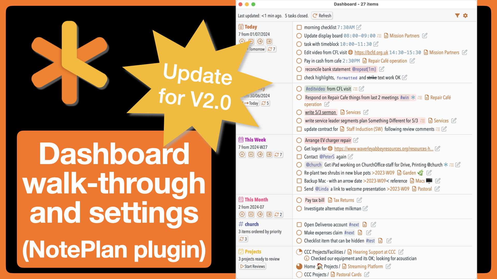
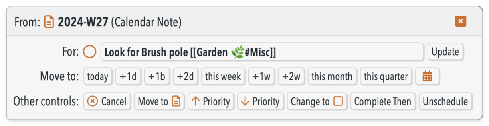
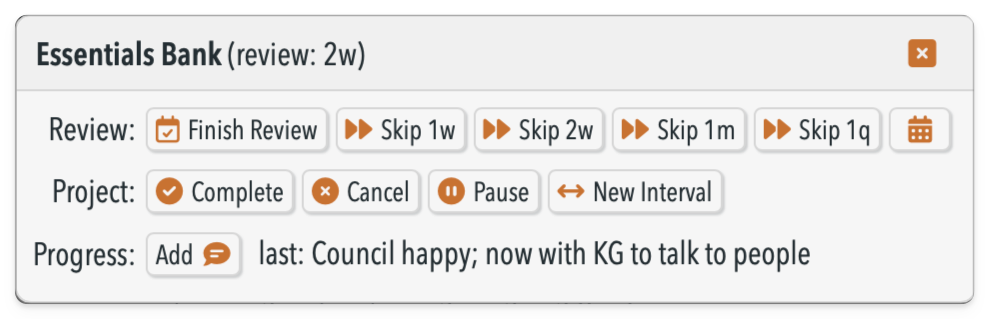

# 🎛 Dashboard plugin


This plugin provides a **dashboard window** for your NotePlan data that in one place shows a compact list of:
- open tasks and checklists from today's note
- scheduled open tasks and checklists from other notes to today
- similarly for yesterday's note, tomorrow's note, and the weekly, monthly and quarterly notes too (if used)
- all open tasks and checklists that contain a particular  `#tags` or `@mention`s of your choosing. This can give "deferred date" functionality (see below).
- all overdue tasks
- all open items with an added priority
- the next notes ready to review (if you use the "Projects and Reviews" plugin)

... and then gives you many controls, mostly in two edit dialogs, that let you quickly complete, cancel or move items to different time periods.

Here's a [great video from user George Crump](https://youtu.be/_lj8osSOvQc) that shows v2.0 in action, and how he lives in the Dashboard throughout his day:

[](https://youtu.be/_lj8osSOvQc)

To open this run the **/show dashboard** command (aliases 'db' or 'sdb'). It automatically picks up the Theme from NotePlan and mimics it as far as possible (you're welcome).

From v2, the top right has icons for two menus: 
- a **Filter menu** that allows quick access to what sections are shown, and other display toggles:
    
    

- a **Settings menu** -- see [Settings](#settings) for more details about these more complex settings.

[](https://www.buymeacoffee.com/revjgc)

## What's improved in v2.0?
Lots! See the [CHANGELOG](./CHANGELOG.md) for details.

## Interacting with items in the Dashboard
All tasks and checklists shown in the Dashboard view can be marked as **complete** by clicking in its usual open circle or square.  The item is then completed in the NotePlan note, and removed from view in this list. You can also **cancel** the item by pressing **⌘ (command)** button when clicking on the open circle or square.


<!-- TODO:  -->

You can make many more changes by clicking on the **pencil** icon after each task. A dialog box pops up with many **action buttons**:



- `today` moves to today's note
- `+1d` moves to the next day's note
- `+1b` moves to the next business day's note (which ignores weekends)
- `+1w` moves to next week's note etc.
- `this week` moves to this week's note etc.
- `🗓️` moves to any date you choose, via a date picker
- `Cancel` cancels the task/checklist
- `Move to note` opens the command bar asking which note + heading you want to move this item to
- `↑ Priority` increases the priority of the current item (i.e. the start of the underlying item goes from none -> `!` -> `!!` -> `!!!` -> `>>`)
- `↓ Priority` decreasas the priority of the current item (i.e. the start of the underlying item goes from none -> `!` -> `!!` -> `!!!` -> `>>`)
- `Change to ◯/◻︎` toggles an item between being a task and a checklist
- `Complete Then` completes an overdue task, but marks it `@done(...)` on the _original_ due date, not today.
- `Unschedule` unschedules a task (i.e. removes any `>date`).

You can also update the text of the item itself, which is saved whenever you press the `Update` button (or any of the other action buttons). You can press `ESC` key to close the dialog, or click on the `X` button.

On the daily/weekly/monthly sections there are 'add task' and 'add checklist' icons, to allow you to add a task directly at the start of that current note. A second pair adds tasks and checklists but to the *next* day/week/month.

Other notes:
- _This requires the separate 'Shared Resources' plugin to be installed_.
- The Dashboard doesn't use NotePlan's normal editor, but a more flexible HTML-based display. Behind the scenes it cleverly translates your current NotePlan theme into its CSS equivalent. (You're welcome.)
- The display is responsive: switching from narrow to normal to multi-column layout depending how wide you set it.
- Note: some of the buttons are hidden when running on iOS or iPadOS because of limitations in the environment the Dashboard runs in. We are hopeful these will be removed in time.
- The items are shown sorted first by increasing time (where there is a time block), then by decreasing priority.
- It de-dupes items that would appear twice in a list where the lines are sync'd together.
- There's a UI toggle "Filter out lower-priority items?". If this is on, then items without any extra priority in calendar files will be hidden until there are no remaining priority items that haven't been completed. Priority items are currently indicated by having `>>`, `!!!`, `!!` or `!` at the beginning of the item.
- The "#tag/@mention Section" will show all open tasks/checklists that include this #tag or @mention. This is a good way of showing all `#next` actions, for example. Further, this can be used to turn this into a 'deferred' section, by setting the tag to show here the same tag that is also set to be ignored in the calendar sections above.
- you can use the '#Tags' section to create a "deferred date" function. To do this tag something as (for example) `#next` and then schedule it with a day in the future.On that future date, it will show up in this `#next` section. (Thanks to @george65 for spottig this use case.)
- The count of tasks done today includes those completed in project notes, not just from the calendar sections shown. Note: this requires having the NotePlan setting 'Todo > Append Completion Date' setting turned on, as otherwise we can't tell when a task is finished. (As @done(...) dates don't get appended to completed checklists, it's not possible to count completed checklists.) To save space, this is not shown on iOS devices.

### Project section
If you use the [Projects & Reviews Plugin](https://github.com/NotePlan/plugins/tree/main/jgclark.Reviews), the Dashboard will show up the projects ready for review. It reads this from the hidden list that's updated every time its **/project lists** command is run, or you **/finish project review** on a project note.  



The 'action buttons' available in this section are:
- `Finish Review` does the equivalent of the "/finish review" command, marking that project as @reviewed today.
- the various `Skip ...` buttons do the equivalent of the "/skip project review" command, that override (or skips) the normal review interval by the duration given. This adds a `@nextReview(...)` to the note's metadata. See [Project + Reviews documentation](../jgclark.Reviews/README.md) for more details.
- `🗓️` skips  to any date you choose, via a date picker
- "Complete", "Cancel" and "Pause" Project buttons, that each mimic the same command from the Project & Reviews plugin
- shows the latest 'Progress' comment for a project, and an `Add` button to add a new progress comment.

### Priority section
Note: this will be slow to generate, as it can't use any of NotePlan's internal caches.

### Updating the Dashboard automatically
The dashboard window can automatically update when a change is made in the relevant calendar note(s) if you have [added a trigger to the frontmatter](https://help.noteplan.co/article/173-plugin-note-triggers) of the relevant daily/weekly/monthly/quarterly note(s). To get this added automatically to the daily note, turn on setting 'Add dashboard auto-update trigger when dashboard opened?' (details below).

Or you can use the **/add trigger to note** command from my [Note Helpers plugin](https://github.com/NotePlan/plugins/tree/main/jgclark.NoteHelpers/) which adds this:
```yaml
---
triggers: onEditorWillSave => jgclark.Dashboard.decideWhetherToUpdateDashboard
---
```

Note: If you use the 'Overdue Tasks' section, this can add some delay before the dashboard window is updated if you have hundreds of overdue tasks 🥺. So this section is deliberately not updated when a trigger has fired. In practice this shouldn't matter, as editing your daily note won't change any overdue tasks.

## Configuration Settings
Dashboard v2 provides a quicker-to-access Settings window, accessed from the cog wheel at the top right of the dashboard window. (This will soon replace the method of going to the NotePlan Preference Pane, and finding the right Plugin.)


These settings change some of how it displays:
- Reschedule items in place, rather than move them?: When updating the due date on an open item in a calendar note, if set this will update its scheduled date in its current note, rather than move it.
- When (re)scheduling an item, also show it as a scheduled item in main Editor?: If set then it uses the '[>]' marker in the underlying Markdown which is shown with 🕓 in the main Editor. By default this is on, to match the standard behaviour of NotePlan's UI.
- Ignore items in calendar sections with this phrase: If set, open tasks/checklists with this word or tag will be ignored, and not counted as open or closed. This is useful for situations where completing the item is outside your control. Note: This doesn't apply to the Tag/Mention section, which has its own setting (below).
- Folders to ignore when finding items: If set, the contents of these folder(s) will be ignored when searching for open or closed tasks/checklists. This is useful where you are using sync'd lines in search results. Default: "@Archive, Saved Searches"
- Show referenced items in separate section? Whether to show Today's open tasks and checklists in two separate sections: first from the daily note itself, and second referenced from project notes. The same also goes for Weekly/Monthly/Quarterly notes.
- Max number of items to show in a section?: The Dashboard isn't designed to show very large numbers of tasks. This gives the maximum number of items that will be shown at one time in the Overdue and Tag sections. (Default: 30)
- Section heading to add/move new tasks under: When moving an item to a different calendar note, or adding a new item, this sets the Section heading to add it under. If the heading isn't present, it will be added using the settings from the QuickCapture plugin (if installed).\nIf this is left empty, then new tasks will appear at the top of the note.
- Heading level for new Headings: level 1-5 to use when adding new headings in notes.
- Move sub-items with the item? If set, then indented sub-items of an item will be moved if the item is moved to a different note.
- Use 'today' to schedule tasks for today?: You can have tasks scheduled for today to use '>today' or the current date. If you use '>today', the task will automatically move to tomorrow if not completed. If you use the current date, the task will not automatically move and will show as an overdue task. 
- Sort order for Overdue tasks: The order to show the Overdue tasks: 'priority' shows the higher priority (from `>>`, `!!!`, `!!` and `!` markers), 'earliest' by earliest modified date of the note, or 'most recent' changed note.
- #tag/@mention(s) to show: If this is set as a #hashtag or @mention, then all open tasks that contain it are shown in a separate section. This is a good way to show all `#next` actions, for example. Further, this can be used to turn this into a 'deferred' section, by setting the tag to show here the same tag that is also set to be ignored in the calendar sections above. May also be more than one, separated by a comma. NOTE: These tasks will only show up in their separate section, unless you have the 'Hide Duplicates' option turned OFF.
- Ignore items in this section with this phrase: Open tasks/checklists in this section will be ignored if they include this phrase.
- Update items in this section when triggered? If true then the 'Tag/Mention' section will be updated even when the update comes from being triggered by a change to the daily note.
- Add dashboard auto-update trigger when dashboard opened? Whether to add the auto-update trigger to the frontmatter to the current note when the dashboard is opened. This will ensure an immediate Dashboard refresh is triggered when the note is changed.
- Automatic Update frequency: If set to any number > 0, the Dashboard will automatically refresh your data when the window is idle for a certain number of minutes.
- Enable interactive processing for each section? If enabled, the Dashboard will display a button that will loop through all the open items in a given section and prompt you to act on them.
- Open note and highlight task when processing? If enabled, the Dashboard will open the note in the Editor and highlight the task in the note when it is processed. If this is turned, off, you can always open the note by clicking the task title in the dialog window
- Show interactive processing transitions? By default, interactive processing will show a shrink/grow transition between each item to be processed. You can turn these off if you prefer.

The Filter menu includes the following toggles:
- Include context for tasks? Whether to show the note link for an open task or checklist
- Exclude tasks that include time blocks?: Whether to stop display of open tasks that contain a time block.
- Exclude checklists that include time blocks?: Whether to stop display of open checklists that contain a time block.
- Include folder name? Whether to include the folder name when showing a note link
- Theme to use for Dashboard: If this is set to a valid Theme name from among those you have installed, this Theme will be used instead of your current Theme. Leave blank to use your current Theme.

## Controlling from Shortcuts, Streamdeck etc.
In v1.x there was a way to toggle individual sections on and off. In v2.0 this has been replaced with a number of 'callback's. 

The simplest **opens (or refreshes) the Dashboard**:
```
noteplan://x-callback-url/runPlugin?pluginID=jgclark.Dashboard&command=Show%20Dashboard
```

Or add `arg0` to **set a list of sections you want to see**. For example, to show the today, tomorrow + @home mentions, run this x-callback:
```
noteplan://x-callback-url/runPlugin?pluginID=jgclark.Dashboard&command=Show%20Dashboard&arg0=DT,DO,@home
```
Use `arg0=` followed by a comma-separated list of one or more of the following section codes:

| Section | Code | Section | Code |
| -------- | -------- | -------- | -------- |
| Today | `DT` | Yesterday | `DY` |
| Tomorrow | `DO` | Week | `W` |
| Month | `M` | Quarter | `Q` |
| Projects | `PROJ` | Overdue | `OVERDUE` |
| Items with Priority | `PRIORITY` | tags / mentions from your settings | `#tag` / `@mention` |

You can also **set a particular setting**:
```
noteplan://x-callback-url/runPlugin?pluginID=jgclark.Dashboard&command=setSetting&arg0=<settingName>&arg1=<value>
```
Or you can **set multiple settings in one call**:
```
noteplan://x-callback-url/runPlugin?pluginID=jgclark.Dashboard&command=setSetting&arg0=<settingName=value pairs separated by semicolons>
```
For both callbacks, the names of the possible settings (described above), and their types, are:

| Name | Type | Name | Type |
| -------- | -------- | -------- | -------- |
| separateSectionForReferencedNotes | true / false |
| filterPriorityItems | true / false |
| dashboardTheme | string |
| hideDuplicates | true / false |
| ignoreTasksWithPhrase | string |
| ignoreChecklistItems | true / false |
| ignoreFolders | comma-separated values |
| includeFolderName | true / false |
| includeTaskContext | true / false |
| rescheduleNotMove | true / false |
| useRescheduleMarker | true / false |
| newTaskSectionHeading | string |
| newTaskSectionHeadingLevel | 1-5 |
| autoAddTrigger | true / false |
| excludeChecklistsWithTimeblocks | true / false |
| excludeTasksWithTimeblocks | true / false |
| showYesterdaySection | true / false |
| showTomorrowSection | true / false |
| showWeekSection | true / false |
| showMonthSection | true / false |
| showQuarterSection | true / false |
| showOverdueSection | true / false |
| showPrioritySection | true / false |
| showProjectSection | true / false |
| maxItemsToShowInSection | number |
| overdueSortOrder | string |
| tagsToShow | string |
| ignoreTagMentionsWithPhrase | string |
| updateTagMentionsOnTrigger | true / false |
| useTodayDate | true / false |
| moveSubItems | true / false |
| enableInteractiveProcessing | true / false |
| interactiveProcessingHighlightTask | true / false |
| enableInteractiveProcessingTransitions | true / false |

As these can be fiddly to set up, I recommend using the **/Make Callback from Current Settings** command to generate the callback URL based on your current settings. This is copied to the clipboard.

## Support
The Dashboard requires the **Shared Resources** plugin to be installed as well, to work and display properly. The Dashboard should automatically offer to install it if it isn't already.

Do join  the excellent Discord community around NotePlan, where the plugins and much more, is discussed and ideas shared. If you find an issue with this plugin, or would like to suggest new features for it, as well as commenting there you can raise an ['Issue' of a Bug or Feature Request on GitHub](https://github.com/NotePlan/plugins/issues).

I'm not part of the NotePlan team, but I've spent at least 10 working weeks on this particular plugin. So if you would like to support my late-night hobby extending NotePlan through writing these plugins, you can through:

[](https://www.buymeacoffee.com/revjgc)

David Wertheimer has contributed much knowledge and code to v2.0, which is a complete re-write using the React framework for Javascript.  George Crump has contributed many suggestions, bug reports, and several great explainer videos.  And of course, thanks to Eduard for continually improving NotePlan itself, and the APIs I've used to build my various Plugins.

Thanks, team!

## History
Please see the [CHANGELOG](CHANGELOG.md).
