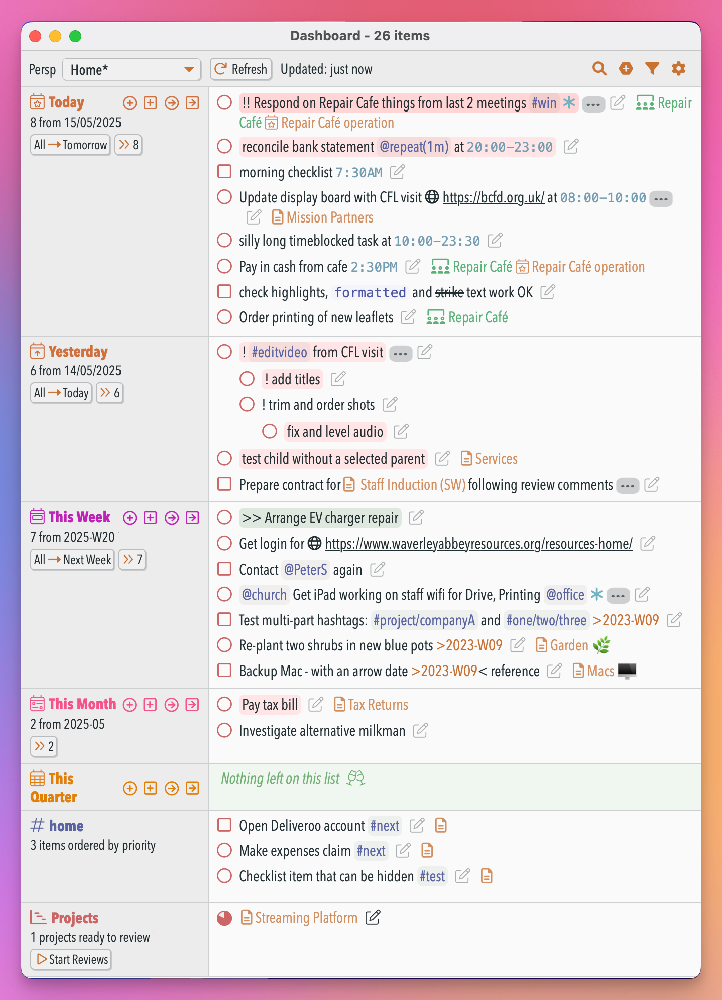
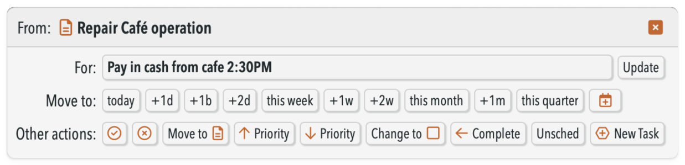
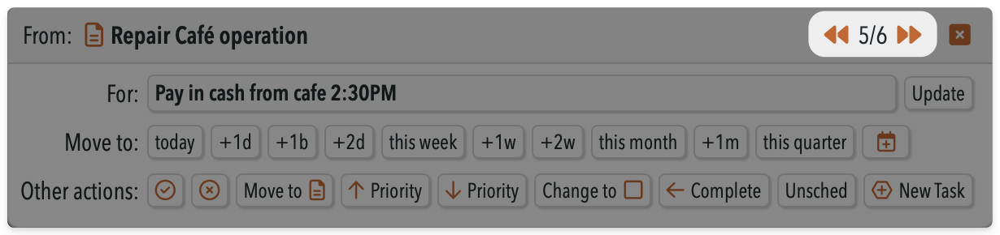
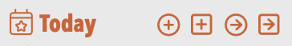
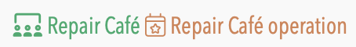

# 🎛 Dashboard plugin


This plugin provides a **dashboard window** for your NotePlan data that in one place shows a compact list of:
- open tasks and checklists from today's note
- scheduled open tasks and checklists from other notes to today
- similarly for yesterday's note, tomorrow's note, this week's and last week's notes, and monthly and quarterly notes too (if used)
- all open tasks and checklists that contain a particular  `#tags` or `@mention`s of your choosing -- for example things tagged with the name of a family member of colleague. This can give "deferred date" functionality (see below).
- all overdue tasks
- all open items with an added priority
- the next Project notes ready to review (if you have the "Projects and Reviews" plugin installed)
- it shows any currently-active time block you've set
- plus a 'Search' field to show all open items that match a search.

This avoids you having to keep _copying_ tasks into your Today note to see them, but instead you can _see_ them all in one place in the Dashboard window.  From there you can quickly edit, complete, cancel or move any of these items to be due on different days/week/months, with the pop-up Edit Dialog.


Here's a [great video from user George Crump](https://youtu.be/_lj8osSOvQc) that shows v2.0 in action, and how he lives in the Dashboard throughout his day:

[](https://youtu.be/_lj8osSOvQc)

My suggestion is to think ahead. You may want to see overdue from yesterday now, but as your use grows you probably want to see more things from more places. E.g. I have a tag of things that I need to discuss with my Administrator, but these are spread across 30 different projects/areas. So I have a Section to show me them from whichever note they live in.
That’s why Dashboard is as it is: don’t keep *copying* things into Today, but *see* them all in one place in the Dashboard window.  Yes, it means keeping it open most of the time, but that’s much easier than continually navigating around different notes.

To open this run the **/show dashboard** command (aliases 'db' or 'sdb'). It automatically picks up the Theme from NotePlan and mimics it as far as possible (you're welcome).

[](https://www.buymeacoffee.com/revjgc)

## Header bar Controls


From left to right these are:
- the **Perspective menu**, showing the currently-active [Perspective](#perspectives) (see below for more details).
- the **Refresh** button, which re-generates the whole display. If you [configure the setting](#configuration-settings) "Automatic Update interval" to any number > 0 minutes, then this should rarely be needed.
- a **Search** button that opens up a Search bar. See [Search section](#search-section) below for more details.
- an **Add new task** button, which then opens the NotePlan command bar to ask for task text to add, and then to which note and section within than note to add it to.  (Shortcut key: <kbd>^⌥a</kbd>)
- a **Filter menu** that allows quick access to what sections are shown, and some other display toggles:
    
    

- a **Settings menu** where you configure what subsets of tasks and checklists you want to see, and how they're displayed. See [Settings](#settings) below for more details. (Shortcut key: <kbd>^⌥,</kbd>)

<!-- _This Plugin requires the separate 'Shared Resources' plugin to be installed. It will offer to install it for you if necessary._ -->

## Perspectives
A **Perspective** is a named set of all your Dashboard settings, including which folders to include/ignore, and which sections to show. Each 'Perspective' has a name, and can be updated and deleted. 

To change between the various Perspectives click on this dropdown menu:


Use the Settings dialog to change your settings for the current perspective. When it notices you've changed something, it adds a `*` to the end of the perspective name. To update the definition of this perspective, select 'Save Perspective' from the dropdown menu.

The '-' Perspective is a default, which doesn't do any filtering. This can't be deleted.

## Updating items from the Dashboard
All tasks and checklists shown in the Dashboard view can be marked as **complete** by clicking in its usual open circle or square.  The item is then completed in the NotePlan note, and removed from view in this list. You can also **cancel** the item by pressing **⌘ (command)** button when clicking on the open circle or square.


You can make many more changes by clicking on the **pencil** icon after each task. An 'edit' dialog box pops up with many **action buttons**:


- `today` moves to today's note
- `+1d` moves to the next day's note
- `+1b` moves to the next business day's note (which ignores weekends)
- `+1w` moves to next week's note etc.
- `this week` moves to this week's note etc.
- `🗓️` moves to any date you choose, via a date picker
- `Cancel` cancels the task/checklist
- `Move to note` opens the command bar asking which note + heading you want to move this item to
- `↑ Priority` increases the priority of the current item (i.e. the start of the underlying item goes from none -> `!` -> `!!` -> `!!!` -> `>>`)
- `↓ Priority` decreases the priority of the current item (i.e. the start of the underlying item goes from none -> `!` -> `!!` -> `!!!` -> `>>`)
- `Change to ◯/◻︎` toggles an item between being a task and a checklist
- `← Complete` completes an overdue task, but marks it `@done(...)` on the _original_ (earlier) due date, not today.
- `Unsched` unschedules a task (i.e. removes any `>date`).
- `+New Task` lets you add a completely new task in any note under any heading without having to leave the Dashboard, or even the Interactive Processing flow. (This is the same as running the '/quick add task under heading' command from the Quick Capture plugin.)

You can also update the text of the item itself, which is saved whenever you press the `Update` button (or any of the other action buttons). You can press `ESC` key to close the dialog, or click on the `X` button.

### Moving/Scheduling items
A very common action is to move items from calendar note to another, or to a regular note. The Dashboard supports many different possible workflows, which will hopefully suit all users.  The main choice is whether to:
- **move items** from one note to the other -- which deletes from the origin note; or
- **(re)schedule items** -- which makes a *copy* in the destination note and appends a `<date` indicating the date it was copied from.

You make this choice in the '(Re)schedule items in place, rather than move them?' setting. There's also a sub-setting if you want to (re)schedule:
  - Use simplified (re)scheduling method?: By default this is off, but if selected then the item simply has its `>date` updated in the note it is in. It does not show with the special 🕓 task icon, and a copy isn't added into the date its being scheduled to. (This is my much preferred way of operating, and avoids duplicating unfinished tasks in calendar notes.)

There are also options about whether to make the same **heading (or hierarchy of headings) appear** in the destination note. The settings that control the options are in the section 'Moving/Scheduling Items':

- Section heading to add/move new tasks under: When moving an item to a different calendar note, or adding a new item, this sets the Section heading to add it under. (Don't include leading #s.) If you leave this field blank, it will prompt you each time which heading to use. If you want new tasks to always appear at the top of the note, use `<<top of note>>`. Likewise for `<<bottom of note>>` if you want them to appear at the bottom. Or if you want the current hierarchy of headings to be maintained in the new note, use `<<carry forward>>`.
- Heading level for new Headings: level 1-5 to use when adding new headings in notes. This can also be set to `0`, which tells the Dashboard to only create the wanted heading if it isn't already present in the destination note.

There are several detailed options:

- Move sub-items with the item? If set, then indented sub-items of an item will be moved if the item is moved to a different note.
- Use '>today' to schedule tasks for today?: You can have tasks scheduled for today to use `>today` or the current date. If you use `>today`, the task will automatically move to tomorrow if not completed. If you use the current date, the task will not automatically move and will show as an overdue task. 

### Interactive Processing


In sections with more than 1 item, a `>> N` button is available (where `N` is the number of items). This brings up the above dialog, but in 'interactive processing' mode, with extra buttons in the header to move forward (or backward) between the items. This allows you to more quickly go through a set of items, and take different actions for each one.

Note:
- you can break out from the sequence at any time by closing the dialog.
- at the moment this only processes tasks that are currently shown -- so it won't process any ones of lower priority that you have hidden.
- there are 3 settings that control aspects of this in the Dashboard Settings dialog.

### Add Task/Checklist items

On the daily/weekly/monthly sections there are 'add task' and 'add checklist' icons, to allow you to add a task directly at the start of that current note. A second pair adds tasks and checklists but to the *next* day/week/month. In the 'Today' section only is an extra button to allow you to add a task directly to any existing note.

### 'All → ...' Move buttons
Some sections have "All →  ..." buttons. They move or schedule all the items in that section to the destination (e.g. from Today to Tomorrow's daily note), including any hidden as lower-priority items. If there are more than 20 items to move, then (on macOS) it will first check whether you want to proceed.

The 'Move not (re)schedule?' setting controls whether it will move or (re)schedule the items. However if you want to use the other action on a particular set of items, you can ⌘-click the button, and it will for this time only use the other action.

Note: _Please be careful with this_: NotePlan doesn't provide a proper Undo/Redo mechanism for plugins, and so these Move operations can't easily be undone. If you do need to do so, then you'll need to use the 'Versions' feature on all the notes the tasks were moved from and to.

## Other notes about the Dashboard display
The Dashboard uses a flexible HTML-based display, that's entirely different technology from NotePlan's editors. Behind the scenes it cleverly translates your current NotePlan theme into its CSS equivalent. (You're welcome.)

The display is **responsive**: change the width of the window, and it will change from narrow to normal to multi-column layout. Note: some of the buttons are hidden when running on iOS or iPadOS because of limitations in the environment the Dashboard runs in. We are hopeful these will be removed in time.

The items are shown **sorted** first by increasing time (where there is a time block), then by decreasing priority. And it **de-duplicates** items that would appear twice in a list where the lines are sync'd together.

There's a UI toggle "**Filter out lower-priority items?**". If this is on, then items without any extra priority in calendar files will be hidden until there are no remaining priority items that haven't been completed. Priority items are currently indicated by having `>>`, `!!!`, `!!` or `!` at the beginning of the item.

The top bar has a **count of tasks done today** (apart from on narrow windows and on iOS). This includes all those completed in project notes, not just from the calendar sections shown. Note: this requires having the NotePlan setting 'Todo > Append Completion Date' setting turned on, as otherwise we can't tell when a task is finished. (As @done(...) dates don't get appended to completed checklists, it's not possible to count completed checklists.) When you complete a task in a project note, it will be included the next time the Dashboard is refreshed, automatically on manually.

The display will **automatically refresh** in the background if you set the "Automatic Update interval" to any number > 0. This number is the number of minutes after the window is idle when it will refresh the sections you want to display. You can also press the 'Refresh' button at any point, and/or you can set a trigger (see below).

(From v2.3) The Dashboard will show notes held in a **Teamspace** (if you are part of one). It shows with the title of the Teamspace in green with the Teamspace icon, before the note title:




### Current Time Block section
[Time blocks in NotePlan](https://help.noteplan.co/article/121-time-blocking) are a helpful way to help you plan your days. If you define some, they appear in the calendar sidebar.  If the current time is within a time block, then this section appears at the top of the Dashboard. For example:


It always shows the time range first, minus any 'Text must contain' string that you have set in NP's 'Todo' settings pane. Where a time block is defined on a heading or list item, then the calendar+clock icon is shown in place of the task/checklist icon.

## Search section


Click on the search icon and a small search bar opens up in the Header, where you can type a term to search for open tasks and checklists in regular or calendar notes. This uses the extended syntax from my separate [Search Extensions plugin](https://noteplan.co/plugins/jgclark.SearchExtensions/) to allow more complex searches than NotePlan natively allows.

The Search Section stays until either you manually refresh the dashboard, or you click the close `[x]` button. This means you can edit the items like any other section contents, and also use Interactive Processing.

There are 2 specific settings for this section:
- Apply current filtering to Search? If set, then the search will use the "What to Include and Exclude?" settings above to filter the search results before displaying them. If not set, then the search will run over all open items.
- Don't return future items? If set, don't return items dated in the future, or from future calendar notes.

_I plan to introduce more search options in later releases. In this release the searches are case-insensitive and match on part-words, which is the same as the NotePlan app. Unless, that is, you have the Search Extensions plugin installed, in which case it will use those settings._

### #tag/@mention sections
The "#tag/@mention Section" will show all open tasks/checklists that include the #tag or @mention of interest. This is a good way of showing all `#next` actions, for example, or all which involve `@007`.

v2.3 introduces '**noteTags**'. These allow you to treat all the open items in a whole note as having a particular tag or mention applied to it. To use this, simply add a `note-tag` field in the frontmatter for the note, with the tag(s)/mention(s) in a list. 
For example in this note:
```md
---
title: Bring down the SPECTRE organisation
note-tag: #ProjectSPECTRE, @007
---
* High speed chase to find the SPECTRE HQ
* Listen in on the SPECTRE Head briefing his operatives
* Use @Q's latest device to put most of the operatives out of action
```
all three tasks will be included in a `#ProjectSPECTRE` Section.

You can use the '#Tags' section to create a "deferred date" function. To do this tag something as (for example) `#next` and then schedule it with a day in the future.On that future date, it will show up in this `#next` section. (Thanks to @george65 for spotting this use case.)

### Project section
If you use the [Projects & Reviews Plugin](https://github.com/NotePlan/plugins/tree/main/jgclark.Reviews), the Dashboard will show up the projects ready for review. It reads this from the hidden list that's updated every time its **/project lists** command is run, or you **/finish project review** on a project note.  


The 'action buttons' available in this section are:
- `Finish Review` does the equivalent of the "/finish review" command, marking that project as @reviewed today.
- the various `Skip ...` buttons do the equivalent of the "/skip project review" command, that override (or skips) the normal review interval by the duration given. This adds a `@nextReview(...)` to the note's metadata. See [Project + Reviews documentation](../jgclark.Reviews/README.md) for more details.
- `🗓️` skips  to any date you choose, via a date picker
- "Toggle Pause", "Complete" and "Cancel" buttons, that each mimic the same command from the Project & Reviews plugin
- shows the latest 'Progress' comment for a project, and an `Add` button to add a new progress comment.

The 'Start Reviews' button does the same as the button of the same name in the Project & Reviews plugin, and is the equivalent of its **/start reviews** command. See the documentation for how that works, and which commands to follow it with once you've done reviewed the note.

### Overdue section
This finds open items with a schedule date (e.g. `>2025-01-22`) in the past. This can generate a lot of tasks, and take a while, so there's a setting "Number of days to look back for Overdue tasks", which if set to any number > 0, will filter by due date (if set) or on date of a calendar note.

You can set the "Sort order for Tag/Mention and Overdue items": 'priority' shows the higher priority (from `>>`, `!!!`, `!!` and `!` markers), 'earliest' by earliest modified date of the note, or 'most recent' changed note.

### Priority section
This finds all open items with a priority set (with `>>`, `!!!`, `!!` and `!` markers). Note: _this is likely to be very slow to generate, as it can't use any of NotePlan's internal caches, and doesn't have a natural way to limit it, like the Overdue section._

David's advice is: "Priority tasks float to the tops of their individual sections already. And I go through all overdue tasks and handle them so that section stays small after you bite the bullet and do it once."

## Configuration Settings
Dashboard provides a quick access Settings window, accessed from the cog wheel at the top right of the dashboard window -- or you can use shortcut ^⌥-comma. (This replaces the normal method of going to the NotePlan Preference Pane, and finding the right Plugin.)


The 3 key settings in "What to Include and Exclude" section control what folders and items are included and excluded in Dashboard's many sections. It includes the folders from the first setting, and then removes any specified from the next setting. Finally, individual lines in notes can be ignored by adding terms to the third setting:

- Folders to Include: Comma-separated list of folder(s) to include when searching for open or closed tasks/checklists. The matches are partial, so 'Home' will include 'Home' and 'The Home Areas' etc. If left blank, all folders are included.
- Folders to Exclude: Comma-separated list of folder(s) to ignore when searching for open or closed tasks/checklists. The matches are partial, so 'Work' will exclude 'Work' and 'Work/CompanyA' etc.  Where there is a conflict, exclusions will take precedence over inclusions.  To ignore notes at the top-level (not in a folder), include '/' in the list. (@Trash is always ignored, but other special folders need to be specified, e.g. @Archive, @Templates.)
- Ignore items in notes with these phrase(s): If set, open tasks/checklists with this word or tag will be ignored, and not counted as open or closed. (This check is not case sensitive.) This is useful for situations where completing the item is outside your control.
  - Apply to sections under headings in Calendar notes? If turned on, then all content in Calendar notes under headings that contains any of those phrases will be ignored. This applies to the preceding headings all the way up the H5->H1 hierarchy of section headings for that line. For example in the following note:
  ```markdown
  ## Work Tasks
  ### Project VENONA
  * Break Russia KGB cipher system >today
  * Find the identity of the moles
  ```
  If this setting contains `Work`, then the two tasks in the H3 section will also be ignored because it is under the H2 `Work Tasks` section.

The rest of the Settings change some of how the Dashboard displays and behaves:
- #tag/@mention(s) to show: If this is set as a #hashtag or @mention, then all open tasks that contain it are shown in a separate section. This is a good way to show all `#next` actions, for example. Further, this can be used to turn this into a 'deferred' section, by setting the tag to show here the same tag that is also set to be ignored in the calendar sections above. May also be more than one, separated by a comma. NOTE: These tasks will only show up in their separate section, unless you have the 'Hide Duplicates' option turned OFF.
- _the settings in the 'Moving/Scheduling Items' section are covered above_.
- Max number of items to show in a section?: The Dashboard isn't designed to show very large numbers of tasks. This gives the maximum number of items that will be shown at one time in the Overdue and Tag sections. (Default: 30)
- Show completed task count?: Show the number of tasks completed today at the top of the Dashboard. Note: For this to work, you need to have enabled "Append Completion Date" in the NotePlan Preferences/Todo section.
- Automatic Update frequency: If set to any number > 0, the Dashboard will automatically refresh your data when the window is idle for a certain number of minutes.
- Theme to use for Dashboard: If this is set to a valid Theme name from among those you have installed, this Theme will be used instead of your current Theme. Leave blank to use your current Theme.
- Show referenced items in separate section? Whether to show Today's open tasks and checklists in two separate sections: first from the daily note itself, and second referenced from project notes. The same also goes for Weekly/Monthly/Quarterly notes.
- Hide priority markers? Hide the `>>`, `!!`, `!`, and `!!` priority markers (if your theme uses priorities markers).
- Show note link for tasks? Whether to show the note link for an open task or checklist.
- Show folder name in note link? Whether to include the folder name when showing a note link
- Show scheduled date for tasks? Whether to display scheduled >dates for tasks in dashboard view.
- Show parent markers on items? If set adds an ellipsis icon on items that have "children" (indented sub-items), whether they are also shown or not.
- Sort order for Overdue tasks: The order to show the Overdue tasks: 'priority' shows the higher priority (from `>>`, `!!!`, `!!` and `!` markers), 'earliest' by earliest modified date of the note, or 'most recent' changed note.
- Enable interactive processing for each section? If enabled, the Dashboard will display a button that will loop through all the open items in a given section and prompt you to act on them.
- Open note and highlight task when processing? If enabled, the Dashboard will open the note in the Editor and highlight the task in the note when it is processed. If this is turned, off, you can always open the note by clicking the task title in the dialog window
- Show interactive processing transitions? By default, interactive processing will show a shrink/grow transition between each item to be processed. You can turn these off if you prefer.

The Filter menu includes the following toggles:
- Include context for tasks? Whether to show the note link for an open task or checklist
- Exclude tasks that include time blocks?: Whether to stop display of open tasks that contain a time block. (This setting does _not_ apply to the 'Current time block' section.)
- Exclude checklists that include time blocks?: Whether to stop display of open checklists that contain a time block. (This setting does _not_ apply to the 'Current time block' section.)

Note: if you have more than 1 device running NotePlan, then all the settings are shared across your devices.

### Backing up your settings
There are a lot of settings here, particularly when Perspectives are used. So I've added a "/backupSettings" command to take a Backup of your Dashboard settings.  This writes a copy of the `settings.json` file to dated version e.g. `settings_backup_20250524090402.json` in the same `<NotePlan root>/Plugins/data/jgclark.Dashboard/` folder. The `<NotePlan root>` varies depending on your sync settings. To find it, in any note go to the `...` menu and click on "Show in Finder", and then navigate up until you see a folder with `Notes` and `Plugins` sub-folders.

This can be triggered by a callback (documented below), so it can be automated in a Shortcut or other third-party tool.

Note: There's also the built-in NotePlan backup mechanism (Settings > Files > "Create a full copy") which includes all plugin settings. This cannot currently be automated.

### Updating the Dashboard automatically with a trigger
(Generally it is better to use the newer 'Automatic update' feature, but this older mechanism is retained for now.)

The dashboard window can automatically update when a change is made in the relevant calendar note(s) if you have [added a trigger to the frontmatter](https://help.noteplan.co/article/173-plugin-note-triggers) of the relevant daily/weekly/monthly/quarterly note(s). To get this added automatically to the daily note, turn on setting 'Add dashboard auto-update trigger when dashboard opened?' (details below).

Or you can use the **/add trigger to note** command from my [Note Helpers plugin](https://github.com/NotePlan/plugins/tree/main/jgclark.NoteHelpers/) which adds this:
```yaml
---
triggers: onEditorWillSave => jgclark.Dashboard.decideWhetherToUpdateDashboard
---
```

Note: If you use the 'Overdue Tasks' section, this can add some delay before the dashboard window is updated if you have hundreds of overdue tasks 🥺. So this section is deliberately not updated when a trigger has fired. In practice this shouldn't matter, as editing your daily note won't change any overdue tasks.

## Controlling from Shortcuts, Streamdeck etc.
There are number of 'callback's you can use to control the dashboard from shortcuts, command line, Streamdeck etc.  As these can be fiddly to set up, I recommend using the **/Make Callback from Current Settings** command to generate the appropriately encoded callback URL. This is copied to the clipboard ready to paste elsewhere.

The simplest **opens (or refreshes) the Dashboard**, using the `showDashboard` call:
```
noteplan://x-callback-url/runPlugin?pluginID=jgclark.Dashboard&command=showDashboard
```

To open using a **specific named Perspective** use the `showPerspective` call. For example to start it in the 'Work' Perspective:
```
noteplan://x-callback-url/runPlugin?pluginID=jgclark.Dashboard&command=showPerspective&arg0=Work
```
This can also be used when it is already open to _switch_ Perspective.

You can also **give a list of sections you want to see** use the `showSections` call. For example, to show the today, tomorrow + @home mentions:
```
noteplan://x-callback-url/runPlugin?pluginID=jgclark.Dashboard&command=showSections&arg0=DT,DO,@home
```
Use `arg0=` followed by a comma-separated list of one or more of the following section codes:

| Section | Code | Section | Code |
| -------- | -------- | -------- | -------- |
| Current Time Block | `TB` | Today | `DT` |
| Yesterday | `DY` | Tomorrow | `DO` |
| This Week | `W` | Last Week | `LW` |
| Month | `M` | Quarter | `Q` |
| Projects | `PROJ` | Overdue | `OVERDUE` |
| Items with Priority | `PRIORITY` | tags / mentions from your settings | `#tag` / `@mention` |

You can also **set a particular setting** using `setSetting` command:
```
noteplan://x-callback-url/runPlugin?pluginID=jgclark.Dashboard&command=setSetting&arg0=<settingName>&arg1=<value>
```

Or you can **set multiple settings in one call**:
```
noteplan://x-callback-url/runPlugin?pluginID=jgclark.Dashboard&command=setSetting&arg0=<settingName=value pairs separated by semicolons>
```

For the `setSetting` callbacks, the names of the possible settings (described above), and their types, are:

| Name | Type |
| -------- | -------- |
| separateSectionForReferencedNotes | true / false |
| filterPriorityItems | true / false |
| dashboardTheme | string |
| hideDuplicates | true / false |
| ignoreItemsWithTerms | string |
| ignoreChecklistItems | true / false |
| includedFolders | comma-separated values |
| excludedFolders | comma-separated values |
| showFolderName | true / false |
| includeTaskContext | true / false |
| rescheduleNotMove | true / false |
| useLiteScheduleMethod | true / false |
| newTaskSectionHeading | string |
| newTaskSectionHeadingLevel | 1-5 |
| excludeChecklistsWithTimeblocks | true / false |
| excludeTasksWithTimeblocks | true / false |
| showYesterdaySection | true / false |
| showTomorrowSection | true / false |
| showWeekSection | true / false |
| showMonthSection | true / false |
| showQuarterSection | true / false |
| showOverdueSection | true / false |
| showPrioritySection | true / false |
| showProjectSection | true / false |
| maxItemsToShowInSection | number |
| overdueSortOrder | string |
| tagsToShow | string |
| useTodayDate | true / false |
| moveSubItems | true / false |
| enableInteractiveProcessing | true / false |
| interactiveProcessingHighlightTask | true / false |
| enableInteractiveProcessingTransitions | true / false |

Finally, you can **backup your Dashboard settings**:
```
noteplan://x-callback-url/runPlugin?pluginID=jgclark.Dashboard&command=backupSettings
```

## Team
I'm just a hobby coder, and not part of the NotePlan team, but I have spent at least 2 working months on this particular plugin. So if you would like to support my late-night hobby extending NotePlan through writing these plugins, you can through:

[](https://www.buymeacoffee.com/revjgc)

Since v2.0, **David Wertheimer** has become co-author, and did much of the complete re-write to use the React framework for Javascript.  George Crump has contributed many suggestions, bug reports, and several great explainer videos.  And of course, thanks to Eduard for continually improving NotePlan itself, and the APIs I've used to build my various Plugins.

Thanks, team!

## Support
The Dashboard requires the **Shared Resources** plugin to be installed as well, to work and display properly. The Dashboard should automatically offer to install it if it isn't already.

Do join the excellent Discord community around NotePlan, where the plugins and much more, is discussed and ideas shared. If you find an issue with this plugin, or would like to suggest new features for it, as well as commenting there you can raise an ['Issue' of a Bug or Feature Request on GitHub](https://github.com/NotePlan/plugins/issues). Please always re-start NotePlan before raising issues, as that clears things more often than it should.

iOS/iPadOS users: if you need support, and we ask for more logs, you can change the logging level by running the "/Change Logging levels" command. For technical reasons, this is not available through the main Settings menu inside the Dashboard.

## History
Please see the [CHANGELOG](CHANGELOG.md).
