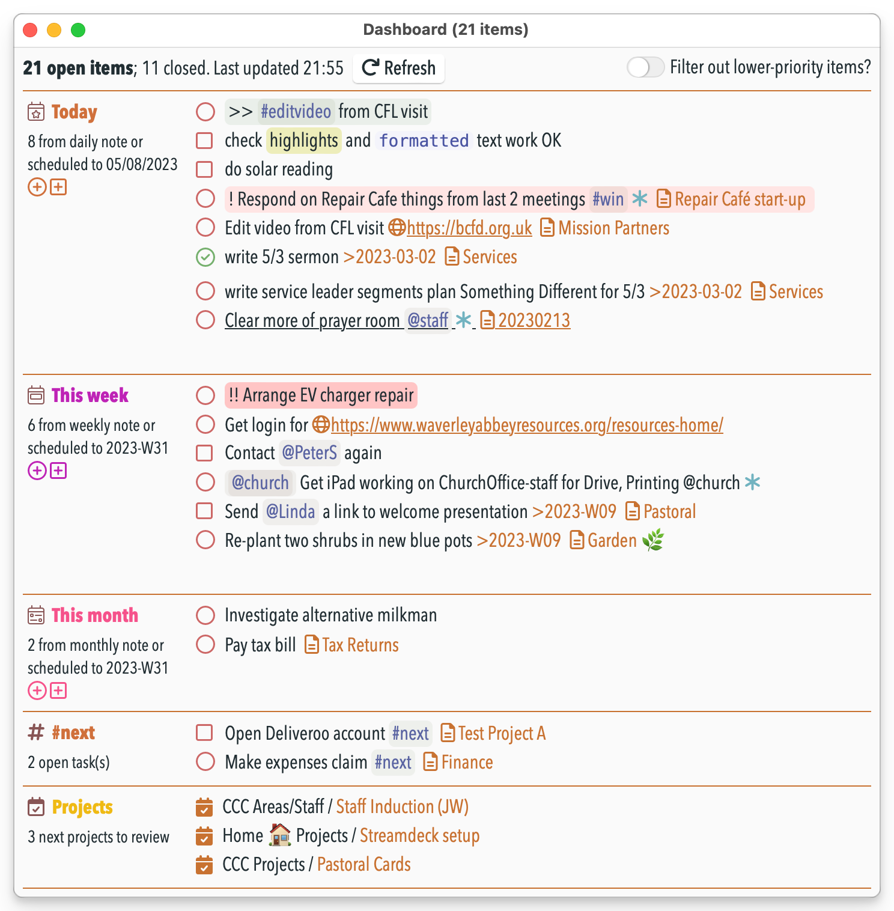
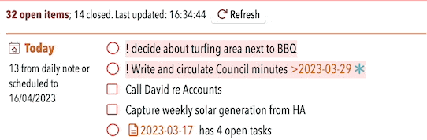

# 🎛 Dashboard plugin


This plugin provides a **dashboard window** that in one place shows a compact list of just:
- open tasks and checklists from today's note
- scheduled open tasks and checklists from other notes to today
- open tasks and checklists from this week's note
- scheduled open tasks and checklists from other notes to this week
- similarly for monthly and quarterly notes too
- all open tasks and checklists that conain a particular @tag or #mention
- next few notes to review (if you use the "Projects and Reviews" plugin)

To open this run the **/show dashboard** command.



All tasks and checklists shown in the Dashboard view can be marked as **complete** by clicking in its usual open circle or square. The item is then completed in the NotePlan note, and removed from view in this list. You can also **cancel** the item by press ⌘ (command) when clicking on the open circle or square.

On the daily/weekly/monthly sections there are 'add task' and 'add checklist' icons, to allow you to add a task directly at the start of that current note:


Other notes:
- _It requires the separate 'Shared Resources' plugin to be installed_.
- The Dashboard doesn't use NotePlan's normal editor, but a more flexible HTML-based display. Behind the scenes it cleverly translates your current NotePlan theme into its CSS equivalent. (You're welcome.)
- The plugin cannot work effectively on an **iPhone**-sized device, so it is disabled there.  On an **iPad** windows can't float in the same way as they can on macOS, so it's less useful, but it still works.
- When the window is wide enough, it will switch to a multi-column display
- It de-dupes items that would appear twice in a list where the lines are sync'd together.
- there's a UI toggle "Filter out lower-priority items?". If this is on, then items without any extra priority in calendar files will be hidden until there are no remaining priority items that haven't been completed. Priority items are currently indicated by having !!!, !! or ! at the beginning or end of the item.

### Updating automatically
The dashboard window can automatically update when a change is made in the relevant calendar note(s) if you have [added a trigger to the frontmatter](https://help.noteplan.co/article/173-plugin-note-triggers) of the relevant daily/weekly/monthly note(s). Turn on setting 'Add dashboard auto-update trigger when dashboard opened?' (details below).

Or you can use the **/add trigger to note** command from my [Note Helpers plugin](https://github.com/NotePlan/plugins/tree/main/jgclark.NoteHelpers/) which adds this:
```yaml
---
triggers: onEditorWillSave => jgclark.Dashboard.decideWhetherToUpdateDashboard
---
```

## Settings
This requires the **Shared Resources** plugin to be installed as well, to work and display properly. The Dashboard should automatically offer to install it if it isn't already.

There are various other settings to change some of how it displays:
- Show referenced items in separate section? Whether to show Today's open tasks and checklists in two separate sections: first from the daily note itself, and second referenced from project notes. The same also goes for Weekly/Monthly/Quarterly notes.
- Ignore items with this phrase: If set, open tasks/checklists with this word or tag will be ignored, and not counted as open or closed. This is useful for situations where completing the item is outside your control.
- Folders to ignore when finding linked items: If set, the contents of these folder(s) will be ignored when searching for open or closed tasks/checklists. This is useful where you are using sync'd lines in search results.
- Include context for tasks? Whether to show the note link for an open task or checklist
- Add dashboard auto-update trigger when dashboard opened?: Whether to add the auto-update trigger to the frontmatter to the current note when the dashboard is opened.
- Exclude tasks that include time blocks?: : Whether to stop display of open tasks that contain a time block.
- Exclude checklists that include time blocks?: Whether to stop display of open checklists that contain a time block.
- Include folder name? Whether to include the folder name when showing a note link
- #tag/@mention to show: (if set) will show all open tasks/checklists that include this #tag or @mention. This is one way of showing all `#next` actions, for example.

## Known Issue
When using this with its trigger, it's normally the case that NotePlan hasn't finished updating itself before the Dashboard display updates. Therefore it can appear one change behind.

## Support
If you find an issue with this plugin, or would like to suggest new features for it, please raise a [Bug or Feature 'Issue'](https://github.com/NotePlan/plugins/issues).

I've spent at least 2 working weeks on this particular plugin, so if you would like to support my late-night work extending NotePlan through writing these plugins, you can through:

[](https://www.buymeacoffee.com/revjgc)

Thanks!

## History
Please see the [CHANGELOG](CHANGELOG.md).
