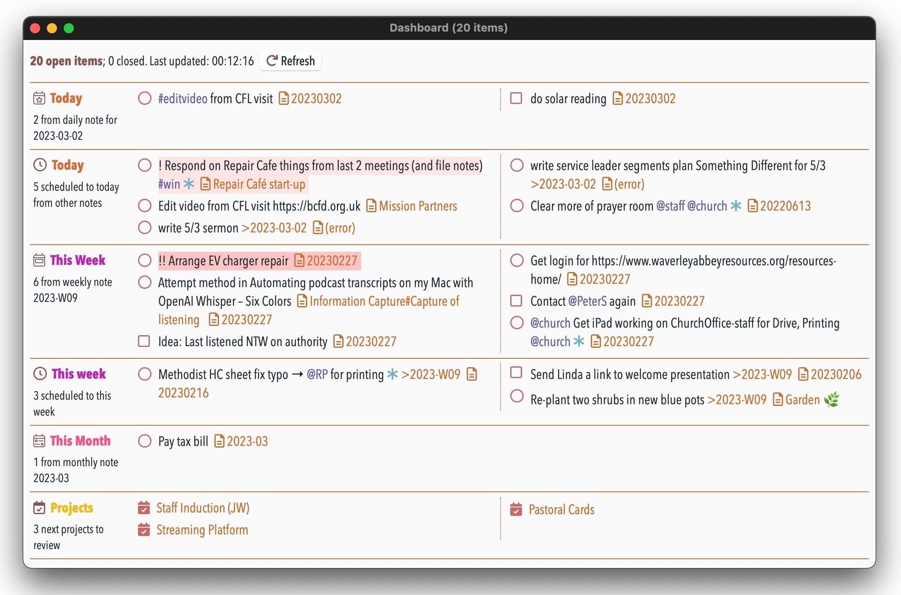

# 🎛 Dashboard plugin


This plugin provides a **dashboard window** that in one place shows a compact list of just the:
- open tasks and checklists from today's note
- scheduled open tasks and checklists from other notes to today
- open tasks and checklists from this week's note
- scheduled open tasks and checklists from other notes to this week
- similarly for monthly and quarterly notes too
- next few notes to review (if you use the "Projects and Reviews" plugin)

To open this run the **/show dashboard** command.

All tasks and checklists can be marked as completed by clicking in its usual open circle or square. The item is then completed in NotePlan, and removed from view in this list.

Note: _It provides this in a view that doesn't use NotePlan's normal editor, but a more flexible HTML-based display. Behind the scenes it cleverly translates your current NotePlan theme into its CSS equivalent. (You're welcome.)_

Note: _This plugin cannot work effectively on an **iPhone**-sized device, so it is disabled there.  On an **iPad** windows can't float in the same way as they can on macOS, so it's less useful, but it still works._

Other notes:
- When the window is wide enough, it will switch to a multi-column display
- It de-dupes items that would appear twice in a list where the lines are sync'd together.
- If already open, the dashboard window will now automatically update when a change is made in the relevant calendar note(s) if you have [added a trigger to the frontmatter](https://help.noteplan.co/article/173-plugin-note-triggers) of the relevant daily/weekly/monthly note(s):
    ```yaml
    ---
    triggers: onEditorWillSave => jgclark.Dashboard.decideWhetherToUpdateDasboard
    ---
    ```

## Settings
This requires the **Shared Resources** plugin to be installed as well, to work and display properly. The Dashboard should automatically offer to install it if it isn't already.

There are various other settings to change some of how it displays:
- Show referenced items in separate section? Whether to show Today's open tasks and checklists in two separate sections: first from the daily note itself, and second referenced from project notes. The same also goes for Weekly/Monthly/Quarterly notes.
- Ignore items with this phrase: If set, open tasks/checklists with this word or tag will be ignored, and not counted as open or closed. This is useful for situations where completing the item is outside your control.
- Folders to ignore when finding linked items: If set, the contents of these folder(s) will be ignored when searching for open or closed tasks/checklists. This is useful where you are using sync'd lines in search results.
- Include context for tasks? Whether to show the note link for an open task or checklist
- Include folder name? Whether to include the folder name when showing a note link
- Default window height: in pixels
- Default window width: in pixels.

## Known Issue
I'm trying to solve a problem when using this with its trigger, that NP hasn't finished updating itself before it re-calculates the Dashboard display.

## Support
If you find an issue with this plugin, or would like to suggest new features for it, please raise a [Bug or Feature 'Issue'](https://github.com/NotePlan/plugins/issues).

I think I've spent a working week on this particular plugin, so if you would like to support my late-night work extending NotePlan through writing these plugins, you can through:

[](https://www.buymeacoffee.com/revjgc)

Thanks!

## History
Please see the [CHANGELOG](CHANGELOG.md).
