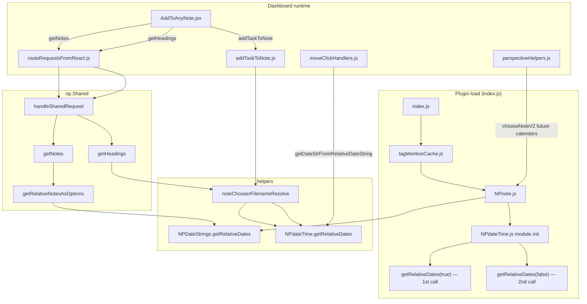

# Relative dates: Dashboard call chains

How **jgclark.Dashboard** reaches `getRelativeDates()` in `@helpers/NPDateStrings.js` and `@helpers/NPdateTime.js`.

Dashboard **never imports** either helper directly. All paths are indirect (helpers, np.Shared, or module side effects).

---

## Two implementations

| Module | Function | Sync? | Typical use from Dashboard |
|--------|----------|-------|----------------------------|
| `@helpers/NPDateStrings.js` | `getRelativeDates(useISODailyDates)` | async (`Promise`) | NoteChooser list entries (`<today>`, `<thisweek>`, …) via np.Shared |
| `@helpers/NPdateTime.js` | `getRelativeDates(useISODailyDates)` | sync | Module-init cache; resolving `<today>` → real filename; calendar move relative strings |

Do not confuse them: **listing** relative notes in the chooser uses **NPDateStrings**; **resolving** a chosen token to a storage filename uses **NPdateTime** (via `noteChooserFilenameResolve`).

---

## First call to `NPdateTime.getRelativeDates()` on Dashboard start

When NotePlan loads the Dashboard plugin, it evaluates `src/index.js`. The **first** import chain that pulls in `@helpers/NPdateTime.js` is:

```
src/index.js
  import { generateTagMentionCache } from './tagMentionCache.js'
    → tagMentionCache.js
        import { findNotesMatchingHashtagOrMention, getNotesChangedInInterval } from '@helpers/NPnote'
          → helpers/NPnote.js
              import { displayTitleWithRelDate, getDateStrFromRelativeDateString } from '@helpers/NPdateTime'
                → helpers/NPdateTime.js  (module body runs to completion)
```

After `getRelativeDates` is defined in `NPdateTime.js`, a top-level constant is initialized:

```javascript
const relativeDatesISO = getRelativeDates(true)   // ← 1st call
```

So on Dashboard plugin load:

1. **First call** — `getRelativeDates(true)`  
   - Fills the module-level `relativeDatesISO` cache (ISO daily date strings, e.g. `2026-05-16`).  
   - Used later by `getDateStrFromRelativeDateString()` and related helpers.

It is **synchronous**, **automatic**, and **not** triggered by opening the Dashboard window or running a command. It happens once per JS context when `NPdateTime` is first imported.

After that, re-importing `NPdateTime` (e.g. from `dashboardHelpers.js`, `noteChooserFilenameResolve.js`, or `dataGenerationDays.js`) does **not** call `getRelativeDates` again—the module is already initialized.

> **Note:** `NPnote.js` also imports `@helpers/NPDateStrings` and `@helpers/noteChooserFilenameResolve` (which imports `NPdateTime` again). Those run after `NPdateTime` has already finished initializing, so they do not produce additional init-time calls.

---

## Path A — `NPDateStrings.getRelativeDates` (async)

### A1. Add Task → NoteChooser (`getNotes`)

User opens **Add Task** and the note dropdown loads (or reloads) relative options.

```
AddToAnyNote.jsx
  loadNotes() / handleNoteChooserOpen
    requestFromPlugin('getNotes', { includeRelativeNotes: true, ... })
      routeRequestsFromReact.js  (newCommsRouter, useSharedHandlersFallback: true)
        Dashboard has no getNotes handler → np.Shared fallback
          DataStore.invokePluginCommandByName('handleSharedRequest', 'np.Shared', ...)
            np.Shared/src/sharedRequestRouter.js  →  getNotes()
              np.Shared/src/requestHandlers/getNotes.js
                getRelativeNotesAsOptions(includeDecoration)
                  np.Shared/src/requestHandlers/noteHelpers.js
                    await getRelativeDates(true)   ← @helpers/NPDateStrings.js
```

Relevant Dashboard files:

- `src/react/components/Header/AddToAnyNote.jsx` — sets `includeRelativeNotes: true`, calls `getNotes`
- `src/routeRequestsFromReact.js` — falls back to np.Shared for unknown REQUEST types

Relevant np.Shared files:

- `src/requestHandlers/getNotes.js`
- `src/requestHandlers/noteHelpers.js` — `getRelativeNotesAsOptions()`

### A2. Perspective diagnostic → `chooseNoteV2`

Only when running **`logPerspectiveFiltering`** (or similar) **without** a filename argument, so the plugin prompts for a note with future calendar entries included:

```
perspectiveHelpers.js
  chooseNoteV2('Choose note to test', allNotesSortedByChanged(), true, false, true)
                                                      calendar ↑      future ↑
    @helpers/NPnote.js  chooseNoteV2()
      if (includeFutureCalendarNotes) {
        await getRelativeDates(true)   ← @helpers/NPDateStrings.js
      }
```

The fifth argument `includeFutureCalendarNotes: true` is what triggers this.

---

## Path B — `NPdateTime.getRelativeDates` (sync, beyond module init)

### B1. Module init (see above)

First/second calls on plugin load — `getRelativeDates(true)` then `getRelativeDates(false)` in `NPdateTime.js`.

### B2. Add Task → save task (`addTaskToNote`)

Resolves NoteChooser values like `<today>` to a real storage filename before opening the note:

```
AddToAnyNote.jsx
  requestFromPlugin('addTaskToNote', { filename: '<today>', ... })
    routeRequestsFromReact.js  →  addTaskToNote.js
      resolveNoteChooserFilenameForLookup(filename)
        @helpers/noteChooserFilenameResolve.js
          getRelativeTokenFilenameEntries()  (60s cache)
            getRelativeDates(true)   ← @helpers/NPdateTime.js  (3rd+ call at runtime)
```

Files:

- `src/requestHandlers/addTaskToNote.js`
- `@helpers/noteChooserFilenameResolve.js`

### B3. Add Task → HeadingChooser (`getHeadings`)

When the heading dropdown loads for a note chosen as `<today>` (etc.):

```
DynamicDialog → HeadingChooser.jsx
  requestFromPlugin('getHeadings', { noteFilename: '<today>', ... })
    routeRequestsFromReact.js  →  np.Shared handleSharedRequest
      np.Shared/src/requestHandlers/getHeadings.js
        resolveNoteChooserFilenameForLookup(params.noteFilename)
          getRelativeDates(true)   ← @helpers/NPdateTime.js  (via same cache as B2)
```

### B4. Calendar move (`getDateStrFromRelativeDateString`)

Does **not** call `getRelativeDates` again at runtime; it reads the **module-init** `relativeDatesISO` array:

```
moveClickHandlers.js  doMoveFromCalToCal()
  getDateStrFromRelativeDateString(newDateStr)
    @helpers/NPdateTime.js  (iterates relativeDatesISO from init)
```

### B5. Other Dashboard files that import `NPdateTime`

These do **not** add extra init calls if `NPdateTime` is already loaded (it will be, via `tagMentionCache` → `NPnote` on plugin load):

| File | Imports from `NPdateTime` |
|------|---------------------------|
| `src/dashboardHelpers.js` | `getDueDateOrStartOfCalendarDate` |
| `src/dataGenerationDays.js` | `toNPLocaleDateString` |
| `src/dataGenerationOverdue.js` | `getDueDateOrStartOfCalendarDate` |
| `src/moveClickHandlers.js` | `calcOffsetDateStr`, `getNPWeekData`, `getDateStrFromRelativeDateString` |
| `src/moveWeekClickHandlers.js` | `calcOffsetDateStr` |

---

## Flow overview



---

## Quick reference

| User action | Helper | Entry point |
|-------------|--------|-------------|
| Plugin loads | `NPdateTime` | `index.js` → `tagMentionCache` → `NPnote` → module init (calls 1 & 2) |
| Add Task: open note list | `NPDateStrings` | `getNotes` → `getRelativeNotesAsOptions` |
| Add Task: save with `<today>` | `NPdateTime` | `addTaskToNote` → `resolveNoteChooserFilenameForLookup` |
| Add Task: pick heading on `<today>` | `NPdateTime` | `getHeadings` → `resolveNoteChooserFilenameForLookup` |
| Move task between calendar notes | `NPdateTime` (cached) | `getDateStrFromRelativeDateString` |
| Perspective “choose note to test” | `NPDateStrings` | `chooseNoteV2` with `includeFutureCalendarNotes: true` |

---

## Related files (outside Dashboard)

- `@helpers/NPDateStrings.js` — async `getRelativeDates`, `getRelativeDatesUsingNPAPI`
- `@helpers/NPdateTime.js` — sync `getRelativeDates`, module caches, `getDateStrFromRelativeDateString`
- `@helpers/noteChooserFilenameResolve.js` — maps `<today>` etc. to filenames (uses `NPdateTime`)
- `np.Shared/src/requestHandlers/noteHelpers.js` — `getRelativeNotesAsOptions` (uses `NPDateStrings`)
- `np.Shared/src/sharedRequestRouter.js` — routes `getNotes`, `getHeadings`, …

See also **CHANGELOG** entries for Add Task / NoteChooser relative-note fixes (v2.4.0.x).
