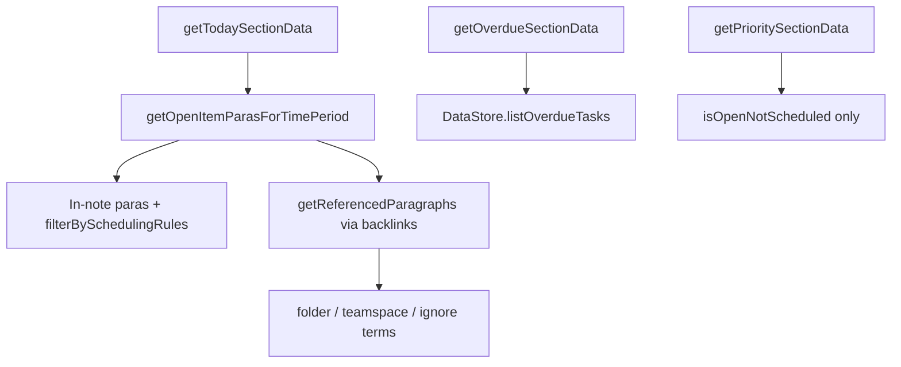

# Plan: Dashboard "Plus Dates"

Status: planning (not implemented).  
Last updated: 2026-08-22.

## Goal

Treat `>YYYY-MM-DD+` as **virtual `>today` for Dashboard section placement** once `today >= that date`, without rewriting the note.

Example: on or after 2025-04-05, `Call bank >2025-04-05+` should appear wherever a `>today` task would (primarily Today / Today-referenced).

**Decided:** once activated, a plus date is **always** treated as `>today` until the task is completed. It stays in Today; it does **not** move to Overdue on later days.

---

## What already exists

Plus dates are not new in the ecosystem:

| Piece | Role today |
|-------|------------|
| `RE_PLUS_DATE` / `RE_PLUS_DATE_G` in `helpers/dateTime.js` | Match `>(YYYY-MM-DD)(+)*` |
| `updateDatePlusTags()` in `helpers/note.js` | **Mutates** content to `>today` (or keeps date + adds `>today`) |
| TaskAutomations `/Update >date+ tags` | User-driven rewrite command |

Dashboard currently does **not** apply this semantics. Placement uses literal matches in `filterBySchedulingRules` (`dashboardHelpers.js`): keep unscheduled, or `>YYYY-MM-DD` for that day, or (Today only) `>today`.

Referenced discovery similarly requires `>${thisDateStr}` or `>today` in `getReferencedParagraphs` (`helpers/NPnote.js`).

So a task with only `>2025-04-05+` never enters today's backlink set, and once past that date it is usually treated as a normal overdue / past-dated schedule - not as `>today`.

---

## Current date -> section pipeline (relevant bits)

Key predicates:

- **Today keep:** unscheduled, or `>YYYY-MM-DD` for that day, or (Today only) `>today`
- **Future hide:** `includesScheduledFutureDate` (compares bare ISO date; trailing `+` is ignored by the regex, so future plus dates already behave as future)
- **Overdue:** `listOverdueTasks` + filters; past dates without `+` go here
- **Priority:** explicitly excludes anything with a schedule tag

---

## Proposed semantics

| Content | Before activation date | On/after activation date |
|---------|------------------------|---------------------------|
| `>2025-04-05+` | Hidden from Today (future-scheduled) | Treated as `>today` for section placement; stays in Today until done |
| `>2025-04-05` (no `+`) | Unchanged | Unchanged (overdue / calendar rules as today) |
| `>today` | Unchanged | Unchanged |

**Not changed:** note content, click-handlers that rewrite dates, TaskAutomations rewrite command.

**Activation rule** (align with existing `updateDatePlusTags`): `todayHyphenated >= isoDate` when `+` is present.

**Interpretation helpers** (suggested new shared helpers, e.g. in `helpers/dateTime.js`):

- `isActivatedPlusDate(content, asOfISO = today): boolean`
- `contentActsAsToday(content, asOfISO = today): boolean` - true if `>today` OR activated `>YYYY-MM-DD+`
- `findActivatedPlusDates(content, asOfISO): Array<string>`

---

## Where to hook (minimal, correct set)

### A. Shared "acts as today" helper (helpers)

Centralize so Dashboard, explain filters, and tests stay aligned. Avoid scattering `includes('>today')` replacements.

### B. Scheduling filters (Dashboard)

- `filterBySchedulingRules` in `dashboardHelpers.js` - Today path: also keep paras where `contentActsAsToday(...)`.
- `isReferencedToPeriod` / explain path in `explainSelectedItemFilters.js` - same for Today.
- Optionally `findOpenTodosInNote` in `helpers/NPnote.js` if anything else relies on it.

### C. Discovery for Today-referenced items (hardest part)

`getReferencedParagraphs` only sees notes that **link to today's calendar note**. A project task with only `>2025-04-05+` does **not** create a backlink to today after that date.

So filters alone are not enough: activated plus dates in project notes will never appear unless we **add a discovery pass**.

Candidate sources:

1. **`DataStore.listOverdueTasks()`** - already used for OVERDUE; activated past plus dates are likely in that set (need to verify with NotePlan). Cheap when Overdue is already on; one extra API call when Overdue is off.
2. **Vault search** for `>` + date pattern with `+` - complete but expensive on every Today refresh.
3. **Dedicated cache** (similar spirit to tagMentionCache) - best long-term, more build cost.

Recommended v1 approach: **reuse `listOverdueTasks` when available**, filter to open items whose content has an activated plus date, merge into Today, and **exclude them from Overdue** so they do not double-count. Fall back or add search only if the API omits some plus-date cases.

### D. Overdue / Priority / Tags / Search

| Section | Likely change |
|---------|----------------|
| **OVERDUE** | Exclude activated plus dates so they are not left in Overdue while acting as Today |
| **PRIORITY** | Keep excluding scheduled items; activated plus dates still have a schedule tag, so stay out of Priority (same as `>today`) |
| **TAG / SEARCH** | Usually show as-is; optionally treat activated plus dates as "not future" when future-filtering (`includesScheduledFutureDate`) |
| **Yesterday / Tomorrow / Week…** | No special plus-date injection unless week-period `+` is added later |

### E. Display (optional - undecided)

Keep showing the literal `>2025-04-05+` in the lozenge (honest to the note), or add a subtle "acts as today" cue. Prefer **no content rewrite** in HTML.

### F. Settings (undecided)

Decide whether this is always on, or behind a Dashboard setting (e.g. `treatPlusDatesAsToday`). Given TaskAutomations already taught users this pattern, default **on** is reasonable, with a toggle if an escape hatch is wanted.

---

## Performance implications

### Cheap (string predicates on paras already in memory)

Updating `filterBySchedulingRules` / `contentActsAsToday` is **O(paras in that note)** - microseconds relative to note I/O. Same for `includesScheduledFutureDate` (regex already ignores trailing `+`).

Negligible on Today / Yesterday / Week generation.

### Expensive (discovery)

| Approach | Cost | When it hurts |
|----------|------|----------------|
| Filter-only (no discovery) | ~0 | Incomplete feature for project notes |
| Extra `listOverdueTasks` when Overdue already refreshed | Marginal (reuse result) | Best if orchestrator already fetches overdue |
| Extra `listOverdueTasks` only for Today when Overdue off | One NotePlan API call per Today refresh | Medium; similar to current Overdue cost |
| Full vault search each Today refresh | High | Large vaults; competes with TAG/search cost |
| Cache of notes containing `+` | Build/invalidate cost; cheap reads | Worth it if plus dates are common and Overdue API is incomplete |

**Orchestrator note:** `getSomeSectionsData` already couples Yesterday + Overdue. Plus Dates should similarly couple **Today + Overdue**: fetch overdue once, split into "activated plus -> DT" vs "true overdue". Avoid a second `listOverdueTasks` when both sections refresh.

### Not a concern (for v1)

- React memoization / WebView `setPluginData` size: same order of magnitude item counts as today.
- Rewriting notes: explicitly out of scope, so no write storms.

### Risk if done poorly

Scanning the whole vault on every incremental Today refresh would regress startup and Refresh. Prefer API reuse or a cache keyed off change interval (pattern already used by `tagMentionCache` / `getNotesChangedInInterval`).

---

## Suggested implementation phases

1. **Helpers + unit tests** - `contentActsAsToday`, activated plus detection; edge cases (multiple dates, `>date` + `>date+`, today exactly on activation day).
2. **Filter hooks** - `filterBySchedulingRules`, explain filters, tests in `dashboardHelpers.test.js`.
3. **Discovery + Overdue routing** - orchestrator shares overdue paras; activated plus go to DT; true overdue stay in OVERDUE; activated plus never stay in OVERDUE.
4. **UI/docs** - setting (if any), CHANGELOG, short user note contrasting with TaskAutomations rewrite.
5. **(Optional later)** cache if discovery via overdue proves incomplete or slow.

---

## Edge cases

1. **Multiple schedule tags** on one line (`>2024-01-01 >2025-04-05+`) - follow TaskAutomations: latest / plus wins? (undecided)
2. **Exact activation day** - treat as today (`>=`), matching `updateDatePlusTags`. **Decided.**
3. **Plus date in today's calendar note itself** - in-note filter should keep it; no discovery needed.
4. **Completed tasks** - ignore (open/checklist only).
5. **Sync duplicates** - existing dedupe paths should still apply after merge.
6. **Coexistence with TaskAutomations** - if user later runs rewrite to real `>today`, both paths should be consistent (idempotent placement).
7. **After activation, section forever** - stay in Today until done (true `>today` parity). **Decided.** Do not move to Overdue on subsequent days.

---

## Open questions (need steer)

1. **Discovery** for project-note plus dates?
   - A) Reuse / share `listOverdueTasks` (fastest path if API covers them)
   - B) Vault search each Today refresh (complete, slower)
   - C) Build a small cache
   - D) Ship filter-only first (calendar in-note only), discovery in a follow-up

2. **Scope of `+`?**
   - A) Daily only (`>YYYY-MM-DD+`) - matches existing regex / TaskAutomations
   - B) Design for week/month/… later, implement daily in v1

3. **Setting?** Always on, or a Dashboard toggle (default on)?

4. **Display:** keep showing `>2025-04-05+`, or visually treat as today in the lozenge?

---

## Related files

- `jgclark.Dashboard/src/dashboardHelpers.js` - `filterBySchedulingRules`, `getOpenItemParasForTimePeriod`
- `jgclark.Dashboard/src/dataGeneration.js` - section orchestrator (Today / Overdue coupling)
- `jgclark.Dashboard/src/dataGenerationDays.js` - Today / Yesterday / Tomorrow
- `jgclark.Dashboard/src/dataGenerationOverdue.js` - Overdue
- `jgclark.Dashboard/src/explainSelectedItemFilters.js` - diagnostic parity with filters
- `helpers/dateTime.js` - `RE_PLUS_DATE*`, `includesScheduledFutureDate`, `findScheduledDates`
- `helpers/note.js` - `updateDatePlusTags` (mutating predecessor)
- `helpers/NPnote.js` - `getReferencedParagraphs`
- `dwertheimer.TaskAutomations` - existing user-facing `>date+` rewrite command
