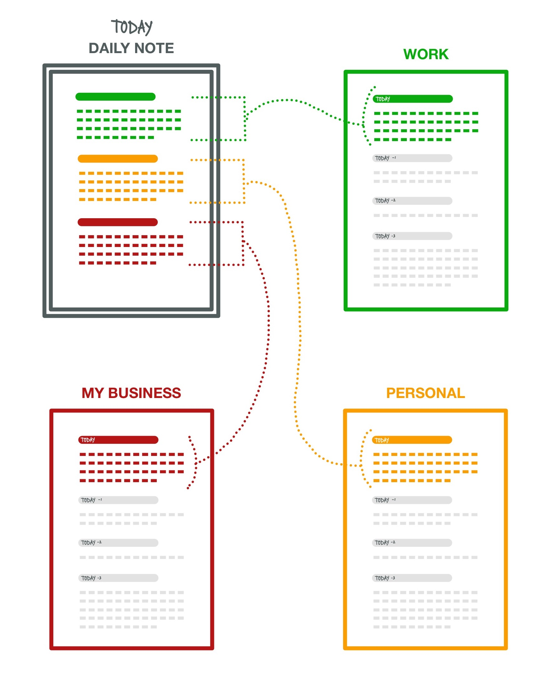

# 🗃 Filer plugin
This plugin provides extra commands to help move or copy things around in NotePlan. It handles individual lines, or the currently selected text, or a 'block' of text (any indented text, including sub-tasks). Most allow you to do the filing/moving _without having to lose your flow by switching to the other note_.

It has some settings, which you review and change by clicking on the ⚙️ gear button on the 'Filer' line in the Plugin Preferences panel (on macOS) or by running the '/Filer: update plugin settings' command (on iOS).

## /move paragraph or selection
The **/move paragraph** command (aliased to **/mp** and **/fp**) quickly **files** (moves) lines to different notes in NotePlan, without having to lose your flow by switching to the other note. It works on any sort of lines, not just tasks.

It pops up the command bar to choose the note you want to move it to, followed by the heading within that note to move it after. Where possible it will visually highlight the lines it will be moving (on NotePlan v3.6.2+). You can press Escape (on Mac) at any time to cancel.  The move happens in the background, leaving you in the current note.

It will move either the currently selected region (you don't need to select the whole of the first or last lines; the plugin will grab the whole lines), or just the current line the cursor is in, plus any indented ('children') lines that follow it.

NB: due to limitations in the API it's not yet possible to move items to a Calendar note that doesn't already exist. I intend to improve this when the API supports it.

## /move paragraph block
This extends the first command, by also moving commands in the current paragraph 'block'. If the 'Include lines from start of Section in the Block?' setting is true, it takes the most recent heading and its following section, up to the next heading of the same level or higher, or the next horizontal line, or the start of the `## Done` or `## Cancelled` section. This means you don't have to move the cursor to the start of the section before you run it.

From v0.7.0, you can turn on 'Use a tighter definition of when a Block finishes?' in the settings, which will stop the section at the next blank line, as well as next heading of the same level or higher, or the next horizontal line, or the start of the `## Done` or `## Cancelled` section.

## /quick move to <...> note
These 4 commands each moves lines to the current weekly note, using the same selection strategy as /mp (see above). The move happens in the background, leaving you in the flow in your current note. (Available with weekly notes from NotePlan v3.6.)

- **/quick move to Today's note** (alias **/qmtd**) -- Note: this is different from the existing 'Move Task To Today ⌘0' shortcut, which actually _schedules_ not moves.
- **/quick move to Tomorrow's note** (alias **/qmtm**) -- Note: this is different from the existing 'Move Task To Tomorrow ⌘1' shortcut, which actually _schedules_ not moves.
- **/quick move to Weekly note** (alias **/qmw**)
- **/quick move to Next Weekly note** (alias **/qmnw**)

They could be mapped to shortcut keys to make using them even faster.

## /add sync'd copy to note
This command (alias **/asc**) adds a sync'd copy of the current line to a section in another note.  Here's a demo with two notes side by side, only to make it clearer:


NB: This feature only works on single lines, not whole blocks, at the moment.

## various /... note link ... commands
There are 4 related commands that move or copy lines in calendar notes that include a `[[note link]]` to regular notes with that title:
- **/move note links**
- **/move note links (recently changed)**
- **/copy note links**
- **/copy note links (recently changed)**

For example, if you collect tasks and notes on 3 different main areas in your daily note, you might want to copy or move those to different 'progress log' notes at the end of each day:


_(Thanks to @jord8on for the graphic which inspired this set of commands.)_

In practice running /copy note links command on a daily note can implement:


There are a number of settings to make it useful for a variety of ways of organising your notes:

- Types of lines to file: for the these commands to choose what sorts of lines to move/copy:
  - all lines
  - all but incomplete task/checklist items
  - only completed task/checklist items
  - only non-task/checklist items
- File the wider block the note link is in? If set, this command will include the rest of the following block this line is in: any indented lines, or (if this line is a heading) all lines following until a blank line, or heading of the same level or higher. Default is not to use blocks, which only files this line.
- Where to add in the note: If the [[note link]] doesn't include a heading, then this controls whether filed lines get inserted at the start or end of the note.
- Allow preamble before first heading? If set, some 'preamble' lines are allowed directly after the title. When filing/moving/inserting items with these commands, this preamble will be left in place, up to and including the first blank line, heading or separator. Otherwise the first heading will be directly after the note's title line (or frontmatter if used).
- Tag that indicates a [[note link]] should be ignored: If this tag (e.g. "#ignore") is included in a line with a [[note link]] then it (and where relevant the rest of its block) will not be moved or copied.

In the demo above, the daily note includes the date ("Tues 21/3") as part of the (sub)heading. As this is copied into the project log, it serves as an automatic index in that note. To add today's date in whatever style you wish is relatively simple using the [date commands in the Templating plugin](https://nptemplating-docs.netlify.app/docs/templating-examples/date-time).

The **/... (recently changed)** versions of these commands operate on recently-changed calendar notes, not just the currently open one. To contol this there's an additional setting:
- How many days to include in 'recent' changes to calendar notes? This sets how many days' worth of changes to calendar notes to include? To include all days, set to 0.

For example, this can be used to copy at the end of each day from the daily note a section with any completed tasks, and any notes that it contains, to a 'progress log' note. This can be run on demand, or could be automated through the following method ...

### Running '/... note links ...' through a Template
When you've set the settings as you wish, then you can run either of the "/... (recently changed)" commands from a Template using command "/np:execute" (or "/np:invoke" etc.):
```
<% await DataStore.invokePluginCommandByName("copy note links (recently changed)","jgclark.Filer",['{}']) %>
```
or, for the 'move' variant:
```
<% await DataStore.invokePluginCommandByName("move note links (recently changed)","jgclark.Filer",['{}']) %>
```

You can then have this run as part of your Daily Template processing. I suggest you set the 'recent days' setting to 3 or more, to cover periods where you don't or can't run the Template.

You can override your usual settings by passing extra parameters in the `[...]` above. Please see this plugin's `plugin.json` file to know what the settings are called.

You can also run from an x-callback call. At simplest this is:
```
noteplan://x-callback-url/runPlugin?pluginID=jgclark.Filer&command=move%20note%20links%20%28recently%20changed%29&arg0=
```

## /new note from clipboard
This command (alias **/nnc**) takes the current text in the clipboard to form the basis of a new note. The command asks for the note title and folder location.

## /new note from selection
This command (alias **/nns**) takes the current selected text to form the basis of a new note. The command asks for the note title and folder location.

## /filer:update plugin settings
This command allows settings to be changed on iOS/iPadOS.

## Support
If you find an issue with this plugin, or would like to suggest new features for it, please raise a [Bug or Feature 'Issue'](https://github.com/NotePlan/plugins/issues).

If you would like to support my late-night work extending NotePlan through writing these plugins, you can through:

[](https://www.buymeacoffee.com/revjgc)

Thanks!

## History
Please see the [CHANGELOG](CHANGELOG.md).
