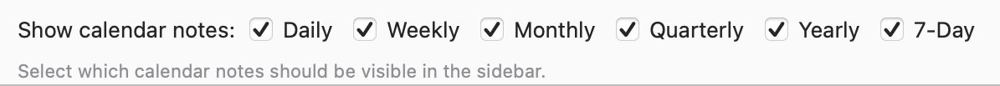
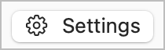

# 💭 Journalling & Reviews Plugin

This plugin makes it easier for you to journal and/or review your days, weeks, months, quarters, and years in NotePlan. It also speeds up applying templates at the start or end of each period.

**Requirements:** NotePlan **3.20** or later (integrated HTML plugin windows). This plugin replaces the older **Journalling Helpers** plugin for current NotePlan versions; on first install, settings will be migrated from that plugin automatically.

### Configuration

To use weekly, monthly, quarterly, or yearly notes, turn them on in **NotePlan Settings** → Calendar:




All commands expect some **configuration** first. On Mac, open the **💭 Journalling & Reviews** card in Plugin Preferences, then use the gear button to edit settings. 

## Quickly applying templates at the start or end of a period

The NotePlan site has good [articles on Templates](https://help.noteplan.co/article/136-templates) and a [Template Gallery](https://noteplan.co/templates).

For template tag commands (events, quote-of-the-day, weather, etc.), see the [Templating documentation](https://noteplan.co/templates/docs).

### `/dayStart` and `/todayStart`

These apply your configured start-of-day template from the `Templates` folder. (Since about NotePlan 3.17, [auto-insert templates](https://help.noteplan.co/article/229-auto-insert-templates) into new calendar notes reduce the need for manual runs.)

- **`/todayStart`**: applies your **Start-of-Day** template only to **today's** calendar note, regardless of which note is open.
- **`/dayStart`**: appends that template to the **currently open daily note** (or today’s note if you are not in a daily note). Be careful on **other** dates: tags like `<%- date… %>` or `<%- weather() %>` still resolve to **today**.

### `/weekStart`, `/monthStart`, and end-of-period commands

**`/weekStart`** and **`/monthStart`** behave like **`/dayStart`** for weekly and monthly notes.

**`/dayEnd`**, **`/todayEnd`**, **`/weekEnd`**, **`/monthEnd`** mirror the “start” commands but use your **end-of-period** templates—useful for habit or stats summaries from [**Habits & Summaries**](https://noteplan.co/plugins/jgclark.Summaries) or cleanup via [**Tidy Up**](https://noteplan.co/plugins/np.Tidy).

---

## Periodic reviews (v2)

There is no single “right” review format. What matters is pausing to answer questions about what went well, what did not, goals, gratitude, mood, and so on.

### Templates you fill in by hand

You can use an end-of-day or end-of-week template (for example the [Mental Health Journal](https://noteplan.co/templates/mental-health-journal-template)) via **`/dayEnd`** or **`/weekEnd`**, then type answers in the note.

### Interactive review window (v2 betas)

Run **Daily Review**, **Weekly Review**, **Monthly Review**, **Quarterly Review**, or **Yearly Review** from the Command Bar (or pinned sidebar where offered). Daily Review aliases include `dr`, `journal`, and `review`.

These commands open a **single** themed HTML window that shows **all** questions at once (colours and fonts follow your current NotePlan theme). When you submit, answers are written under the correct section heading in the calendar note.

**New or changed in v2:**

- **Window placement:** **Review Window type** — *New Window*, *Main Window*, or *Split View* in the main window.
- **Open the calendar note when reviewing it?** (default on) — skips the old “open this note?” prompt when appropriate.
- **Question strings** no longer use `||` delimiters; use line breaks (and optional `\n`) instead.
- **Prefill:** If matching answers already exist in the note (under your review/journal heading when present, otherwise the whole note), they appear in the form. The latest matching block wins.
- **Summary block** at the top of the window:
  - **Daily:** completed tasks from notes touched that day (Dashboard-style), plus **calendar events** (counts and timed duration respect **EventHelpers**-style settings where applicable).
  - **Week / month / quarter / year:** done items in that period tagged `#win` or `#bigwin`, shown as multi-column checklist-style rows. Task text is rendered like note HTML export (hashtags, mentions, links, etc.); `@done(…)` stamps are omitted for readability.
- **Calendars to include in review summaries:** optional filter list; leave empty to include all calendars.
- **Correct note for the period:** the open editor is only reused when it is the **same period type and title** as the command (e.g. today for a daily review). Otherwise the plugin opens the intended calendar note. Quarterly notes use NotePlan’s title format **`YYYY-Qn`** (e.g. `2026-Q1`).
- **Planning vs reviewing:** For each period you can set a **planned items** name (defaults such as *Big Wins*, *Big Rocks*, *Key Outcomes*, *Goals*, *Theme*). After the main form, a **planning** area can write an **H2** and `>> …` tasks at the **start** of the **next** period’s calendar note, replacing any existing section with that title. Empty planning clears that section on the next note. The heading uses `{planName} for {next period title}` (e.g. `Big Rocks for 2026-W15`), separate from the on-screen “Planned:” / “Planning: …” labels.

### Section headings (split in v2)

- **Daily Journal Section Heading** — where **daily** review/journal answers are appended (default: `Journal`).
- **Review Section Heading** — where **weekly / monthly / quarterly / yearly** answers go (default: `Review`).

If the heading does not already exist in a note, the content is added at the end of the note.

### Question types and layout codes

These define input controls and how lines are written to the note:

- `<boolean>` — ticked/unticked; if ticked, the surrounding text is included in the output
- `<done>` — the same as `<boolean>` above
- `<int>` — whole number
- `<number>` — number, may include a decimal part
- `<duration>` — `[H]H:MM` (e.g. `1:05`, `12:30`)
- `<string>` — single-line text
- `<bullets>` — multi-line; each non-empty line becomes a markdown bullet (`- `)
- `<checklists>` — same, with checklist markers (`+ `)
- `<tasks>` — same, with task markers (`* `)
- `<mood>` — pick from your configured mood list

You can include Headings amongst the questions:

- `<h2>` / `<h3>` (legacy: `<subheading>`) — output as headings in the note/HTML.
- Literal `##` / `###` lines in settings are also supported.

Placeholders

- `<date>` — current review period’s calendar title in the window and in saved output (e.g. `2026-03-28`, `2026-W13`, `2026-Q1`). Substituted in **parsed** heading and label text too (e.g. `## Weekly Review for <date>` matches the period title in the UI).
- `<datenext>` or `<nextdate>` — the **following** period in the same format (e.g. weekly `2026-W52` → `2027-W01`).
- line breaks or `\n`. 

Note: Multiple `<boolean>`, `<int>`, or `<number>` items on one line are supported; answers are merged on one line with spaces (without `||`).

If a question is left empty, that line is omitted from the output. If a line in the note already starts with the same question text, it is treated as an existing answer, and prefilled.

### Example (Daily Review)

Question string:

```
<h2>Stats for <date>
Health: @sleep(<number>) @work(<int>) @fruitveg(<int>) #stretches<boolean> #closedRings<boolean>
Work: @work(<number>)

<h3>Journal
Mood: <mood>
Gratitude: <string>
Wins: <bullets>
Challenges: <string>
```

The v2 window shows the summary (when applicable), then this layout; submitting might produce:

```markdown
## Stats for 2026-04-06
@sleep(6.8) @work(7)
@fruitveg(4) #stretches
### Journal
Mood: 😇 Blessed
Gratitude: Went to great Nana's 100th birthday party -- result!
Wins:
- First win...
- Another one
```

### Moods

Comma-separated list of labels (emoji optional).

---

## Screenshots to capture

Use these when updating plugin or website docs (retina/`@2x` where you already use `calendar-settings@2x.png`):

1. **Daily Review window** — full window with **Summary** (tasks + events), main questions, and **planning** section; preferably **New Window** and one of **Split View** / **Main Window** if you document all three modes.
2. **Weekly (or monthly) Review window** — Summary showing **#win** / **#bigwin** styling and a heading that uses **`<date>`** (e.g. “Weekly Review for 2026-W14”).
3. **Quarterly note** — editor or sidebar showing title **`YYYY-Qn`** and a submitted review block (optional but clarifies Q-format fix).
4. **Next-period planning output** — the **next** day/week/month note showing the **H2** + **`>>`** tasks written by the planning section (paired with a screenshot of the planning fields filled in), if you document that feature visually.

---

## Support

Issues and feature ideas: [NotePlan plugins on GitHub](https://github.com/NotePlan/plugins/issues).

If you would like to support my late-night work extending NotePlan through writing these plugins, you can through:

[](https://www.buymeacoffee.com/revjgc)

Thanks!

## History

See the [CHANGELOG](https://github.com/NotePlan/plugins/blob/main/jgclark.Journalling/CHANGELOG.md) for v2 beta notes and migration details.
