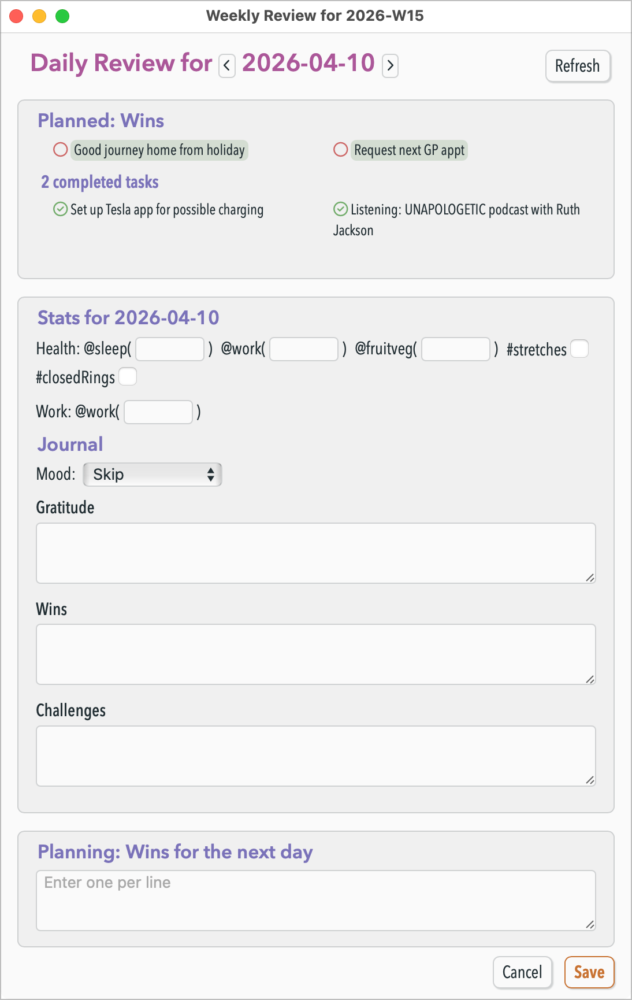

# 💭 Periodic Reviews Plugin

This plugin makes it easier for you to review your days, weeks, months, quarters, and years in NotePlan. It's designed to help you intentionally focus on whatever are the most important projects/goals/behaviours across all of your different endeavours in life.

Many truly productive people suggest that regular reviews are the most important tool to help us focus on the most important outcomes in life.

There is no single “right” way to review personal or work aims or goals. What matters is pausing to answer questions about what went well, what did not, goals, gratitude, mood, and so on. This is where this plugin fits in.

First you need to configure the questions you want to use for each time period (some of daily, weekly, monthly, quarterly and yearly). Then at the end of the period, run the **/Daily Review** command (alias: 'dr'), or the similar one for the other review periods.

The plugin then opens a window that shows **all** these questions in a window form (with colours and fonts follow your current NotePlan theme). When you submit the form, your answers are written under the correct section heading in the calendar note.

Further, it will then ask you to decide your top few tasks/goals/priority work for the next period. There can only be a very few of these. If you give any, they will be written into the next period's note, prefixed with a `>>` marker (customisable), to indicate these most important things to focus on.

### Example (Daily Review)
Here's an example of the Daily Review Window:



This is generated from the following settings:
- "Daily Review/Journal Questions":

```
## Stats for <date>
Health: @sleep(<number>) @work(<int>) @fruitveg(<int>) #stretches<boolean> #closedRings<boolean>
Work: @work(<number>)

### Journal
Mood: <mood>
Gratitude: <string>
Wins: <bullets>
Challenges: <string>
```

- "Daily Review/Journal Questions": `Wins`

Submitting the form will insert something like this into **today**'s note:

```markdown
## Stats for 2026-04-10
@sleep(6.8) @work(7)
@fruitveg(4) #stretches

### Journal
Mood: 😇 Blessed
Gratitude: Went to great Nana's 100th birthday party -- result!
Wins:
- First win...
- Another one
```
And if  you enter items in the 'Planning' section, then it will prefix something like this into **tomorrow**'s note:
```markdown
## Wins for 2026-04-10
* >> First win
* >> Second win
```

### Which period is reviewed?
If a daily note is currently open when **/Daily Review** is called, then that day is reviewed, otherwise today's note is used. The same goes for the other calendar periods.

The window first shows a Summary section, that starts with a reminder of the main few tasks/aims/goals you set for that period, and whether they were completed or not. For Daily notes only, it includes alist of tasks completed that day, plus a list of calendar events.

### Basic Configuration
To use weekly, monthly, quarterly, or yearly notes, turn them on in **NotePlan Settings** → Calendar:


 Open the **💭 Journalling & Reviews** card in Plugin Preferences, then use the gear button to edit settings. 

### Setting the Review Questions
The terms in angle brackets define both the input controls and how lines are written to the note. The available input controls are:

- `<boolean>` — ticked/unticked; if ticked, the surrounding text is included in the output
- `<done>` — the same as `<boolean>` above
- `<int>` or `<integer>` — whole number (integer)
- `<number>` — number, which may include a decimal part
- `<duration>` — `[H]H:MM` (e.g. `1:05`, `12:30`)
- `<string>` — single-line text
- `<bullets>` — multi-line; each non-empty line is prefixed with a markdown bullet (`- `)
- `<checklists>` — same, with checklist markers (`+ `)
- `<tasks>` — same, with task markers (`* `)
- `<mood>` — pick from your configured mood list.

You can include headings and placeholders:

- Literal `##` / `###` lines in settings (and legacy `<subheading>`) — output as headings in the note/HTML.
- `<date>` — current review period’s calendar title in the window and in saved output (e.g. `2026-03-28`, `2026-W13`, `2026-Q1`). Substituted in **parsed** heading and label text too (e.g. `## Weekly Review for <date>` matches the period title in the UI).
- `<datenext>` or `<nextdate>` — the **following** period in the same format (e.g. weekly `2026-W52` → `2027-W01`).
- line breaks or `\n`. 

Notes:
- Multiple `<boolean>`, `<int>`, or `<number>` items on one line are supported
- If matching answers already exist in the note, they will appear **pre-filled**  in the form. The latest matching block wins.

### Other Settings

- **Window placement:** **Review Window type** — 'New Window' (the default), 'Main Window', or a 'Split View' within the main window.
- **Open the calendar note when reviewing it?** (default: on). 
- **Calendars to include in review summaries:** optional filter list; leave empty to include all calendars.
- **Planning vs reviewing:** For each period you can set a **planned items** name (defaults such as *Big Wins*, *Big Rocks*, *Key Outcomes*, *Goals*, *Theme*). After the main form, a **planning** area can write an **H2** and `>> …` tasks at the **start** of the **next** period’s calendar note, replacing any existing section with that title. Empty planning clears that section on the next note. The heading uses `{planName} for {next period title}` (e.g. `Big Rocks for 2026-W15`), separate from the on-screen “Planned:” / “Planning: …” labels.

### Section headings

- **Daily Journal Section Heading** — where **daily** review/journal answers are appended (default: `Journal`).
- **Review Section Heading** — where **weekly / monthly / quarterly / yearly** answers go (default: `Review`).

If the heading does not already exist in a note, the content is added at the end of the note.


If a question is left empty, that line is omitted from the output. If a line in the note already starts with the same question text, it is treated as an existing answer, and prefilled.


### Moods

Comma-separated list of labels (emoji optional).

---

## FAQ
Q: What's the minimum version of NotePlan this runs with?  
A: v3.20 (for the integrated HTML plugin windows). 

Q: How is this plugin related to your **Journalling Helpers** plugin?  
A: This plugin replaces that older plugin for the review questions functionality, but not its start- and end-of-day template helpers. On first install, those settings will be migrated from that plugin automatically, if you'd used that before.

Q: How is this different from your **Projects & Reviews** plugin?  
A: That plugin is designed to be used for assisting track and review Projects or project-like activities. It works on regular notes, and helps you review work on many projects, and review each at its suitable review interval. This plugin is designed to help you intentionally focus on whatever are the most important projects/goals/behaviours across all of your different endeavours in life.

<!-- TODO: needs to be removed ...
## Quickly applying templates at the start or end of a period

The NotePlan site has good [articles on Templates](https://help.noteplan.co/article/136-templates) and a [Template Gallery](https://noteplan.co/templates).

For template tag commands (events, quote-of-the-day, weather, etc.), see the [Templating documentation](https://noteplan.co/templates/docs).

### `/dayStart` and `/todayStart`

These apply your configured start-of-day template from the `Templates` folder. (Since about NotePlan 3.17, [auto-insert templates](https://help.noteplan.co/article/229-auto-insert-templates) into new calendar notes reduce the need for manual runs.)

- **`/todayStart`**: applies your **Start-of-Day** template only to **today's** calendar note, regardless of which note is open.
- **`/dayStart`**: appends that template to the **currently open daily note** (or today’s note if you are not in a daily note). Be careful on **other** dates: tags like `<%- date… %>` or `<%- weather() %>` still resolve to **today**.

### `/weekStart`, `/monthStart`, and end-of-period commands

**`/weekStart`** and **`/monthStart`** behave like **`/dayStart`** for weekly and monthly notes.

**`/dayEnd`**, **`/todayEnd`**, **`/weekEnd`**, **`/monthEnd`** mirror the “start” commands but use your **end-of-period** templates—useful for habit or stats summaries from [**Habits & Summaries**](https://noteplan.co/plugins/jgclark.Summaries) or cleanup via [**Tidy Up**](https://noteplan.co/plugins/np.Tidy).

-->

---

## Support

Issues and feature ideas: [NotePlan plugins on GitHub](https://github.com/NotePlan/plugins/issues).

If you would like to support my late-night work extending NotePlan through writing these plugins, you can through:

[](https://www.buymeacoffee.com/revjgc)

Thanks!

## History

See the [CHANGELOG](https://noteplan.co/plugins/jgclark.PeriodicReviews/CHANGELOG.md) for release history for v2.
