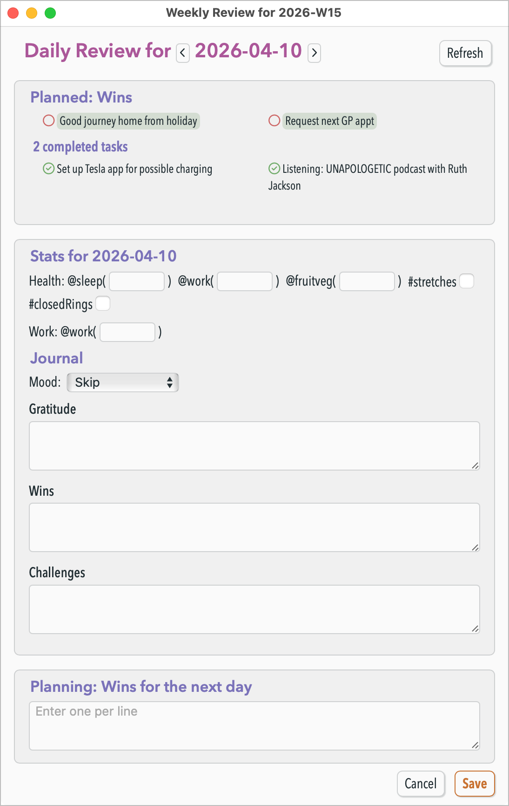
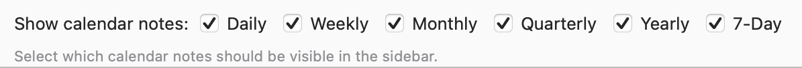

# 💭 Periodic Reviews Plugin

This plugin makes it easier for you to review your days, weeks, months, quarters, and years in NotePlan. It's designed to help you intentionally focus on whatever are the most important projects/goals/behaviours across all of your different endeavours in life.

Many truly productive people suggest that regular reviews are the most important tool to help us focus on the most important outcomes in life.

There is no single “right” way to review personal or work aims or goals. What matters is pausing to answer questions about what went well, what did not, goals, gratitude, mood, and so on. This is where this plugin fits in.

First you need to configure the questions you want to use for each time period (some of daily, weekly, monthly, quarterly and yearly). Then at the end of the period, run the **/Daily Review** command (alias: 'dr'), or the similar one for the other review periods.

The plugin then opens a window that shows **all** these questions in a window form (with colours and fonts follow your current NotePlan theme). When you submit the form, your answers are written under the correct section heading in the calendar note.

Further, it will then ask you to decide your top few tasks/goals/priority work for the next period. There can only be a very few of these. If you give any, they will be written into the next period's note with your selected big-task marker (`>>`, `!!!`, or `!!`) to indicate these most important things to focus on.

### Example (Daily Review)
Here's an example of the Daily Review Window:



This is generated from the following settings:
- "Daily Review/Journal Questions":

```
## Stats for <date>
Health: @sleep(<number>) @work(<int>) @fruitveg(<int>) #stretches<boolean> #closedRings<boolean>
Work: @work(<number>)

### Journal
Mood: <mood>
Gratitude: <string>
Wins: <bullets>
Challenges: <string>
```

- "Daily Planned items heading": `Wins`

Submitting the form will insert something like this into **today**'s note:

```markdown
## Stats for 2026-04-10
@sleep(6.8) @work(7)
@fruitveg(4) #stretches

### Journal
Mood: 😇 Blessed
Gratitude: Went to great Nana's 100th birthday party -- result!
Wins:
- First win...
- Another one
```
And if you enter items in the 'Planning' section, then it will prefix something like this into **tomorrow**'s note:
```markdown
## Wins for 2026-04-10
* >> First win
* >> Second win
```

### Which period is reviewed?
If a calendar note of the matching kind is open when you run a review command (for example yesterday's daily note when running **/Daily Review**), that note is reviewed and the editor stays on it instead of jumping to the current period. Teamspace calendar notes are supported. If no matching calendar note is open, the plugin uses the current period (today, this week, and so on).

The window first shows a **Summary** section. It starts with a reminder of the main few tasks/aims/goals you set for that period (your carry-over plan items), and whether they were completed or not. **Daily** and **Weekly** reviews also list completed tasks for the period. **Daily** reviews also include a list of calendar events. Summary subsections are collapsible (carry-over plan items are expanded by default; completed tasks and events start collapsed).

## Configuration
To use weekly, monthly, quarterly, or yearly notes, turn them on in NotePlan Settings → Calendar:



Open the **Periodic Reviews** card in Plugin Preferences, then use the gear button to edit settings. 

### Setting the Review Questions
The terms in angle brackets define both the input controls and how lines are written to the note. The available input controls are:

- `<boolean>` — ticked/unticked; if ticked, the surrounding text is included in the output
- `<done>` — the same as `<boolean>` above
- `<int>` or `<integer>` — whole number (integer)
- `<number>` — number, which may include a decimal part
- `<duration>` — `[H]H:MM` (e.g. `1:05`, `12:30`). (To be helpful, it will also successfully parse durations given as decimal hours (e.g. `@sleep(7)` pre-fills as `7:00`, `@sleep(7.5)` as `7:30`).
- `<string>` — single-line text
- `<bullets>` — multi-line; each non-empty line is prefixed with a markdown bullet (`- `)
- `<checklists>` — same, with checklist markers (`+ `)
- `<tasks>` — same, with task markers (`* `)
- `<mood>` — pick from your configured mood list.

You can include headings and placeholders:

- Literal `##` / `###` lines in settings (and legacy `<subheading>`) — output as headings in the note/HTML.
- `<date>` — current review period’s calendar title in the window and in saved output (e.g. `2026-03-28`, `2026-W13`, `2026-Q1`). Substituted in **parsed** heading and label text too (e.g. `## Weekly Review for <date>` matches the period title in the UI).
- `<datenext>` or `<nextdate>` — the **following** period in the same format (e.g. weekly `2026-W52` → `2027-W01`).
- line breaks or `\n`. 

Notes:
- Multiple `<boolean>`, `<int>`, `<number>`, or `<duration>` items on one line are supported (for example `Health: @steps(<int>) @distance(<number>) @sleep(<duration>) <string>`).
- If matching answers already exist in the note, they will appear **pre-filled** in the form. The latest matching block wins.
- When you save, existing lines are updated in place rather than duplicated. Mixed lines keep any extra `@mentions`, `#hashtags`, or free text that are not part of the template, updating only the template tokens on that line.

### Other Settings

- **Review Window type**: 'New Window' (the default), 'Main Window', or a 'Split View' within the main window.
- **Open the calendar note when reviewing it?** (default: true).
- **Calendars to include in review summaries**: optional filter list; leave empty to include all calendars.
- **Big task marker style:** choose whether major tasks/goals are indicated by `>>` (priority 4, the default), `!!!` (priority 3), or `!!` (priority 2). This is used when scanning summary/carry-over "big task" lines and when writing planning tasks to the next period.
- **Planned items suffix (for next period note):** optional text appended to each planned item written to the next period’s note (default: `#win`).
- **Review Section Heading**: The name of a section heading after which weekly/monthly/quarterly/yearly Review answers are added. If it doesn't exist, it is added at the end of the note (default: `Review`).
- **List of moods**: optional comma-separated list of possible <mood>s to select from. Can include emojis, as the default shows.

Then for the **day period**, there are 3 settings:
- **Daily Journal Section Heading**: The name of a section heading after which Daily Review/Journal answers are added. If it doesn't exist, it is added at the end of the note (default: `Journal`).
- **Daily Planned Items Heading**: Used in the review window and as the H2 title prefix for planned tasks written to the next day's note (e.g. 'Big Wins' becomes 'Big Wins for YYYY-MM-DD'). Leave blank to write planned items only, with no heading.
- **Daily Review/Journal Questions**: Multi-line string that includes both the Journal/Review questions and how to lay out the answers in the daily note (details above).

Then for each **other time period**, there are 2 settings:
- **Name for [period] Planned items**: Used in the review window and as the H2 title prefix for planned items written to the next [period]'s note (e.g. 'Theme' becomes 'Theme for 2027'). Leave blank to write planned items only, with no heading.
- **[period] Review/Journal Questions**: String that includes both the Journal/Review questions and how to lay out the answers in the [period] note (details above).

If a question is left empty, that line is omitted from the output. If a line in the note already starts with the same question text, it is treated as an existing answer, and prefilled.

---

## FAQ
Q: What's the minimum version of NotePlan this runs with?  
A: v3.20 (for the integrated HTML plugin windows). 

Q: How is this plugin related to your **Journalling Helpers** plugin?  
A: This plugin replaces that older plugin for the review questions functionality, but not its start- and end-of-day template helpers. On first install, those settings will be migrated from that plugin automatically, if you'd used that before.

Q: How is this different from your **Projects & Reviews** plugin?  
A: That plugin is designed to be used for assisting track and review Projects or project-like activities. It works on regular notes, and helps you review work on many projects, and review each at its suitable review interval. This plugin is designed to help you intentionally focus on whatever are the most important projects/goals/behaviours across all of your different endeavours in life.

## Support

Issues and feature ideas: [NotePlan plugins on GitHub](https://github.com/NotePlan/plugins/issues).

If you would like to support my late-night work extending NotePlan through writing these plugins, you can through:

[](https://www.buymeacoffee.com/revjgc)

Thanks!

## History

See the [CHANGELOG](https://noteplan.co/plugins/jgclark.PeriodicReviews/CHANGELOG.md) for release history for v2.
