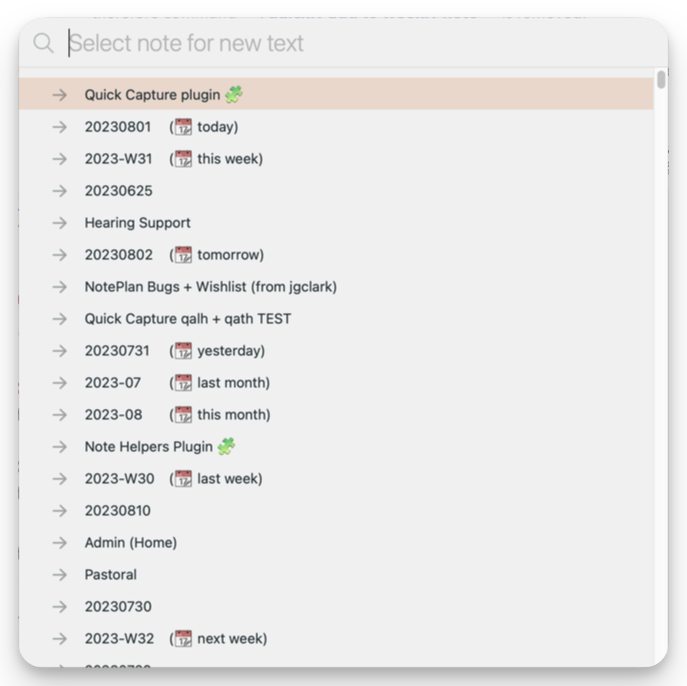

# ⚡️ QuickCapture plugin
This plugin provides commands to more quickly add tasks/todos or general text to NotePlan notes, _without having to switch away from the note you're currently working on_:

- **/quick add task to inbox** (alias **/int**): Quickly add a task to your chosen Inbox location. (To configure this, see below.)
- **/quick append task to note** (alias **/qat**): Quickly append a task to a chosen project note
- **/quick add task under heading** (alias **/qath**): Quickly add a task at the top of a chosen note's heading
- **/quick add line under heading** (alias **/qalh**): Quickly add text lines at the top of a chosen note's heading
- **/quick add to calendar note** (alias **/qac**): Quickly add a task to a chosen calendar note
- **/quick add to journal today** (alias **/qajd**): Quickly add text to the Journal section of today's daily note
- **/quick add to journal this week** (alias **/qajw**): Quickly add text to the Journal section of this week's note
- **/quick add to this month's journal** (alias **/qajm**): Quickly add text to the Journal section of this month's note
- **/quick add to this year's journal** (alias **/qajy**): Quickly add text to the Journal section of this year's note
- **/quick prepend task to calendar note** (alias **/qpc**): Quickly prepend a task to a chosen calendar note
- **/quick prepend task to note** (alias **/qpt**): Quickly prepend a task to a chosen project note. (Inserts after title or YAML frontmatter, or starting metadata lines.)

Where a command offers calendar notes as a destination, the most-used dates (`yesterday`, `tomorrow`, `this week` and their equivalents for weeks, months and quarters) have this 'relative date' added, so you can find them more easily in the long list. The list is sorted with most-recently updated first.



These can be used by Shortcuts on iOS or macOS or by other third-party apps to integrate NotePlan into your working practices: see [Using from x-callback calls](#using-from-x-callback-calls) below.

Note: there's a bug in NotePlan's API that means '/quick add task under heading' and '/quick add line under heading' don't work properly if there's an identical line to the heading you select earlier in the same file, even if it's not a markdown heading.

## Tips for macOS users
- Add Keyboard Shortcuts to get to these commands even more quickly, by using macOS System Settings > Keyboard > Shortcuts.
- My suggestions about [Using Text Expansion with NotePlan](https://noteplan.co/n/0D40215F-ACA3-4B89-8976-C6B32B1BA167) are relevant here.

## Configuration
The command `/quick add task to inbox` requires configuring, by clicking on the gear button on the 'Event Helpers' line in the Plugin Preferences panel. (Or, on iOS or iPadOS you can use the **/QuickCapture: update plugin settings** instead.)

The settings are:
- 'Where is your Inbox?': Select 'Daily' or 'Weekly' to use whatever is the current daily or weekly note. Or  choose 'Fixed' and then add the note title in the next setting
- 'InboxTitle': If the previous setting is set to 'Fixed', this is where you set the Title of that note. (Default: "📥 Inbox".)
- 'Where to add in Inbox?': either "prepend" (start) or "append" (end) in Inbox (and the other commands which use the term 'add'). Note: if the note has frontmatter, the item will be added _after_ that.
- 'Text to append to new inbox tasks': optional text  (that can include hashtags or mentions) to append to any tasks captured to the inbox.

## Using from x-callback calls
From v0.9 it's possible to call each of these commands from [outside NotePlan using the **x-callback mechanism**](https://help.noteplan.co/article/49-x-callback-url-scheme#runplugin). The URL calls all take the same form:
```
noteplan://x-callback-url/runPlugin?pluginID=jgclark.QuickCapture&command=<encoded command name>&arg0=<encoded string>&arg1=<encoded string>&arg2=<encoded string>
```
Notes:
- the number and order of arguments you pass is important
- where an argument isn't valid (empty in the table below), don't include it
- as with all x-callback URLs, all the arguments (including the command name) need to be URL encoded. For example, spaces need to be turned into '%20'.
- The matching of section headings in /qalh and /qath is done as an exact match, or (from v0.12) just the first part of it. This means it's possible to have a section such as `## Journal for 3.4.22` that changes every day, but still refer to it by the unchanging string `Journal`.
- from NotePlan v3.6.1 and plugin v0.12.0 it's possible to send one or more empty arguments, and that will cause the missing argument(s) be requested from the user, as if it were run interactively.

| Command | x-callback start | arg0 | arg1 | arg2 | arg3 |
|-----|-------------|-----|-----|-----|------|
| /quick add task to inbox | `noteplan://x-callback-url/runPlugin?pluginID=jgclark.QuickCapture&command=quick%20add%20task%20to%20inbox&` | text to add | title of the inbox note to use (optional; will ask if not given), or a **relative date** (listed below) |  |
| /quick add checklist under heading | `noteplan://x-callback-url/runPlugin?pluginID=jgclark.QuickCapture&command=quick%20add%20checklist%20under%20heading` | note title to use (can be YYYYMMDD, YYYY-MM-DD, YYYY-Wnn etc. or a relative date (listed below)) | note heading to add checklist under | text to add | heading level (1-5) if this is a new heading |
| /quick add task under heading | `noteplan://x-callback-url/runPlugin?pluginID=jgclark.QuickCapture&command=quick%20add%20task%20under%20heading` | note title to use (can be YYYYMMDD, YYYY-MM-DD, YYYY-Wnn etc. or a relative date (listed below)) | note heading to add text under | text to add | heading level (1-5) if this is a new heading |
| /quick add line under heading | `noteplan://x-callback-url/runPlugin?pluginID=jgclark.QuickCapture&command=quick%20add%20line%20under%20heading` | note title (can be YYYYMMDD, YYYY-MM-DD, YYYY-Wnn etc. or relative date  (listed below)) | note heading to add text under | text to add | heading level (1-5) if this is a new heading |
| /quick add to calendar note | `noteplan://x-callback-url/runPlugin?pluginID=jgclark.QuickCapture&command=quick%20add%20to%20calendar%20note` | note date (YYYYMMDD, YYYY-MM-DD, YYYY-Wnn etc.) or relative date (listed below) | text to add |  |
| /quick add to journal today | `noteplan://x-callback-url/runPlugin?pluginID=jgclark.QuickCapture&command=quick%20add%20to%20journal%20today` | text to add |  |  |
| /quick add to journal this week | `noteplan://x-callback-url/runPlugin?pluginID=jgclark.QuickCapture&command=quick%20add%20to%20journal%20this%20week` | text to add |  |  |
| /quick prepend task to calendar note | `noteplan://x-callback-url/runPlugin?pluginID=jgclark.QuickCapture&command=quick%20add%20to%20calendar%20note` | note date (YYYYMMDD, YYYY-MM-DD, YYYY-Wnn etc.) or relative date (listed below) | text to add |  |
| /quick append task to note | `noteplan://x-callback-url/runPlugin?pluginID=jgclark.QuickCapture&command=quick%20append%20task%20to%20note` | note title | task to append | |
| /quick prepend task to note | `noteplan://x-callback-url/runPlugin?pluginID=jgclark.QuickCapture&command=quick%20prepend%20task%20to%20note` | note title | task to prepend | |

The **relative dates** possible in some commands are:
- `today`, `yesterday`, `tomorrow`
- `this week`, `last week`, `next week`
- `this month`, `last month`, `next month`
- `this quarter`, `last quarter`, `next quarter`

Pass in in place of the 'note title' or 'note date' argument (suitably URL encoded, of course).

## Support
If you find an issue with this plugin, or would like to suggest new features for it, please raise a [Bug or Feature 'Issue'](https://github.com/NotePlan/plugins/issues).

If you would like to support my late-night work extending NotePlan through writing these plugins, you can through:

[](https://www.buymeacoffee.com/revjgc)

Thanks!

## History
See [CHANGELOG](CHANGELOG.md)
