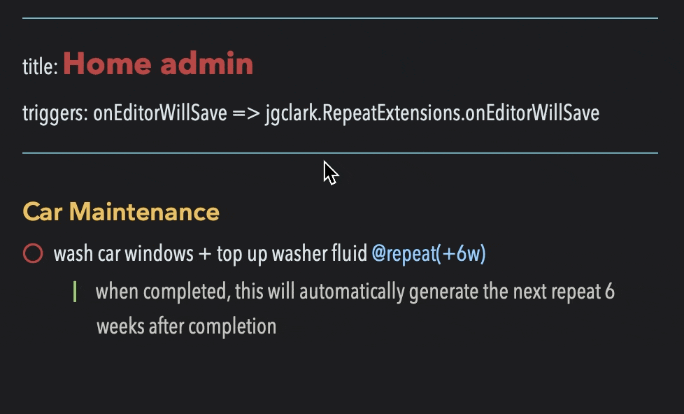

# 🔁 Repeat Extension plugin

NotePlan has a simple [built-in repeat mechanism](https://noteplan.co/faq/Notes%20&%20Todos/How%20to%20create%20a%20recurring%20or%20repeating%20todo/), which allows for `@repeat(1/n)`.  That wasn't flexible enough for my purposes, so I wrote this plugin to allow repeats **every x days, weeks, months, quarters or years**. It does the work of creating the next task using information from completed tasks that include a `@repeat(interval)` string and a completed `@done(...)` date.

Here are some examples:

| Type of repeat | The original line | The result after completing the task and then running /rpt |
|-----|-----|-----|
| every Monday (starting 2023-07-10) | `* task @repeat(1w) >2023-07-10` | `* task @repeat(1w) >2023-07-17` (i.e. the next Monday) <br /> `* [x] task @repeat(1w) >2023-07-10 @done(...) ` |
| 1st of the month (starting 2023-08-01) | `* do expenses @repeat(1m) >2023-08-01` | `* do expenses @repeat(1m) >2023-09-01` (i.e. the next month start) <br /> `* [x] do expenses @repeat(1m) >2023-08-01 @done(...) ` |
| every 2 weeks | `* put out recycling @repeat(2w)` | `* put out recycling @repeat(2w) >2021-07-15` <br /> `* [x] put out recycling @repeat(2w) @done(2021-07-01)` |
| 2 months after last done | `* top up washer fluid @repeat(+2m)` | `* top up washer fluid @repeat(+2m) >2023-09-04` <br /> `* [x] top up washer fluid @repeat(+2m) @done(2023-07-04)` |

See below for more details.

Compared with the built-in functionality, it also allows you to easily change the text of a repeated task, which otherwise means visiting all the future notes with repeats.

## Configuration
For this feature to work, **you need to have the 'Append Completion Date' setting turned on in Preferences > Todo**, and not to mind the time portion of the `@done(...)` tag being removed, as a sign that the line has been processed.

## Running it Automatically
From NotePlan v3.7.2, this plugin can **automatically generate** the new repeated task after you complete an existing one. Here's an example (from v0.5) where it will repeat 6 weeks after completion:



This requires adding the following [trigger line](https://help.noteplan.co/article/173-plugin-note-triggers) to the frontmatter at the start of _every note_ you wish to automate in this way:
``` yaml
---
title: <<the note's title on this line, instead of a markdown H1 title>>
triggers: onEditorWillSave => jgclark.RepeatExtensions.onEditorWillSave
---
```
Tip: This is most easily done by using the **/add trigger to note** command from my [Note Helpers plugin](https://github.com/NotePlan/plugins/tree/main/jgclark.NoteHelpers/).

## Running it Manually
On the _currently open note_, open the command bar and type the **/generate repeats** command.
- When run on a _Project note_, it creates the new repeated task straight before the completed task.
- When run on a _Calendar note_, it creates the new repeated task on the date of the new repeat. This uses the same calendar note type: so a repeat in a weekly note will go to the appropriate weekly note, etc.

## Specifiying the Intervals
The time intervals have two parts: number and then a character. The **character** is one of:
- `b` or `B`: business days (ignore weekends, but doesn't ignore public holidays, as they're different for each country)
- `d` or `D`: days
- `w` or `W`: weeks
- `m` or `M`: months
- `q` or `Q`: quarters
- `y` or `Y`: years

When the **number** starts with a **+** (e.g. `+1m`) it will duplicate the task for 1 month after the date the _task was completed_.
When the number doesn't start with a + (e.g. `1m`) it will duplicate the task for 1 month after the date the _task was last due_. This is found from a `>yyyy-mm-dd` scheduled date. If this can't be determined, then it defaults to the first option.

From v0.6 you can specify scheduled dates to all the other calendar note types supported by NotePlan:
- weekly (e.g. `>2023-W28`)
- monthly (e.g. `>2023-07`)
- quarterly (e.g. `>2023-Q3`)
- yearly (e.g. `>2023`)

The resulting repeat lines will also be specified using that same note type, and will write to the appropriate new calendar note (unless it came from a project note, in which case it will stay in the same project note).

## Support
If you find an issue with this plugin, or would like to suggest new features for it, please raise a [Bug or Feature 'Issue'](https://github.com/NotePlan/plugins/issues).

If you would like to support my late-night work extending NotePlan through writing these plugins, you can through

[](https://www.buymeacoffee.com/revjgc)

Thanks!

## Changes
Please see the [CHANGELOG](CHANGELOG.md).
