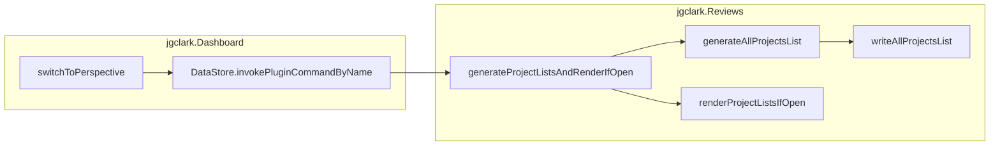
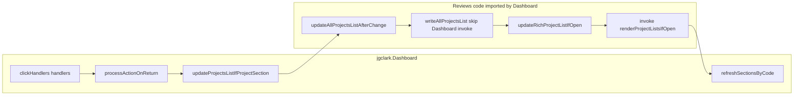
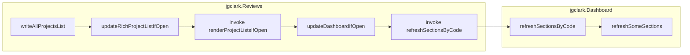
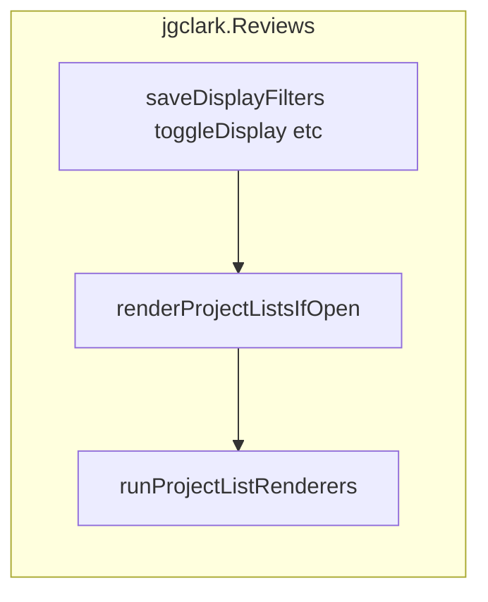

# Architecture: Communication between Projects + Reviews and Dashboard

This note describes how `jgclark.Reviews` (Projects / Reviews, “P”) and `jgclark.Dashboard` (“D”) signal each other so one can refresh when the other’s data changes.

## Cross-plugin mechanism

Both directions use **NotePlan’s `DataStore.invokePluginCommandByName(commandName, pluginId, args)` to run an exported command in the other plugin. There is no separate event bus.

---

## Rich Project List refresh: `updateRichProjectListIfOpen`

**Location:** `jgclark.Reviews/src/reviewHelpers.js` — `export async function updateRichProjectListIfOpen(scrollPosForRichList: number = 0)`.

**Role:** After `allProjectsList.json` is saved, keep the **Rich Project List** HTML window (`jgclark.Reviews.rich-review-list`) in sync **if that window is already open**. It does **not** open the window.

**Mechanism:** If Reviews is installed and `isHTMLWindowOpen(richProjectListWinId)` is true, it calls `DataStore.invokePluginCommandByName('renderProjectListsIfOpen', 'jgclark.Reviews', [null, scrollPosForRichList])`. The first argument is `null` so `renderProjectListsIfOpen` uses `getReviewSettings()`; the second preserves scroll position (pixels).

**Ordering vs Dashboard:** `writeAllProjectsList` always calls `updateRichProjectListIfOpen` before it optionally calls `updateDashboardIfOpen` (unless `skipUpdateDashboardIfOpen` is set — see Scenario 2). That order ensures the Rich list has re-rendered from the new JSON **before** Dashboard PROJ* sections read the same file (Scenario 3).

---

## When each side checks that the other’s window is open

**Design goal:** Neither plugin should **open** the other’s UI as a side effect of these sync paths. Updates apply to **data** (e.g. `allProjectsList.json`, note content) even when the other window is closed; **webview refresh** only runs when the target window is already open (or the code path explicitly uses `shouldOpen: false` and bails out if the Rich list is closed).

| Direction | Where it checks | What happens if closed |
|-----------|-----------------|-------------------------|
| **P → D** | `updateDashboardIfOpen()` uses `pluginIsInstalled('jgclark.Dashboard')` then `isHTMLWindowOpen(DASHBOARD_WINDOW_ID)`. `DASHBOARD_WINDOW_ID` is Dashboard’s `WEBVIEW_WINDOW_ID` (`jgclark.Dashboard.main` from `jgclark.Dashboard/src/constants.js`). | No invoke if plugin not installed or window closed. |
| **P → P (Rich refresh)** | `updateRichProjectListIfOpen(scrollPos)` in `reviewHelpers.js`: `pluginIsInstalled` for Reviews, `isHTMLWindowOpen` for `jgclark.Reviews.rich-review-list`, then `invokePluginCommandByName('renderProjectListsIfOpen', 'jgclark.Reviews', [null, scrollPos])`. | No invoke if Reviews not installed or Rich window closed. Called from `writeAllProjectsList` **before** `updateDashboardIfOpen` so Dashboard PROJ* refresh runs after Rich re-render. |
| **P → D (after invoke)** | Dashboard’s `refreshSectionsByCode()` in `dashboardHooks.js` first checks `isHTMLWindowOpen(WEBVIEW_WINDOW_ID)`. | Returns `true` without calling `refreshSomeSections`. If `refreshSomeSections` runs but `pluginData` is missing, it returns `success: false` (INFO message). |
| **D → P (render only)** | `renderProjectListsIfOpen()` always calls `runProjectListRenderers(config, false, scrollPos)` — i.e. `shouldOpen: false`. For Rich HTML, `renderProjectListsHTML` then requires `isHTMLWindowOpen(RICH_PROJECT_LIST_WIN_ID)` when `shouldOpen` is false; `RICH_PROJECT_LIST_WIN_ID` is `jgclark.Reviews.rich-review-list`. | No HTML window is created; function returns early / does nothing for Rich output. |
| **D → P (extra render)** | _(removed)_ A second `renderProjectListsIfOpen` invoke after perspective switch was redundant with `generateProjectListsAndRenderIfOpen`. | N/A |

**Important:**

- `generateProjectListsAndRenderIfOpen` (called when switching Dashboard perspective, if Reviews is installed) **always** regenerates `allProjectsList.json`. That is file/data work and does **not** open the Projects Rich window. It then calls `renderProjectListsIfOpen`, which **does not** open the window (`shouldOpen: false`).
- `updateProjectsListIfProjectSection` (after `REMOVE_LINE_FROM_JSON` in the bridge when the line was in `PROJACT` / `PROJREVIEW`) updates the shared JSON via Reviews helpers; it does not open any window. It calls `updateAllProjectsListAfterChange` with `skipUpdateDashboardIfOpen: true`, so `writeAllProjectsList` still runs `updateRichProjectListIfOpen` (Rich HTML, if open) but **skips** `updateDashboardIfOpen`. Dashboard then runs `refreshSectionsByCode` in-process (`projectsListSync.js`), and `processActionOnReturn` re-fetches shared data before sending `UPDATE_DATA` so PROJ* rows match the new JSON (avoids same-plugin invoke ordering; see **Scenario 2** and **Races and ordering**).
- Opening the Dashboard or the Rich Project List for the user is reserved for explicit commands / UI (e.g. `displayProjectLists` with `shouldOpen: true`), not for these cross-plugin hooks.

---

## The five scenarios (call chaining)

Each diagram uses **subgraphs** for plugin boundaries. `invokePluginCommandByName` is the usual hop between plugin runtimes. **Scenario 2** uses **direct imports** of Reviews helpers into Dashboard’s bundle for the JSON update: `writeAllProjectsList` still runs `updateRichProjectListIfOpen` then skips `updateDashboardIfOpen`; PROJ* refresh is `refreshSectionsByCode` awaited in Dashboard (not the invoke from `writeAllProjectsList`). **Scenario 3** is the generic Reviews-driven path where `writeAllProjectsList` runs Rich refresh then `updateDashboardIfOpen`.

### Scenario 1 — Dashboard perspective change → Reviews regenerates list and re-renders if open

**Trigger:** User switches perspective in Dashboard → `switchToPerspective()` in `jgclark.Dashboard/src/perspectiveHelpers.js`.

**Mechanism:** Fire-and-forget `invokePluginCommandByName('generateProjectListsAndRenderIfOpen', 'jgclark.Reviews', [])` (guarded by `pluginIsInstalled`). Reviews regenerates `allProjectsList.json`, then `renderProjectListsIfOpen` with `shouldOpen: false`.

### Scenario 2 — Dashboard completes/cancels a PROJ line → Reviews updates `allProjectsList.json` and Rich list (if open)

**Trigger:** Task/checklist handler succeeds with `REMOVE_LINE_FROM_JSON` for `PROJACT` / `PROJREVIEW`.

**Mechanism:** `processActionOnReturn` in `pluginToHTMLBridge.js` calls `updateProjectsListIfProjectSection` in `projectsListSync.js`, which imports and calls `updateAllProjectsListAfterChange` in Reviews (same JS context as Dashboard for this call path: Dashboard’s Rollup bundle includes Reviews modules). `writeAllProjectsList` runs with `skipUpdateDashboardIfOpen: true`: it still calls `updateRichProjectListIfOpen` → invoke `renderProjectListsIfOpen` (scroll passed through), but **does not** call `updateDashboardIfOpen`. `updateProjectsListIfProjectSection` then `await refreshSectionsByCode(['PROJACT','PROJREVIEW'])` in Dashboard (`dashboardHooks.js`) so PROJ* data merges before the bridge sends `UPDATE_DATA`. `processActionOnReturn` re-fetches `getGlobalSharedData` before that send so the payload is not a pre-refresh snapshot.

### Scenario 3 — Reviews writes project list JSON → Rich list refreshes (if open), then Dashboard PROJ* sections (if open)

**Mechanism:** Any successful `writeAllProjectsList` **without** `skipUpdateDashboardIfOpen` → `updateRichProjectListIfOpen` → `invokePluginCommandByName('renderProjectListsIfOpen', 'jgclark.Reviews', [null, scrollPos])` → then `updateDashboardIfOpen` → `invokePluginCommandByName('refreshSectionsByCode', 'jgclark.Dashboard', [['PROJACT','PROJREVIEW','PROJ']])` → `refreshSomeSections`. Order is intentional: Dashboard reads the same JSON after Reviews has finished re-rendering the Rich window. `refreshSomeSections` does not call `writeAllProjectsList`, so this chain cannot loop.

**Typical callers:** `generateAllProjectsList`, `updateProjectInAllProjectsList`, `updateAllProjectsListAfterChange` **when not** passing `skipUpdateDashboardIfOpen`, etc.

### Scenario 4 — Reviews settings saved → regenerate list and refresh Dashboard (if open)

**Trigger:** NotePlan runs `onSettingsUpdated` for Reviews after settings change.

**Mechanism:** `onSettingsUpdated` → `generateAllProjectsList` → `writeAllProjectsList` → same chain as **Scenario 3** (`updateRichProjectListIfOpen` → invoke Reviews render, then `updateDashboardIfOpen` → invoke Dashboard). Rich list is refreshed via `renderProjectListsIfOpen` only if that window is already open.

When `usePerspectives` is true, folder/teamspace filters for list generation usually come from Dashboard perspectives; changing those is handled on the Dashboard side (**Scenario 1**), not by Reviews `onSettingsUpdated` alone.

After the chain below, `onSettingsUpdated` still awaits `renderProjectListsIfOpen` (Reviews only, no extra hop to Dashboard).

```mermaid
flowchart LR
  subgraph noteplan [NotePlan]
    hook["onSettingsUpdated Reviews"]
  end
  subgraph reviewsPlugin [jgclark.Reviews]
    onSet["onSettingsUpdated in index.js"]
    genAll["generateAllProjectsList"]
    writeList["writeAllProjectsList"]
    updRich["updateRichProjectListIfOpen"]
    invokeRich["invoke renderProjectListsIfOpen"]
    updDash["updateDashboardIfOpen"]
    invokePToD["DataStore.invokePluginCommandByName"]
    hook --> onSet --> genAll --> writeList --> updRich --> invokeRich --> updDash --> invokePToD
  end
  subgraph dashboardPlugin [jgclark.Dashboard]
    refreshByCode["refreshSectionsByCode"]
    refreshSome["refreshSomeSections"]
    invokePToD --> refreshByCode --> refreshSome
  end
```

### Scenario 5 — Rich list display-only changes → stays inside Reviews (no Dashboard)

**Trigger:** User changes display filters or toggles in the Rich project list UI (e.g. `saveDisplayFilters`, `toggleDisplayFinished`, and related paths).

**Mechanism:** Settings are saved and `renderProjectListsIfOpen` runs so the Rich window updates. `allProjectsList.json` is not rewritten**, so `writeAllProjectsList` does not run and `updateDashboardIfOpen` is **not** called. No cross-plugin invoke.

---

## Quick reference

| Direction | NotePlan API | Command / helper |
|-----------|--------------|------------------|
| D → P | `invokePluginCommandByName` | `generateProjectListsAndRenderIfOpen`, `renderProjectListsIfOpen` |
| D → P (task/checklist in `PROJ*` ) | After `REMOVE_LINE_FROM_JSON` in bridge | `updateProjectsListIfProjectSection` in [`projectsListSync.js`](../jgclark.Dashboard/src/projectsListSync.js) → `updateAllProjectsListAfterChange` (with `skipUpdateDashboardIfOpen`) → `writeAllProjectsList` → `updateRichProjectListIfOpen` → then in-process `refreshSectionsByCode` |
| P → P (Rich, after list write) | `invokePluginCommandByName` | `updateRichProjectListIfOpen` in `reviewHelpers.js` → `renderProjectListsIfOpen` (Rich window must already be open) |
| P → D | `invokePluginCommandByName` | `updateDashboardIfOpen` → `refreshSectionsByCode` with `[['PROJACT','PROJREVIEW','PROJ']]` (skipped when `writeAllProjectsList` is called with `skipUpdateDashboardIfOpen`; Dashboard then refreshes in-process — Scenario 2) |

---

## Failure modes and caveats (why sync sometimes appears to do nothing)

### Projects → Dashboard: Dashboard open but `pluginData` not ready

`refreshSectionsByCode` checks `isHTMLWindowOpen` first. If `getGlobalSharedData(WEBVIEW_WINDOW_ID)` has no `pluginData` yet (e.g. React not finished initialising), `refreshSomeSections` returns `handlerResult(false, …)` with an INFO-level message so `refreshSectionsByCode` returns `false` and the Reviews-side invoke does not look like a silent success.

### Projects → Dashboard: project sections turned off in Dashboard settings (expected)

`getSomeSectionsData` only merges **PROJACT** / **PROJREVIEW** when `showProjectActiveSection` / `showProjectReviewSection` are enabled for the current perspective. A refresh for those codes may therefore change nothing visible — **this is expected**, not a bug, when those sections are hidden in Dashboard settings.

### Dashboard → Projects: fire-and-forget invoke and swallowed errors

- `switchToPerspective` calls `generateProjectListsAndRenderIfOpen` **without** `await` (intentional: non-blocking; no return value consumed). Rejections are surfaced via `.catch` → `logWarn`. `pluginIsInstalled('jgclark.Reviews')` skips the invoke if Reviews is not installed.
- `generateProjectListsAndRenderIfOpen` still catches errors and logs without rethrowing (documented in code): `invokePluginCommandByName` may appear successful when work failed — check the plugin console.

### Dashboard → Projects: `allProjectsList.json` after removing a dashboard line

After `REMOVE_LINE_FROM_JSON` in `pluginToHTMLBridge.processActionOnReturn`, Dashboard calls `updateProjectsListIfProjectSection` (from `projectsListSync.js`) when the handler supplied a **PROJACT** / **PROJREVIEW** section code (via `handlerResult.sectionCodes`, `data.sectionCodes`, or `data.item.sectionCode`). Task/checklist handlers include `sectionCodes` in their `handlerResult` where needed so the bridge can sync once per removal.

### Reviews settings + perspectives: no active perspective

If `usePerspectives` is true but Dashboard has **no active perspective**, `getReviewSettings` logs `logWarn` and continues using **folder / teamspace fields from Reviews `settings.json` (same as when perspectives are off), with `includedTeamspaces` default `['private']`. External callers still get `null` only when `settings.json` is missing or empty (`getReviewSettings(true)`).

### Races and ordering

`updateDashboardIfOpen` still warns about **race conditions with perspective changes**; list writes and Dashboard refreshes can overlap.

**Same-plugin invoke vs HTML bridge (PROJ* completion from Dashboard):** When `writeAllProjectsList` runs inside the Dashboard bundle and immediately calls `updateDashboardIfOpen`, `invokePluginCommandByName('refreshSectionsByCode', 'jgclark.Dashboard', ...)` can return before the webview has applied the refreshed PROJ* sections. `processActionOnReturn` could then send `UPDATE_DATA` using a snapshot taken before that refresh, overwriting merged rows (e.g. new next-action missing even though `allProjectsList.json` is correct). Mitigations: (1) `skipUpdateDashboardIfOpen` on the Dashboard bridge path so `writeAllProjectsList` still runs `updateRichProjectListIfOpen` but skips the invoke; (2) `await refreshSectionsByCode` in `projectsListSync.js` after the list write; (3) re-fetch `getGlobalSharedData` before the post-`REMOVE_LINE` `UPDATE_DATA` send.

**Editor `onEditorWillSave`:** Non-calendar “refresh all” excludes **PROJACT** / **PROJREVIEW** (`sectionCodesFromAllProjectsJson`) so a second PROJ* refresh does not race list-backed updates after Reviews has already invoked Dashboard (see `dashboardHooks.js`).

### `outputStyle` = Markdown

When `shouldOpen` is false** (e.g. `renderProjectListsIfOpen`), `renderProjectListsMarkdown` returns immediately and **does not** rewrite summary notes.

### `invokePluginCommandByName` argument shape

Reviews must pass `[['PROJACT', 'PROJREVIEW', 'PROJ']]` into `invokePluginCommandByName` so `refreshSectionsByCode` receives a **flat** array after spread. `refreshSectionsByCode` logs and flattens one level if it receives a mistaken **array-of-arrays**; see JSDoc on `dashboardHooks.js`.

### Dependency on the other plugin

`updateDashboardIfOpen` returns early if `pluginIsInstalled('jgclark.Dashboard')` is false. Other invoke failures remain in try/catch with `logError`.

---

## Related source files

- Reviews: `src/reviewHelpers.js` (`updateDashboardIfOpen`, `updateRichProjectListIfOpen`, `getReviewSettings`), `src/allProjectsListHelpers.js` (`writeAllProjectsList`), `src/reviews.js` (`generateProjectListsAndRenderIfOpen`, `renderProjectListsIfOpen`, `renderProjectListsHTML`), `src/index.js` (`onSettingsUpdated`)
- Dashboard: `src/perspectiveHelpers.js` (`switchToPerspective`), `src/projectsListSync.js` (`updateProjectsListIfProjectSection`, in-process `refreshSectionsByCode` after list write), `src/clickHandlers.js` (task handlers), `src/pluginToHTMLBridge.js` (`processActionOnReturn` / `REMOVE_LINE_FROM_JSON`), `src/dashboardHooks.js` (`refreshSectionsByCode`), `src/refreshClickHandlers.js` (`refreshSomeSections`)
