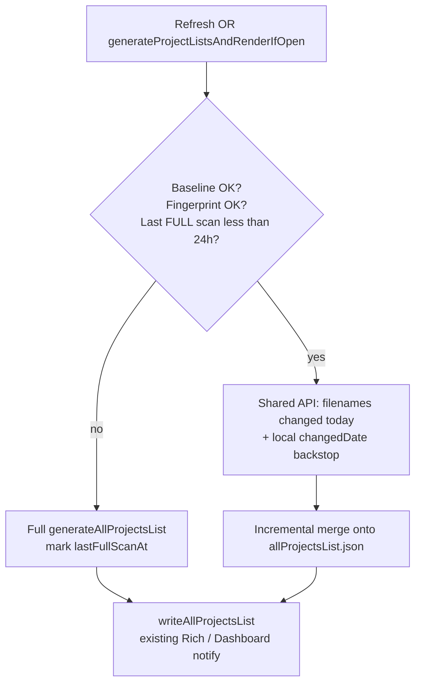

# Plan: Incremental Reviews refresh via notes-changed-today

**Status: DEPRECATED** -- do not implement from this document.  
**Superseded by:** [`np.Shared/PLAN-notes-changed-recently-cache.md`](../np.Shared/PLAN-notes-changed-recently-cache.md) (Shared 7-day notes-changed cache for Dashboard, Reviews, and other plugins).

Date: 2026-09-18 (deprecated same day in favour of the Shared plan)

This Reviews-only, today-scoped plan was an early sketch. The wider Shared design replaces it for:

- where the change index lives (`np.Shared`, not Dashboard done-count JSON)
- window (7 days, not today-only)
- multi-plugin generate/update/read

Locked product decisions from below that still apply under the Shared plan:

1. Fast path for **both** user Refresh and Dashboard-triggered `generateProjectListsAndRenderIfOpen`
2. Reviews full project-list scan at least every **24 hours**
3. A proper shared API (now owned by Shared, not a thin Dashboard-file reader)

Keep this file only as historical context. New work should follow the Shared plan (especially its Reviews consumer phases).

Related: `ARCHITECTURE-Comms_with_Dashboard.md`

---

## Goal (historical)

Make Reviews **Refresh** (and Dashboard-triggered list regen) scale with notes touched recently, not with the full in-scope project set, by reusing Dashboard's notes-changed-today work through a **shared extracted API**, with a **full vault scan at least every 24 hours**.

---

## Decisions (locked -- carried into Shared plan where noted)

| # | Question | Decision |
|---|----------|----------|
| 1 | Scope of fast path | **Both** user Refresh (`displayProjectLists` / Rich toolbar / Cmd-R / idle auto-refresh) **and** Dashboard-triggered `generateProjectListsAndRenderIfOpen` (perspective switch, folder-filter sync, etc.) |
| 2 | Full-scan cadence | **Yes** -- force a full regenerate at least every **24 hours** (safety net), even if incremental would otherwise apply |
| 3 | Shared API | **Extract** a shared API -- **now:** Shared `notesChangedRecently` cache, not "read Dashboard done-count JSON" |

---

## Background (historical)

### What Dashboard's cache is

- File: `Plugins/data/jgclark.Dashboard/todaysChangedNoteList.json`
- Writer: `updateDoneCountsFromChangedNotes()` in `jgclark.Dashboard/src/countDoneTasks.js`
- Discovery today: `getNotesChangedInInterval(0)` from `helpers/NPnote.js`
- Shape: per-note done-count fields keyed by `filename`. **Every note changed today is present**, including zero completions.
- Day boundary: preference `jgclark.Dashboard.todayDoneCountsList.lastTimeThisWasRunPref`

Useful to Reviews under the old sketch: the **filename set**, not the done counts. Under the Shared plan, discovery moves to `np.Shared`; Dashboard keeps done counts as metrics only.

### What Reviews Refresh does today

1. `enumerateMatchingProjectNoteTagPairs` -- filter **all** `DataStore.projectNotes` + tag match
2. `buildProjectsFromPairsSync` -- for **every** pair, compare `noteChangedAtMs`; miss → expensive `new Project(...)`
3. Write `allProjectsList.json`

`noteChangedAtMs` already skips constructor work on hits, but Refresh still enumerates and touches every matching row.

### Live scale (author vault, 2026-09-18)

- Dashboard changed-today entries: ~17
- Reviews `allProjectsList` rows: ~78
- Overlap (project rows whose note changed today): ~7

---

## Target architecture



### Fast-path algorithm

1. Load baseline `allProjectsList.json`.
2. If any of the following → **full** `generateAllProjectsList` and record **last full-scan** time:
   - Missing / corrupt baseline
   - Perspective or folder/teamspace fingerprint change (existing prefs)
   - Settings action that already means rebuild
   - Last **full** scan older than **24 hours** (new pref; see below)
3. Otherwise **incremental**:
   - `changedFilenames` = shared API (Dashboard-backed when fresh) **∪** local backstop
   - Local backstop: `getNotesChangedInIntervalFromList(DataStore.projectNotes, …)` since last Reviews generation (or start of today) -- cheap in-memory filter; closes "edited project, Dashboard has not recounted yet"
   - Drop calendar-only names for Reviews work
   - Rebuild Project rows only for changed filenames still in folder/teamspace/tag scope
   - Keep other baseline rows; still run `calcReviewFieldsForProject` for due/next-review display
   - Remove baseline rows whose note is gone or out of scope
4. Write JSON; keep existing `updateRichProjectListIfOpen` / `updateDashboardIfOpen` behaviour.

Do **not** call `updateDoneCountsFromChangedNotes` from Reviews -- that redoes done-count paragraph work Reviews does not need.

---

## Shared API (decision 3)

Extract a small, reusable API so Reviews is not coupled to the done-count schema long term.

### Suggested placement

Prefer **`helpers/`** (e.g. extend `helpers/NPnote.js` or a dedicated `helpers/notesChangedToday.js`) so both Dashboard and Reviews can import without pulling plugin UI code.

Alternative: thin wrappers in Dashboard that write a filename-oriented contract, with helpers as the read/fallback layer -- still one public helper surface for callers.

### Suggested surface (names indicative)

```javascript
/**
 * Filenames of notes with changedDate on the current calendar day.
 * Prefers Dashboard's persisted set when that cache is from today; otherwise
 * falls back to getNotesChangedInInterval(0) (or FromList when a note list is passed).
 * @param {{ noteTypesToInclude?: Array<string>, preferDashboardCache?: boolean }} options
 * @returns {Array<string>}
 */
function getFilenamesOfNotesChangedToday(options = {}): Array<string>

/**
 * Whether Dashboard's todaysChangedNoteList (or shared sidecar) is usable for today.
 * @returns {boolean}
 */
function isNotesChangedTodayCacheFresh(): boolean
```

### Dashboard write-path changes

- Keep writing `todaysChangedNoteList.json` for done counts (Dashboard UI).
- Refactor recount so **filename discovery** goes through the shared helper (or the helper reads the same file + pref Dashboard already maintains).
- Optionally document the file + pref as the on-disk backing store for the helper's fast path.
- Do not require Reviews to import `countDoneTasks.js`.

### Fallback rules

| Situation | Behaviour |
|-----------|-----------|
| Dashboard not installed / file missing | Helper uses `getNotesChangedInInterval(0)` or `FromList` |
| Pref not today / day rolled over | Treat cache as empty; scan or FromList |
| Caller passes `noteTypesToInclude: ['Notes']` | Filter to project/regular notes for Reviews |

---

## Call sites (decision 1)

Wire incremental vs full through one gate used by:

| Entry | Notes |
|-------|--------|
| `displayProjectLists` / HTML `refresh` / ⌘R / idle auto-refresh | User-facing Refresh |
| `generateProjectListsAndRenderIfOpen` (`afterBanner`) | Dashboard perspective / folder sync |
| Any other path that today calls `generateAllProjectsList` for a "refresh-like" regen | Same gate; settings **rebuild** and explicit full-test commands stay full |

Silent `getAllProjectsFromList` age short-circuit (&lt; 1h) stays as today; when it *does* regenerate, use the same gate (full if ≥24h since last full scan).

---

## 24h full scan (decision 2)

- New preference, e.g. `Reviews-lastAllProjectsFullScanTime` (ms), set only when a **full** enumerate+build completes (not on incremental merge).
- Gate: if `Date.now() - lastFullScan > 24h` → full path.
- Distinct from existing `Reviews-lastAllProjectsGenerationTime` (any successful write, including incremental), which remains useful for list age / local backstop window.
- Existing 1h `shouldRegenerateAllProjectsList` age can stay for "must have *some* regen"; 24h forces **full** quality, not merely incremental.

---

## Implementation phases

### Phase 0 -- Measure

On current Refresh: log pair count, `noteChangedAtMs` hits/misses, ms for enumerate vs build. Baseline for before/after.

### Phase 1 -- Extract shared API

- Implement `getFilenamesOfNotesChangedToday` / freshness check in helpers (or agreed home).
- Point Dashboard `updateDoneCountsFromChangedNotes` at shared discovery where practical (or have the helper read Dashboard's file first).
- Unit tests: empty file, day rollover, prefer-cache vs fallback.

### Phase 2 -- Incremental core in Reviews

- `generateAllProjectsListIncremental` (name TBD) + gate in `allProjectsListHelpers.js`.
- 24h full-scan pref.
- Wire **both** Refresh and `generateProjectListsAndRenderIfOpen`.
- Keep paint-first / afterSpin / afterBanner UX unchanged.

### Phase 3 -- Harden

- Tombstones / out-of-scope cleanup
- Editor-focused note still forces rebuild (`getNoteChangeTimeMsForCache` null)
- Tests: add/remove/tag-loss, empty Dashboard cache, day rollover, 24h force-full
- Update `ARCHITECTURE-Comms_with_Dashboard.md` with incremental + shared API notes
- CHANGELOG under current Reviews (and Dashboard if API/docs touch it)

### Phase 4 -- Optional later

- `np.Shared` tagMentionCache for **full**-regen project discovery only (separate from this plan)

---

## Out of scope for this work

- Calling Dashboard's done-count recount from Reviews
- Replacing single-note `updateAllProjectsListAfterChange` (keep it)
- Changing PROJ* Dashboard section generation beyond benefiting from faster list writes

---

## Expected impact

| Path | Expected change |
|------|-----------------|
| Rich Refresh + Dashboard-triggered regen | Large -- work ~ notes changed today ∩ projects |
| At least once per 24h | Full scan (correctness / drift) |
| Single-note review actions | Unchanged (already incremental) |
| Perspective / folder fingerprint change | Full regen (unchanged) |

---

## Open items (non-blocking)

- Exact helper module path (`helpers/NPnote.js` vs new file)
- Whether Dashboard also writes a filename-only sidecar or the helper only reads existing JSON keys
- Whether 24h is wall-clock from last full scan only, or also "first Refresh after local midnight" (prefer simple wall-clock 24h unless product wants calendar-day)

---

## Do not implement from this document

**Deprecated.** Use [`np.Shared/PLAN-notes-changed-recently-cache.md`](../np.Shared/PLAN-notes-changed-recently-cache.md) as the plan of record.
