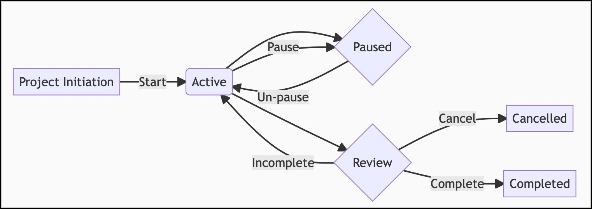

# 🔬 Projects + Reviews plugin
Unlike many task or project management apps, NotePlan has very little enforced structure, and is entirely text/markdown based.  This makes it much more flexible, but makes it less obvious how to use it for tracking and managing complex work, loosely referred to here as 'Projects'.

This plugin provides commands to help **review** Project-based notes, and it helps me manage over 50 such projects. This will be familiar to people who use David Allen's **Getting Things Done** approach, or any other where **regular reviews** are important. (It probably won't have much applicability to people who use NotePlan as a Zettelkasten-style knowledge base.)

The main review screen looks like this, showing the projects due for review from various different NotePlan folders:


If, like me, you're using the helpful [PARA Approach](https://fortelabs.co/blog/series/para/), then your **Areas** are also a form of Project, at least as far as Reviewing them goes.  I have another 50 of these.

User George Crump (@george65) has created a video showing most of what the plugin does (from v0.10; the buttons have changed a little since then):

[](https://youtu.be/R-3qn6wdDLk)

## Using NotePlan for Project-like work
Each **Project** is described by a separate note, and has a lifecycle something like this:



Each such project contains the `#project` hashtag, `@review(...)` and some other metadata fields on a line (which come after the title).  For example:

```markdown
# Secret Undertaking
#project @review(2w) @reviewed(2021-07-20) @start(2021-04-05) @due(2021-11-30)
Aim: Do this amazing secret thing

## Details
* [x] Get briefing from 'M' at HQ
* [x] recruit James Bond
* [ ]  task Q with building a personal jetpack (with USB ports)
* [ ] set up team Deliveroo account
...
```

The fields I use are:
- `@review(...)`: interval to use between reviews, of form [number][bdwmqy]:
    - After the [number] is a character, which is one of: **b**usiness days (ignore weekends, but doesn't ignore public holidays, as they're different for each country), **d**ays, **w**eeks, **m**onths, **q**uarters, **y**ears.
- `@reviewed(YYYY-MM-DD)`: last time this project was reviewed, using this plugin
- `@nextReview(YYY-MM-DD)`: specific date for next review (if wanted)
- `@start(YYY-MM-DD)`: project's start date
- `@due(YYY-MM-DD)`: project's due date
- `@completed(YYY-MM-DD)`: date project was completed (if relevant)
- `@cancelled(YYY-MM-DD)`: date project was cancelled (if relevant)
- `Aim: free text`: optional, and not used in any processing
- `Progress: N:YYYY-MM-DD: one-line description`: your latest summary of progress for this N% (optional). If present this is shown in the projects list; if not the % completion is calculated on the number of open and closed tasks.

Similarly, if you follow the **PARA method**, then you will also have "**Areas** of responsibility" to maintain, and I use a `#area` tag to mark these. These don't normally have a start/end/completed dates, but they also need reviewing.  For example:

```markdown
# Car maintenance
#area @review(1m) @reviewed(2021-06-25)
Aim: Make sure car continues to run well, is legal etc.

* check tyres @repeat(+1m) >2021-07-23
* pay car/road tax @repeat(1y) >2021-10-11
* book yearly service @repeat(1y) >2022-02-01
...
```

The first hashtag on the line defines its type, so as well as `#project`, `#area` you could have a `#goal` or whatever makes most sense for you. (This example uses my related [Repeat Extensions plugin](https://github.com/NotePlan/plugins/tree/main/jgclark.RepeatExtensions/) to give more flexibility than the built-in repeats.)

Other notes:
- If you also add the `#paused` tag to the metadata line, then that stops that note from being included in active reviews, but will show up in the lists.
- From v0.9 these 'metadata fields' can appear anywhere in the note, not just on the second line. If there are multiple copies of a field, only the first one is used.
- I'm sometimes asked why I use `@reviewed(2021-06-25)` rather than `@reviewed/2021-06-25`. The answer is that while the latter form is displayed in a neater way in the sidebar, the date part isn't available in the NotePlan API as the part after the slash is not a valid @tag as it doesn't contain an alphabetic character.

## Reviewing Projects and/or Areas
Use the '**Hashtags to review**' setting to control which notes are included in the review lists:
- If this setting is empty, then it will include all notes for review that include a `@review(...)` string.
- if it is set (e.g. `#project, #area, #goal`), then it will include just those notes which also have one or more of those tags.
- You can specify folders to ignore using the 'Folders to Ignore' setting; I have this set to `Summaries, Reviews, Saved Searches`. Any sub-folders of these will also be ignored. (Note that the special Templates, Archive and Trash are always excluded.)
- Particularly if you have a large collection of notes in NP, you can also specify a 'Folders to Include' setting (which includes any sub-folders).

When you have [configured the plugin](#configuration), and added suitable metadata to notes, you're then ready to use some or all of the following commands:

## The Commands
### "/project lists" command
This shows a list of project notes, including basic tasks statistics and time until next review, and time until the project is due to complete. **Tip**: Place this list next to your main NotePlan window, and you can click on each project title in the table, and it will open in the main window ready to review and update.

You can set the '**Output style to use**'. This is either a '**Rich**' (HTML, shown above) or original '**Markdown**' (normal NotePlan) output style:


Notes about the displays:
- the **Rich style** _isn't a normal NotePlan note that is saved and can be accessed again later_. You will need to re-run the command to see the list again once you close the window.  This 'Rich' style mimics the NotePlan Theme you use.  In this style this heading row deliberately 'sticks' to the top of the window as you scroll the list:

- due to limits on the API for 'Rich' style output, all #tags to review get shown one after the other in a single window.
- if you can make the window wide enough it will display in 2 or even 3 columns!
- the **Markdown style** list _is_ stored in summary note(s) in the 'Reviews' folder (or whatever you set the 'Folder to store' setting to be).
- the button 'Start reviews' / 'Start reviewing notes ready for review' is a shortcut to the '/start reviews' command (described next).
- each project title is also an active link which can be clicked to take you to that project note. (Or Option-click to open that in a new split window, which keeps the review list open.)

Other settings:
- Folders to Include (optional): Specify which folders to include (which includes any of their sub-folders). This match is done anywhere in the folder name, so you could simply say `Project` which would match for `Client A/Projects` as well as `Client B/Projects`.
- Folders to Ignore (optional): Specify which folders to ignore (which includes any of their sub-folders too).  This match is done anywhere in the folder name.
- Confirm next Review?: When running '/next project review' it asks whether to start the next review.
- Display order for projects: The sort options  are by 'due' date, by 'review' date or 'title'.
- Display projects grouped by folder? Whether to group the projects by their folder.
- Hide top level folder in output? Whether to suppress higher-level folder names in project list headings.
- How to show completed/cancelled projects?: The options are 'display at end', 'display' or 'hide'.
- Only display overdue projects/areas?: If not ticked then it will display all project/area notes, not just overdue ones.
- Display project dates?  Whether to display the project's review and due dates (where set).
- Display project's latest progress?  Whether to show the project's latest progress (where available). If some lines have a specific 'Progress:' field. (See above for details.)
- Display archived projects? Whether to display project notes marked as `#archive`.

### "/start reviews" command
This kicks off the most overdue review by opening that project's note in the editor. When you have finished the review run one of the next two commands ...

### "/finish project review" command
This updates the current open project's `@reviewed(date)`, and if a Rich style project list is open, it is refreshed.

### "/next project review" command
This updates this project's `@reviewed(date)`, and jumps to the next project to review. If there are none left ready for review it will show a congratulations message.

### "/skip project review" command
This adds a `@nextReview(...)` date of your choosing to the current project note, that overrides the normal review interval for it, and jumps to the next project to review.  The next time "finish review" command is used on the project note, the `@nextReview(date)` is removed.

### "/add progress update" command
This prompts for a short description of latest progress (as short text string) and current % complete (number). This is inserted into the metadata area of the current project note as:

```markdown
Progress: <num>@YYYY-MM-DD: <short description>
```
It will also update the project's `@reviewed(date)`, and if a Rich style project list is open, it is refreshed.

### "/complete project" command
This adds a `@completed(date)` to the metadata line of the open project note, adds its details to a yearly note in Summaries folder (if the folder exists), and removes the project/area from the review list. It also offers to move it to NotePlan's separate Archive folder.

### "/cancel project" command
This adds a `@cancelled(date)` to the metadata line of the open project note, adds its details to a yearly note in Summaries folder (if the folder exists), and removes the project/area from the review list. It also offers to move it to NotePlan's separate Archive folder.

### "/pause project toggle" command
This is a toggle that adds or removes a `#paused` tag to the metadata line of the open project note. When paused it stops the note being offered with '/next review'. However, it keeps showing it in the review list, so you don't forget about it entirely.

## Capturing Progress
In a project/area note you can, if you wish, include a one-line summary of your view on its current overall progress. If given, the latest one is shown in the project lists. To continue the example above, here's the start of the note a few weeks later, showing I think we're 10% complete:

```markdown
# Secret Undertaking
#project @review(1w) @reviewed(2021-05-20) @start(2021-04-05) @due(2021-11-30)
Aim: Do this amazing secret thing
Progress: 10@2021-05-20: Tracked down 007 and got him on the case
Progress: 0@2021-04-05: Project started with a briefing from M about SPECTRE's dastardly plan

## Details
* [x] Get briefing from 'M' at HQ
* [x] recruit James Bond
* [x]  task Q with building a personal jetpack (with USB ports)
* [x] set up team Deliveroo account
* [ ] arrange for 007's parking tickets to be paid
...
```
The starting percentage number doesn't have to be given; if it's not it is calculated from the % of open and completed tasks found in the note. The date and the comment are needed.

## Creating a new Project/Area note
A good way to quickly create a new Project or Area note is to use the `/np:new` (new note from template) or `/np:qtn` (Quick template note) command from the Templating plugin. Here is what I use as my New Project Template:

```markdown
---
title: Create a new Project note
type: template, quick-note, empty-note, project-note
folder: <select>
---
# <%- prompt('noteTitle', 'Project name') %>
#project @start(<%- promptDate('startDate', 'Enter start date') %>) @due(<%- promptDate('dueDate', 'Enter due date') %>) @review(<%- promptDateInterval('question', 'Enter review interval') %>)
Aim: <%- prompt('aim') %>
Context: <%- prompt('context') %>
```

## Using 'Next Actions'
Part of the GTD methodology is to note which are the 'next actions' for a project. This plugin doesn't have specific commands to manage these, but NP has various other features and plugins that can help.

This is what user @George65 does:
- when reviewing notes I use the "/add sync'd copy to note" command (from the [Filer plugin](https://github.com/NotePlan/plugins/tree/main/jgclark.Filer)) to 'sync' actionable tasks to the current weekly note. (Or, if I know I don't need to get to it until the next week, then it goes into the following week or whatever. If it is actionable but I don't need to get to it until the next month I sync it into that next months task.)
- in essence this recreates the GTD 30 day, and monthly folders, but with the advantage that all these tasks are synced back to their projects.
- each day I drag out from the reference area's week's note any actions I want to do that day, maintaining the Sync line status.
- I also will copy over any tasks I didn't do from the previous day.

Another approach is to add a hashtag like `#next` or `#na` to all actionable tasks. Then you can use the "/searchOpenTasks" command (from the [Search Extensions plugin](https://github.com/NotePlan/plugins/tree/main/jgclark.SearchExtensions)) with search term `#next` to sync _all_ your open `#next` tasks to your `#next Search Results` note. You can then use this as the source to drag'n'drop tasks into daily/weekly/monthly notes.

## Configuration
These commands require configuration before they will know how you intend to use projects and reviews. On macOS this is done by clicking the gear button on the 'Summaries' line in the Plugin Preferences panel. On iOS/iPadOS run the '/Projects: update plugin settings' command instead.

## Running from x-callback calls
Most of these commands can be run from an x-callback call:

`noteplan://x-callback-url/runPlugin?pluginID=jgclark.Reviews&command=project%20lists`

The `command` parameter is the command name, but needs to be 'percent encoded' (i.e. with any spaces changed to `%20`).

If you wish to override your current settings for this call, add `&arg0=` followed by a JSON version of the keys and values e.g.
`arg0={"foldersToInclude":["CCC Projects"],"displayDates":true,"displayProgress":false,"displayGroupedByFolder":false,"displayOrder":"title"}`
that then needs to be URL encoded e.g.
`arg0=%7B%22foldersToInclude%22%3A%5B%22CCC%20Projects%22%5D%2C%22displayDates%22%3Atrue%2C%22displayProgress%22%3Afalse%2C%22displayGroupedByFolder%22%3Afalse%2C%22displayOrder%22%3A%22title%22%7D`

The name of the settings are taken from the `key`s from the plugin's `plugin.json` file, which are mostly the names shown in the settings dialog without spaces.

## Thanks
Particular thanks to George Crump, 'John1' and David Wertheimer for their suggestions and beta testing.

You might also like [Anton Skliar's description of his process which includes this and other plugins](https://noteplan.co/n/381AC6DF-FB8F-49A5-AF8D-1B43B3092922).

## Support
There is what I consider to be a bug in the NotePlan API that means most of these commands **can only update a project note if it is open in the main  Editor**, not in a separate window, or the non-leftmost split window.

If you find an issue with this plugin, or would like to suggest new features for it, please raise a [Bug or Feature 'Issue'](https://github.com/NotePlan/plugins/issues).

If you would like to support my late-night work extending NotePlan through writing these plugins, you can through

[](https://www.buymeacoffee.com/revjgc)

Thanks!

## Changes
Please see the [CHANGELOG](CHANGELOG.md).
