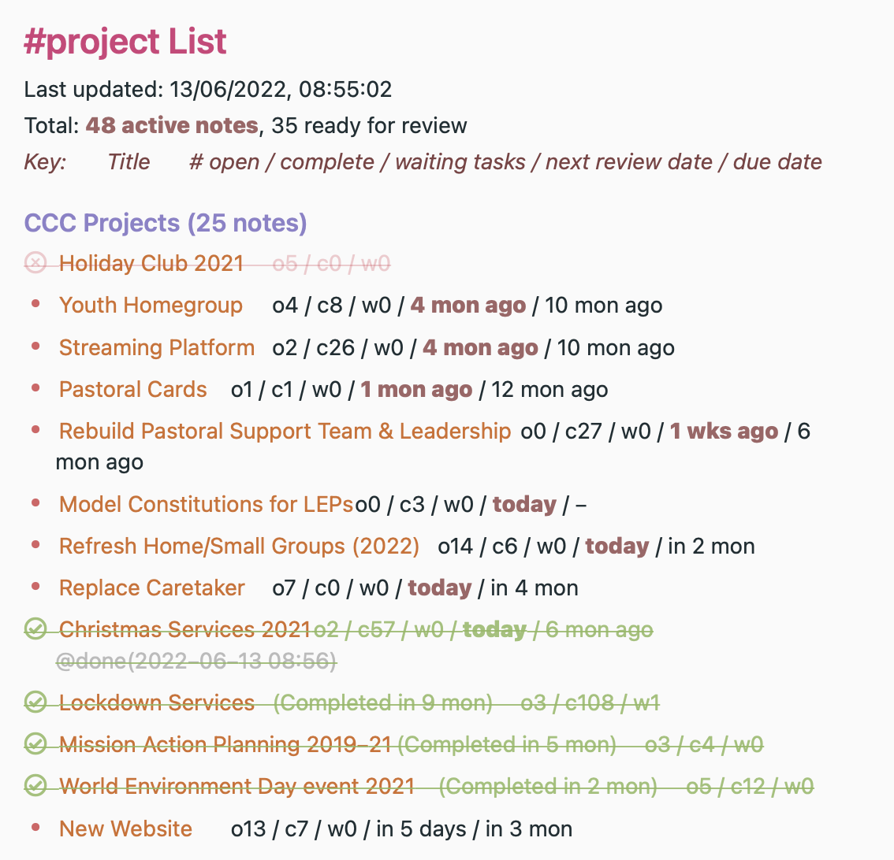

# 🔬 Reviews  plugin
Unlike many task or project management apps, NotePlan has very little enforced structure, and entirely text/markdown based.  This makes it much more flexible, but makes it less obvious how to use it for tracking and managing complex work, loosely referred to here as 'Projects'.   This plugin provides commands to help **review** Project-based notes, and it helps me manage about 100 such projects.. This will be familiar to people who use David Allen's **Getting Things Done** approach, or any other where **regular reviews** are important. (It probably won't have much applicability to people who just use NotePlan as a Zettelkasten-style knowledge base.)

(If you're using the helpful [PARA Approach](https://fortelabs.co/blog/series/para/), then your **Areas** are also a form of Project, at least as far as Reviewing them goes.)

User George Crump (@george65) has created a [great video showing how the plugin works](https://bit.ly/3l1tSw4).

## Using NotePlan for Project-like work

Each **Project** is described by a separate note. Each such project contains the `#project` hashtag, `@review(...)` and some other metadata fields on the line immediately after the title.  For example:

```markdown
# Secret Undertaking
#project @review(2w) @reviewed(2021-07-20) @start(2021-04-05) @due(2021-11-30)
Aim: Do this amazing secret thing

## Details
* recruit James Bond
...
```

The fields I use are:
- `@review(...)`: interval to use between reviews, of form [nn][dwmqy]
- `@reviewed(YYYY-MM-DD)`: last time this project was reviewed, using this plugin
- `@start(YYY-MM-DD)`: project's start date
- `@due(YYY-MM-DD)`: project's due date
- `@completed(YYY-MM-DD)`: date project was completed (if relevant)
- `@cancelled(YYY-MM-DD)`: date project was cancelled (if relevant)

Similarly, if you follow the PARA method, then you will also have "**Areas** of responsibility" to maintain, and I use a `#area` tag to mark these. These don't normally have a start/end/completed dates, but they also need reviewing.  For example:

```markdown
# Car maintenance
#area @review(1m) @reviewed(2021-06-25)
Aim: Make sure car continues to run well, is legal etc.

* check tyres @repeat(+1m) >2021-07-23
* pay car/road tax @repeat(1y) >2021-10-11
* book yearly service @repeat(1y) >2022-02-01
...
```

## Creating a new Project/Area note
A good way to quickly create a new Project or Area note is to use the `/np:new` (new note from template) or `/np:qtn` (Quick template note) command from the Templating plugin. Here is what I use as my New Project Template:

```markdown
---
title: Create a new Project note
type: template, quick-note, empty-note, project-note
folder: <select>
---
# <%- prompt('noteTitle', 'Project name') %>
#project @start(<%- promptDate('startDate', 'Enter start date') %>) @due(<%- promptDate('dueDate', 'Enter due date') %>) @review(<%- promptDateInterval('question', 'Enter review interval') %>)
Aim: <%- prompt('aim') %>
Context: <%- prompt('context') %>
```

## Reviewing Projects and/or Areas
Use the `noteTypeTags` setting to control which notes are included in the review lists:
- If this setting is empty, then it will include all notes for review that include a `@review(...)` string.
- if it is set (e.g. `#project, #area`), then it will include just those notes which also have one or more of those tags.
You can specify folders to ignore using the `foldersToIgnore` setting; I have this set to `Summaries, Reviews, @Templates, @Archive, @Trash`.

When you have [configured the plugin](#configuration), and added suitable metadata to notes, you're then ready to use some or all of the following commands:

### /project lists
**Now with new alternative command: '/HTML project lists'!**. _Note:  this provides a richer view, but it can't be saved for later._

This creates/updates a list of project notes, including basic tasks statistics and time until next review, and time until the project is due to complete. This is stored in summary note(s) in the 'Reviews' folder (or whatever you set the 'Folder to store' setting to be). For example:



You can specify folders to ignore using the 'Folders to ignore' shared setting (as above), and also these more specific settings:
- Display project dates?  Whether to display the project's review and due dates (where set).
- Display project's latest progress?  Whether to show the project's latest progress (where available). If a specific 'Progress:' field is set it will use that, otherwise it will calculate %completion based on the number of completed and open tasks.
- Display order for projects: The sort options  are by 'due' date, by 'review' date or 'title'.
- Display grouped by folder? Whether to group the projects by their folder.
- Display archived projects? Whether to display project notes marked as `#archive`.

### /start reviews
This creates a hidden list of notes ready for review, and then kicks off the most overdue review by opening that note in the editor. When you have finished the review run one of the next two commands ...

### /complete review
This updates the current open project's `@reviewed(date)`.

### /next review
This updates this project's `@reviewed(date)`, and jumps to the next project to review. If there are none left ready for review it will show a congratulations message.

### /complete project
This add an #archive tag, and a `@completed(date)` mention to the metadata line of the open project note, removes the project/area from the review list, and offers to move it to the NotePlan Archive area.

### /cancel project
This add an #archive tag, and a `@cancelled(date)` mention to the metadata line of the open project note, removes the project/area from the review list, and offers to move it to the NotePlan Archive area.

## Configuration
These commands require configuration, which is done by clicking the gear button on the 'Summaries' line in the Plugin Preferences panel.

## To do
- look at updating the plugin to take advantage of YAML frontmatter blocks, introduced in v3.4.x

## Support
If you find an issue with this plugin, or would like to suggest new features for it, please raise a [Bug or Feature 'Issue'](https://github.com/NotePlan/plugins/issues).

If you would like to support my late-night work extending NotePlan through writing these plugins, you can through:
. Thanks!

## Changes
Please see the [CHANGELOG](CHANGELOG.md).
