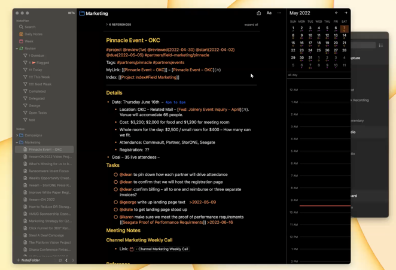
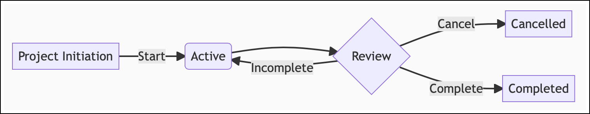
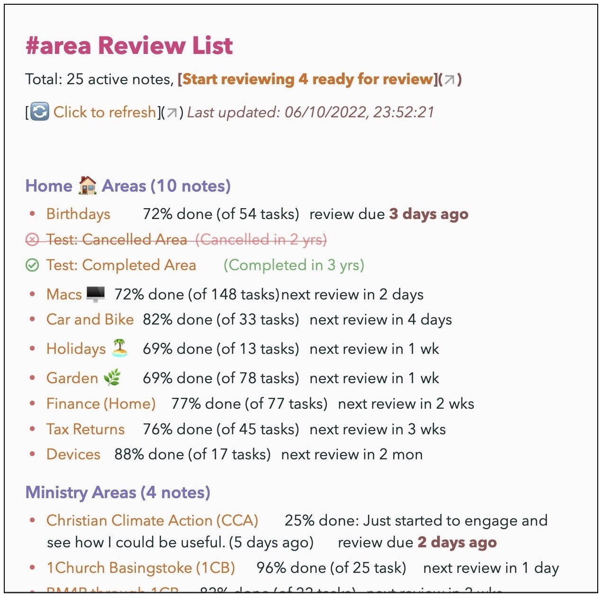

# 🔬 Reviews  plugin
Unlike many task or project management apps, NotePlan has very little enforced structure, and is entirely text/markdown based.  This makes it much more flexible, but makes it less obvious how to use it for tracking and managing complex work, loosely referred to here as 'Projects'.

This plugin provides commands to help **review** Project-based notes, and it helps me manage over 50 such projects. This will be familiar to people who use David Allen's **Getting Things Done** approach, or any other where **regular reviews** are important. (It probably won't have much applicability to people who just use NotePlan as a Zettelkasten-style knowledge base.)

If, like me, you're using the helpful [PARA Approach](https://fortelabs.co/blog/series/para/), then your **Areas** are also a form of Project, at least as far as Reviewing them goes.  I have another 50 of these.

User George Crump (@george65) has created a [great video showing how the plugin works](https://storone.zoom.us/rec/play/Pgo9gL24JcZeLJfMW23GWVMGgYGMIN9NZgK5eJwhec8Xg0kyqTZG-uxJjjQh3tK2CvIAYAK5QheSTKis.0Qf5Lu0zvNIIIra3). (Note: it was created before v0.8 was released.)
[](https://storone.zoom.us/rec/play/Pgo9gL24JcZeLJfMW23GWVMGgYGMIN9NZgK5eJwhec8Xg0kyqTZG-uxJjjQh3tK2CvIAYAK5QheSTKis.0Qf5Lu0zvNIIIra3)

## Using NotePlan for Project-like work
Each **Project** is described by a separate note, and has a lifecycle something like this:



Each such project contains the `#project` hashtag, `@review(...)` and some other metadata fields on a line (which I suggest comes after the title).  For example:


<!-- ```markdown
# Secret Undertaking
#project @review(2w) @reviewed(2021-07-20) @start(2021-04-05) @due(2021-11-30)
Aim: Do this amazing secret thing
Progress: 10@2022-01-07: Had the briefing and got 007 on the case

## Details
* [x] Get briefing from 'M' at HQ
* [x] recruit James Bond
* task Q with building a personal jetpack (with USB ports)
* set up team Deliveroo account
...
``` -->

The fields I use are:
- `@review(...)`: interval to use between reviews, of form [number][bdwmqy]:
    - After the [number] is a character, which is one of: **b**usiness days (ignore weekends, but doesn't ignore public holidays, as they're different for each country), **d**ays, **w**eeks, **m**onths, **q**uarters, **y**ears.
- `@reviewed(YYYY-MM-DD)`: last time this project was reviewed, using this plugin
- `@start(YYY-MM-DD)`: project's start date
- `@due(YYY-MM-DD)`: project's due date
- `@completed(YYY-MM-DD)`: date project was completed (if relevant)
- `@cancelled(YYY-MM-DD)`: date project was cancelled (if relevant)
- `Aim: free text`: optional, and not used in any processing
- `Progress: N:YYYY-MM-DD: free text ...`: your latest summary of progress for this N% (optional)

Similarly, if you follow the PARA method, then you will also have "**Areas** of responsibility" to maintain, and I use a `#area` tag to mark these. These don't normally have a start/end/completed dates, but they also need reviewing.  For example:

```markdown
# Car maintenance
#area @review(1m) @reviewed(2021-06-25)
Aim: Make sure car continues to run well, is legal etc.

* check tyres @repeat(+1m) >2021-07-23
* pay car/road tax @repeat(1y) >2021-10-11
* book yearly service @repeat(1y) >2022-02-01
...
```

(These use my related [Repeat Extensions plugin](https://github.com/NotePlan/plugins/tree/main/jgclark.RepeatExtensions/) to give more flexibility than the built-in repeats.)

## Reviewing Projects and/or Areas
Use the 'Hashtags to review' setting to control which notes are included in the review lists:
- If this setting is empty, then it will include all notes for review that include a `@review(...)` string.
- if it is set (e.g. `#project, #area, #goal`), then it will include just those notes which also have one or more of those tags.
- You can specify folders to ignore using the 'Folders to Ignore' setting; I have this set to `Summaries, Reviews, Saved Searches`. (Note that the special Templates, Archive and Trash are always excluded.)

When you have [configured the plugin](#configuration), and added suitable metadata to notes, you're then ready to use some or all of the following commands:

### "/project lists" command
This creates or updates a list of project notes, including basic tasks statistics and time until next review, and time until the project is due to complete. This is stored in summary note(s) in the 'Reviews' folder (or whatever you set the 'Folder to store' setting to be). For example:

From v0.8 you can now set the '**Output style to use**'. This is either a new 'Rich' (HTML) or original 'Markdown' (normal NotePlan) output style.

 

Note:  the 'Rich' style _isn't a normal NotePlan note that is saved and can be accessed again later_. You will need to re-run the command to see the list again once you close the window.  This 'Rich' style mimics the NotePlan Theme you use.

**Tip**: Place this Rich list next to your main NotePlan window, and you can click on each project title in the table, and it will open in the main window ready to review and update.

Other settings:
- Specify folders to ignore using the 'Folders to ignore' shared setting (as above).
- Display project dates?  Whether to display the project's review and due dates (where set).
- Display project's latest progress?  Whether to show the project's latest progress (where available). If a specific 'Progress:' field is set it will use that, otherwise it will calculate %completion based on the number of completed and open tasks.
- Display order for projects: The sort options  are by 'due' date, by 'review' date or 'title'.
- Display grouped by folder? Whether to group the projects by their folder.
- Display archived projects? Whether to display project notes marked as `#archive`.

On the second line is a link 'Start reviewing _N_ ready for review', which is a shortcut to the '/start reviews' command (described next).
Each project title is also an active link which can be clicked to take you to that project note. (Or Option-click to open that in a new split window, which keeps the review list open.)

#### Running from x-callback call
From v0.8 this command can be run from an x-callback call:

`noteplan://x-callback-url/runPlugin?pluginID=jgclark.Reviews&command=project%20lists`

If you wish to override your current settings for this call, add `&arg0=` followed by a URL encoded version of keys and values e.g. `arg0=displayDates%3Dtrue%2CdisplayProgress%3Dfalse%2CdisplayGroupedByFolder%3Dfalse`.

The name of the settings are taken from the `key`s from the plugin's `plugin.json` file, which are mostly the names shown in the settings dialog without spaces.

### "/start reviews" command
This creates a hidden list of notes ready for review, and then kicks off the most overdue review by opening that note in the editor. When you have finished the review run one of the next two commands ...

### "/complete review" command
This updates the current open project's `@reviewed(date)`.

### "/next review" command
This updates this project's `@reviewed(date)`, and jumps to the next project to review. If there are none left ready for review it will show a congratulations message.

## Creating a new Project/Area note
A good way to quickly create a new Project or Area note is to use the `/np:new` (new note from template) or `/np:qtn` (Quick template note) command from the Templating plugin. Here is what I use as my New Project Template:

```markdown
---
title: Create a new Project note
type: template, quick-note, empty-note, project-note
folder: <select>
---
# <%- prompt('noteTitle', 'Project name') %>
#project @start(<%- promptDate('startDate', 'Enter start date') %>) @due(<%- promptDate('dueDate', 'Enter due date') %>) @review(<%- promptDateInterval('question', 'Enter review interval') %>)
Aim: <%- prompt('aim') %>
Context: <%- prompt('context') %>
```

## "/complete project" command
This adds an #archive tag, and a `@completed(date)` mention to the metadata line of the open project note, removes the project/area from the review list. It also offers to move it to NotePlan's separate Archive folder.

## "/cancel project" command
This adds an #archive tag, and a `@cancelled(date)` mention to the metadata line of the open project note, removes the project/area from the review list. It also offers to move it to NotePlan's separate Archive folder.

## Configuration
These commands require configuration, which is done by clicking the gear button on the 'Summaries' line in the Plugin Preferences panel.

## Thanks
Thanks to George Crump for his suggestions and beta testing.

## Support
If you find an issue with this plugin, or would like to suggest new features for it, please raise a [Bug or Feature 'Issue'](https://github.com/NotePlan/plugins/issues).

If you would like to support my late-night work extending NotePlan through writing these plugins, you can through

[](https://www.buymeacoffee.com/revjgc)

Thanks!

## Changes
Please see the [CHANGELOG](CHANGELOG.md).
