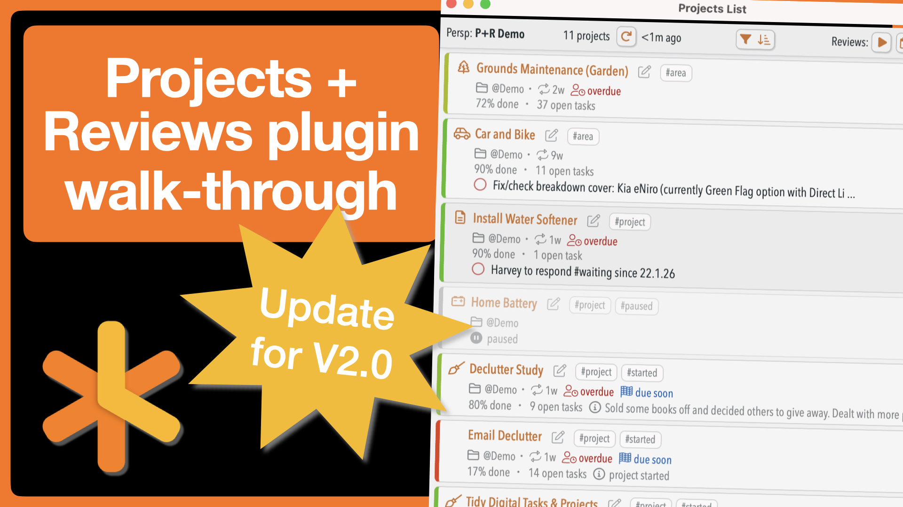
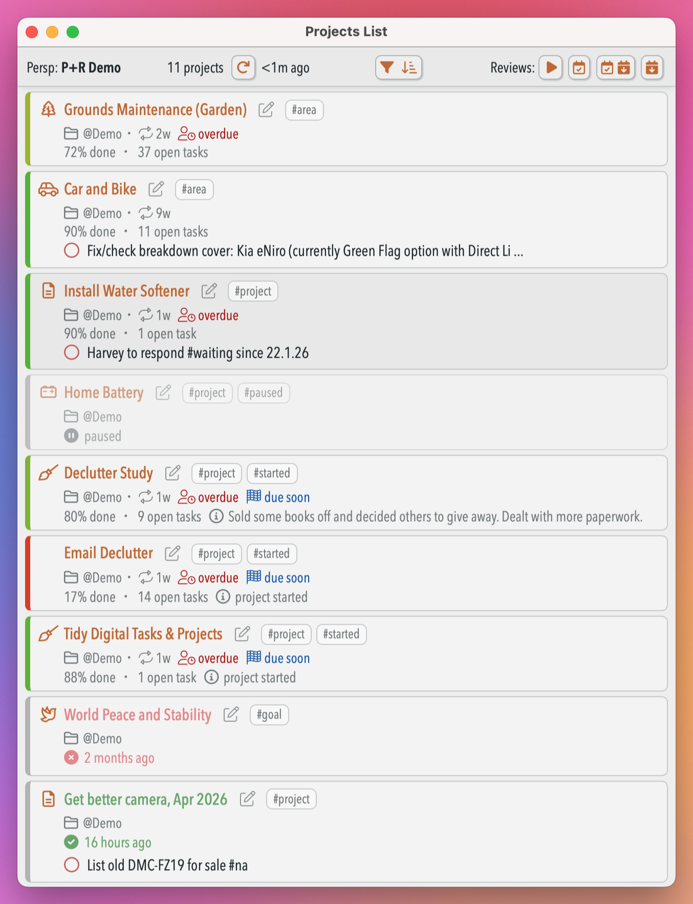
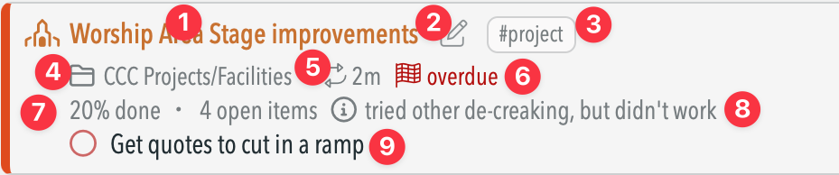
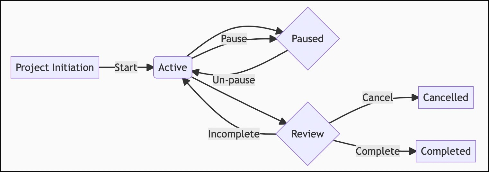
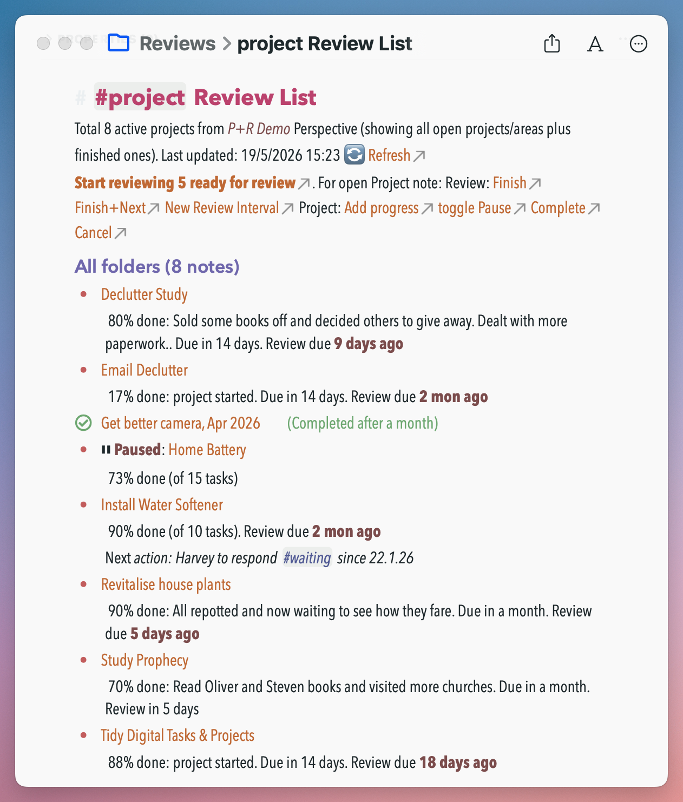
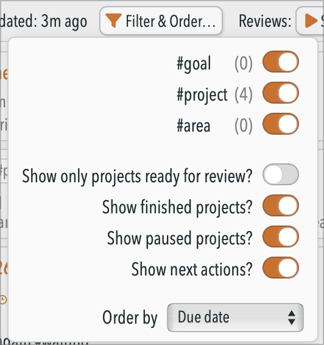
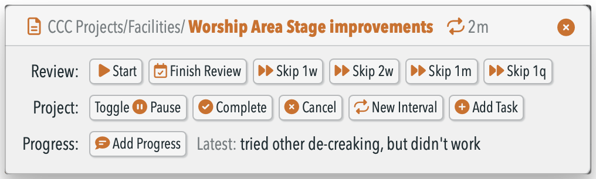
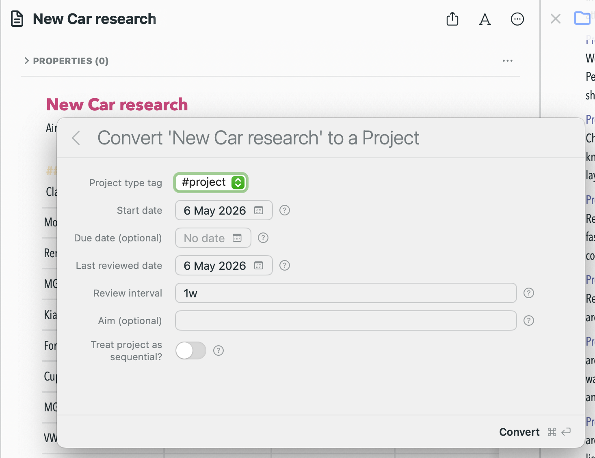

# 🔬 Projects + Reviews plugin
Unlike most task or project management apps, NotePlan has very little enforced structure, and is entirely text/markdown based.  This makes it much more flexible, but makes it less obvious how to use it for managing and tracking complex work, loosely referred to here as 'Projects'.

This plugin lets you easily a single list of active **Projects**, and their progress towards completion. It helps regularly **review** Project notes -- an approach that will be familiar to people who use David Allen's **Getting Things Done** methodology, or any other where **regular reviews** are important.

- [Walk-through of Project + Reviews Plugin v2](https://youtu.be/EOuOHk4f2d8) by the plugin author.

  [](https://youtu.be/EOuOHk4f2d8)

## Overview
The **/project lists** command shows the Project Review List screen, showing the projects due for review from various different NotePlan folders:



Each Project row show the following details:


1. Title, with its icon
2. Edit button, brings up edit dialog
3. Any hashtags defined on the project
4. Folder it lives in
5. The review interval
6. Notes if the project or reviews are overdue or due soon.
7. % completion (as before, but now shown in a more compact way)
8. Latest 'progress' you've noted for the project
9. Any 'next action' on the project


- [Inside Look: How George, CMO of Verge.io, Uses NotePlan for Effective Project Management](https://www.youtube.com/watch?v=J-FlyffE9iA) featuring a rather earlier version of this plugin and my Dashboard plugin.

  [](https://www.youtube.com/watch?v=J-FlyffE9iA)

You might also like:
- [my description of using PARA in NotePlan at scale](https://noteplan.co/n/BCC8CAFA-273F-4513-9A88-53CA811F3C8D)
- [Antony's description of his process which includes this and other plugins](https://noteplan.co/n/381AC6DF-FB8F-49A5-AF8D-1B43B3092922).

## Using NotePlan for Projects (or Project-like work)

Each **Project** is described by a separate note. If, like me, you're using the helpful [PARA Approach](https://fortelabs.co/blog/series/para/), then your **Areas** are also a form of Project, at least as far as Reviewing them goes.

Each such project/area note contains some **metadata** fields including a hashtag (e.g. `#project`), a `review: <interval>`, and a number of optional dates. For example:

```markdown
---
title: Secret Undertaking
project: #project
start: 2021-04-05
due: 2021-11-30
reviewed: 2021-07-20
review: 2w
aim: Stop SPECTRE from world domination
---
# Secret Undertaking

## Details
* [x] Get briefing from 'M' at HQ
* [x] recruit James Bond
* [ ] task 'Q' with building a personal jetpack (with USB ports)
* [ ] set up team Deliveroo account
...
```

The fields it uses are:
- `project`: a set of one or more hashtags that help you know what sort of project this is. At simplest this can be `#project`, but it can be anything else that's useful, for example `#goal`.
- `review`: interval to use between reviews, of form `[number][bdwmqy]`:
    - After the [number] is a character, which is one of: **b**usiness days (ignore weekends, but doesn't ignore public holidays, as they're different for each country), **d**ays, **w**eeks, **m**onths, **q**uarters, **y**ears.
- `reviewed`: the last date this project was reviewed using this plugin
- `nextReview`: specific date for next review (if wanted)
- `start`: project's start date (optional)
- `due`: project's due date (optional; not normally relevant for Areas)
- `completed`: date project was completed (if relevant)
- `cancelled`: date project was cancelled (if relevant)
- `Aim`: optional. The plugin doesn't read or display the Aim, but the `/convert to project` form will write it to an `aim:` frontmatter field if you supply one.
- `Progress: N@YYYY-MM-DD one-line description`: your latest summary of progress for this N% (optional). If present this is shown in the projects list; if not, the % progress is calculated as the number of open and closed tasks. (From v1.3 the default format omits the colon after the date; older lines with a colon are still parsed.)

An example of an Area-type note:

```markdown
---
title: Car Maintenance
project: #area
review: 1m
reviewed: 2021-06-25
Aim: Make sure 007's Aston Martin continues to run well, is legal etc.
---
# Car Maintenance

## One-off tasks
* [x] patch up bullet holes after last mission @done(2021-06-20)

## Regular tasks
* check tyres @repeat(+1m) >2021-07-23
* pay road tax @repeat(1y) >2021-10-11
* do yearly service @repeat(1y) >2022-02-01
...
```
(Note: This example uses my related [Repeat Extensions plugin](https://github.com/NotePlan/plugins/tree/main/jgclark.RepeatExtensions/) to give more flexibility than the built-in repeats.)


Other details about the metadata:
- You can change the name of the Frontmatter key for the hashtags to use, by changing the "Frontmatter metadata key" setting (see below). Another good option might be `metadata`.
- If you also add the `#paused` tag to the metadata line, then that stops that note from being included in active reviews, but can show up in the lists. Pausing or un-pausing also updates the metadata `reviewed: <date>`.
- From v1.3 you can add `project: #sequential` in the frontmatter: the plugin then treats the first open task/checklist in the note as the 'next action', without needing to use next-action tags on individual tasks.
- If there are multiple copies of a metadata field, only the first one is used.
- You can of course use any other frontmatter keys and values you wish. For example, you might want to use `status: started` or `status: complete` and use `status` as part of the ['Cards'  Kanban-style folder view definition](https://help.noteplan.co/article/239-card-kanban-view).

## Project lifecycles
Here's the underlying lifecycle that this plugin supports:



(An Area tends not to have a Due date, and so rarely get Completed.)


<!--
#### Combined frontmatter key (default `project`)

The combined key (settable via the **Frontmatter metadata key** setting; default `project`, with `metadata` a common alternative) holds **only hashtags** — for example `#project` and any markers such as `#sequential` or `#paused`. Date/interval values live in their own separate keys (`start`, `due`, `reviewed`, `review`, `nextReview`, `completed`, `cancelled`).

When a note still has a metadata line in the body but **no** value in the combined frontmatter key, the plugin will migrate that body line into the configured frontmatter key and **remove the metadata line from the body**. When any command later updates that project note, it writes to frontmatter and removes the previous body metadata line if present. All tags such as `#project` are preserved during migration.

The plugin:

- **Reads** from these separate fields if they already exist in frontmatter (using whatever key names your current settings imply), and overlays them on top of what it finds in the combined line.
- **Writes back** to these fields **only if they already exist**. It will not create new separate keys on its own; it simply keeps any existing ones in sync when it updates metadata, again using the key names derived from your current `*MentionStr` settings.

You can therefore:

- Use only the combined frontmatter key, or
- Use both the combined key and any separate fields you choose to add, or
- Continue to use just the body metadata line (the plugin will migrate it into frontmatter and remove it from the body when it next needs to update metadata).

The first hashtag in the note defines its type, so as well as `#project`, `#area` you could have a `#goal` or whatever makes most sense for you. 
-->

## Selecting notes to include
There are 2 parts of this:
1. Use the '**Hashtags to review**' setting to control which notes are included in the review lists. If it is set (e.g. `#project, #area, #goal`), then it will include just those notes which also have one or more of those tags. If this setting is empty, then it will include all notes for review that include `review: <interval>` metadata.
2. Then specify which **folders** you want to include and/or exclude notes from. There are 2 ways to do this:

  - Use the '**Folders to Include**' and '**Folders to Exclude**' settings to put a comma-separated list of folders to include and exclude. Good folders to exclude include `Summaries, Reviews, Saved Searches`. Any sub-folders of these will also be ignored. This match is done anywhere in the folder name, so you could simply say `Project` which would match for `Client A/Projects` as well as `Client B/Projects`. Note also:
    - if you specify the root folder `/` this only includes the root folder itself, and not all its sub-folders.
    - If 'Folders to Include' setting is empty, then all folders will be used apart from those in the 'Folders to Exclude' setting.
    - The special Templates, Archive and Trash are always excluded.
  
  - Or if you use my separate **[Dashboard plugin](https://noteplan.co/plugins/jgclark.Dashboard/)**, turn on the '**Use Perspectives**' setting to inherit its definitions of what folders (and (Team)Space notes, and even note sections) are included and excluded.  to be installed. If you change the active Perspective in the Dashboard, the Project Lists window will also automatically update (from Dashboard v2.4).

When you have [configured the plugin](#configuration), and added suitable metadata to notes, you're then ready to use some or all of the following commands:

## The main /project lists command
This shows a list of project notes, including basic tasks statistics and time until next review, and time until the project is due to complete. 

It defaults to a colourful '**Rich**' style, shown above. The window opens by default in a new window; use the "Open 'Rich' Project List in what sort of window?" setting to switch to opening in the main window or a split view of the main window instead. The plugin also appears in the NotePlan Sidebar.

Or you can use '**Output style to use**' setting to the original '**Markdown**' (normal NotePlan) output style, shown here:



### Project Lists: 2 styles of display
The **Rich style** presents a list of all your matching projects, ordered and further filtered according to controls in the Filter & Order... dropdown: 

There's a top bar that 'sticks' to the top of the window as you scroll the list. It grows/shrinks depending how wide the window is. It includes a Refresh button, and at the right end are buttons to control running Reviews:


The narrower version of the top bar looks like this: 

After each project name (the title of the note) is an edit icon, which when clicked opens a dialog with helpful controls for that particular project. The dialog title includes the folder and a clickable project note name.



Other notes:
- If you can make the window wide enough it will display in 2 (or even 3!) columns; layout adapts at narrower widths.
- Each project row can show a **count badge** (grey square) with the number of open, non-future items; badges only appear for active projects when the count is greater than zero.
- Long 'next action' lines are truncated when needed. If a project note has an icon set in its frontmatter, that icon is shown in the list.
- This HTML window that picks up the NotePlan Theme you use (though see below on how to override this).

The **Markdown style** list is quite different: it is stored as summary note(s) in the 'Reviews' folder (or whatever you set the 'Folder to store' setting to be). It creates one note per project tag (for example,  `#project` separate from `#area`).  Other notes:
- the button 'Start reviews' / 'Start reviewing notes ready for review' is a shortcut to the '/start reviews' command (described below).
- each project title is also an active link which can be clicked to take you to that project note. (Or Option-click to open that in a new split window, which keeps the review list open.)
- _Note: this style is now deprecated, and I expect to remove support after v2._

## Progress Summaries
In a project/area note you can, if you wish, include a **one-line summary** of your view on its current **overall progress**. If given, the latest one is shown in the project lists. To continue the example above, here's the start of the note a few weeks later, showing I think it's only 10% complete:

```markdown
# Secret Undertaking
Progress: 10@2021-05-20 Tracked down 007 and got him on the case
Progress: 0@2021-04-05 Project started with a briefing from M about SPECTRE's dastardly plan

## Details
* [x] track 007 down
* [x] Get briefing from 'M' at HQ
* [x] task 'Q' with building a personal jetpack (with USB ports)
* [x] set up team Deliveroo account
* [ ] arrange for 007's parking tickets to be paid
...
```

The starting percentage number doesn't have to be given; if it's not it is _calculated from the % of open and completed tasks_ found in the note.

To add a progress comment, either run the **/add progress update** command, or click the "Add Progress" button in the edit dialog. Note: Adding a comment also automatically updates the "reviewed" date on the project.

The settings relating to Progress calculations and comments are:
- Ignore tasks set more than these days in the future: If set more than 0, then when the progress percentage is calculated it will ignore items scheduled more than this number of days in the future. (Default is 1 day: all items with future scheduled dates are ignored.)
- Ignore checklists in progress? If set, then checklists in progress will not be counted as part of the project's completion percentage.
- Progress Heading: (from v1.3) Optional heading name under which `Progress: ...` lines are stored in the project note. If you set this when the note already has progress lines, the plugin finds them and inserts the heading above. Tip: if this ends with `…` the section will start folded.
- Progress Heading level: heading level (1–5) used when the Progress heading is created (default `2`).
- Also write most recent Progress line to frontmatter?: (from v1.3) When on, the current progress line is also written to frontmatter so it can be used in Folder Views (default: off).

## Other Plugin settings
- Open 'Rich' Project List in what sort of window?: Choose how the Rich project list opens on NotePlan v3.20+. The options are `New Window` (default — separate window), `Main Window` (take over the main window), or `Split View` (a split view in the main window).
- Automatic Update interval: If set to any number > 0, the Rich Project Lists window will automatically refresh after that many minutes. The current scroll position is preserved as closely as possible. Set to 0 to disable.
- Next action tag(s): optional list of #hashtags to include in a task or checklist to indicate it's the next action in this project (comma-separated; default `#na`). If there are no tagged items and the note has `#sequential` in the frontmatter `project:` field, the first open task/checklist is shown as the next action. Only the first matching item is shown. (Also see the next setting.)
- Sequential project marker: the marker to identify sequential projects (default `#sequential`).
- Display next actions in output? This requires the 'Next action tag(s)' setting to be set or use `#sequential` markers. There is also a 'Show next actions?' toggle control for this in the Filter… menu.
- Display order for projects: The sort options are by `due` date, `review` date, `title`, or `firstTag` (the first project tag, in the order they're listed in 'Hashtags to Review').
- Show projects grouped by folder? Whether to group the projects by their folder.
- Hide higher-level folder names in headings? If 'Show projects grouped by folder?' (above) is set, this hides all but the lowest-level subfolder name in headings.
- Show completed/cancelled projects? If set, then completed/cancelled projects will be shown at the end of the list of active projects.
- Only show projects/areas ready for review?: If true then it will only show project/area notes ready for review (plus paused ones).
- Show project dates? Whether to show the project's review and due dates (where set).
- Show project's latest progress? Whether to show the project's latest progress summary text. These are only shown where there are specific `Progress:` field(s) in the note. (See above for details.)
- Confirm next Review?: When running '/next project review' it asks whether to start the next review.
- Theme to use for Rich project list: if set to a valid installed Theme name, then that will always be used in place of the currently active theme for the Rich project list window.
- Folder to Archive completed/cancelled project notes to: By default this is the built-in Archive folder (shown in the sidebar) which has the special name `@Archive`, but it can be set to any other folder name.
- Archive using folder structure? When you complete or cancel a project, and you opt to move it to the Archive, if set this will replicate the project note's existing folder structure inside your chosen Archive folder (set above). (This is the same thing that the Filer plugin's "/archive note using folder structure" command does, though Filer does not need to be installed to use this.)
- Remove due dates when pausing a project?: If set, all open tasks/checklists in the project will have any `>date` removed when the project is paused (default: on).
- Frontmatter metadata key: the YAML key used for the combined project metadata value (default `project`; `metadata` is a common alternative). The value of this key holds only hashtags (e.g. `#project`, `#sequential`); date/interval values live in their own separate keys.

## The other Commands

Each command is described in turn. If you have a Rich style project list open, the list will be automatically updated after most of them.

### "/start reviews" command
This kicks off the most overdue review by opening that project's note in the editor. When you have finished the review run one of the next two commands ...
(There is a button for this in the top bar of the project list window.)

### "/finish project review" command
This updates the current open project's `reviewed: date` metadata, and if a Rich style project list is open, it is refreshed.
If the 'Next action tag(s)' setting is set, then it will warn if it finds no example of those tags on all open tasks/checklists.
(There is a button for this in the top bar of the project list window.)

### "/finish project review and start next" command
This is a convenience combination of "/finish project review" and "/next project review": it updates the current project's `reviewed: date` metadata and then jumps straight to the next project ready for review. If there are none left, it shows you a congratulations message instead.
(There is a button for this in the top bar of the project list window.)

### "/next project review" command
This updates this project's `reviewed: date` metadata, and jumps to the next project to review. If there are none left ready for review it will show a congratulations message.
(There is a button for this in the top bar of the project list window.)

### "/skip project review" command
This overrides (or skips) the normal review interval for a project, by adding `nextReview: <date>` metadata of your choosing to the current project note. (Why? This avoids changing the `review: <interval>`, or giving a misleading impression by setting the `reviewed: <date>` metadata to today.)  It also jumps to the next project to review.  The next time "finish review" command is used on the project note, the `nextReview` metadata is removed.

### "/set new review interval" command
This prompts you for a new review interval (e.g. `1w`, `2m`, `3q`, `1y`) and writes it back to the current project's `review:` metadata value. This is the right command to use when you want to permanently change how often a project is reviewed; use `/skip project review` instead if you only want to push out the *next* review without changing the interval.

### "/complete project" command
This sets a completion date on the open project note and will update the review list.

It also opens a single **closeout form** (from NotePlan v3.21+) asking three things:

1. **Archive project note?** — if yes, the note is moved to NotePlan's `@Archive` folder (or whatever folder you've set in the **Folder to Archive completed/cancelled project notes to** setting). If "Archive using folder structure?" is on, the note's existing folder structure is replicated under the Archive folder.
2. **Add summary line to a calendar note?** — choose `Quarterly`, `Yearly`, or `none`. A summary line is appended under the **Finished List Heading** (default `Finished Projects/Areas`) in the current quarterly or yearly calendar note.
3. **Final progress comment (optional)** — if you supply text, it is added as a `Progress: ...` line on today's date before the project closes out.

On older versions of NotePlan (without Command Bar forms) the same three questions are asked as separate prompts.

### "/cancel project" command
This is the same flow as `/complete project`, but it sets the `cancelled` frontmatter key (derived from your `cancelled` mention setting) instead of `completed`, and the closeout form is titled "Cancel Project". The same archive / summary-destination / final-progress-comment options apply.

### "/pause project toggle" command
This is a toggle that adds or removes a `#paused` tag to the metadata line of the open project note. When paused it stops the note being offered with '/next review'. However, it keeps showing it in the review list, so you don't forget about it entirely.

If the 'Remove due dates when pausing a project?' setting is set, then all open tasks and checklists with a `>date` will have that date removed.

### "/add progress update" command
This prompts for a short description of latest progress (as short text string) and current % complete (number). This is inserted into the metadata area of the current project note (under the Progress Heading if that setting is set) as:

```markdown
Progress: <num>@YYYY-MM-DD <short description>
```
It will also update the project's `reviewed: date` metadata.

### "/convert to project" command
(New in v2, and requires NotePlan v3.21+.) This takes an **existing** regular note and turns it into a project note by showing you a form to gather the metadata, then writing the answers to the note's frontmatter. (This is designed to supplement [Creating a new Project/Area note](#creating-a-new-projectarea-note) below.)



The fields on the form are:
- **Project type tag** — a choice from your **Hashtags to review** setting (e.g. `#project`, `#area`). This becomes the value of your configured **Frontmatter metadata key** (default `project:`), which must contain **only hashtags** (and optional markers such as `#sequential` — see below).
- **Start date**, **Due date** (optional), **Last reviewed date** — written to the separate frontmatter fields derived from your mention settings (e.g. `start`, `due`, `reviewed`).
- **Review interval** — e.g. `1w`, `2m`; stored in the separate field derived from your review-interval mention setting (e.g. `review`).
- **Aim** (optional) — if you enter text, it is written to an `aim:` frontmatter field.
- **Treat project as sequential?** (optional checkbox) — only shown if your **Sequential project marker** setting is non-empty. If you turn it on, that marker (default `#sequential`) is added to the `project:` metadata field so the first open task/checklist is treated as the next action, as described [above](#capturing-and-displaying-next-actions).

### "/weeklyProjectsProgress" command
This scans your Area/Project folders and writes two CSV files into the plugin's hidden data folder (`NotePlan/Plugins/Data/jgclark.Reviews/`):

- one with the number of distinct notes progressed per folder per week (a project note counts as progressed if one or more tasks were completed that week)
- one with the total number of completed tasks per folder per week

### "/heatmaps for weekly Projects Progress" command
This first runs the same scan as `/weeklyProjectsProgress` (so the CSVs are kept fresh), and then shows a pair of heatmaps in new windows:

- notes progressed per week per folder of notes (where a project note counts as being progressed if one or more tasks are completed)
- tasks completed per week per folder of notes

For those with lots of different projects or project groups, this is a handy way of seeing over time which of them are getting more or less attention.

### "/migrate all projects" command
(New for v2.) This runs a **batch metadata migration** on every project note that matches your current set of relevant project-like notes. This is the same command that was offered for you to use when upgrading from v1.x to v2.0.

When the command finishes, a dialog reports how many notes **actually** had a successful metadata migration (`ok` in the log), how many had migration issues logged, how many needed no migration, and how many failed in the constructor.

**Migration log (`migration_log.tsv`):** Rows are appended to `NotePlan/Plugins/Data/jgclark.Reviews/migration_log.tsv` (same folder as `allProjectsList.json`). Columns are **`filename`**, **`title`**, **`date`** (ISO timestamp when the row was written), and **`detail`** (`ok` or an error message). The file is append-only.

- **During `/migrate all projects`:** you get **at most one row per project note/tag pair** in that run. A row is written only when a migration step actually changed the note (or reported an error), or when the `Project` constructor throws — **notes that needed no migration do not get a log row.** Nested migration steps still do not add extra or duplicate rows.
- **During normal plugin use** (e.g. opening a project or finishing a review when body metadata is merged into frontmatter), a row is written when that migration runs, independently of the batch command.


## Capturing and Displaying 'Next Actions'
Part of the "Getting Things Done" methodology is to be clear what your **next action** is. If you put a standard tag on such actionable tasks/checklists (e.g. `#na` or `#next` — default is `#na`) and set that in the plugin settings, the project list shows that next action after the progress summary. Only the first matching item is shown; if there are no tagged items and the note has `project: #sequential` in frontmatter, the first open task/checklist in the note is shown instead. You can set several next-action tags (e.g. `#na` for things you can do, `#waiting` for things you're waiting on others).

Note: **Future-scheduled tasks are ignored** when choosing a next action using the 'sequential' method.

The **Dashboard Plugin** has 2 possible Project Sections, and these can also show the 'next actions' for a project.

Another approach comes from user George C:
- when reviewing notes I use the **add sync'd copy to note** command (from the [Filer plugin](https://github.com/NotePlan/plugins/tree/main/jgclark.Filer)) to 'sync' actionable tasks to the current weekly note. (Or, if I know I don't need to get to it until the next week, then it goes into the following week or whatever. If it is actionable but I don't need to get to it until the next month I sync it into that next months task.)
- in essence this recreates the GTD 30 day, and monthly folders, but with the advantage that all these tasks are synced back to their projects.
- each day I drag out from the reference area's week's note any actions I want to do that day, maintaining the Sync line status.
- I also will copy over any tasks I didn't do from the previous day.

## Creating a new Project/Area note
There are a variety of tools to help you create a new Project or Area note ...

### Templates
Use the `/np:new` (new note from template) or `/np:qtn` (Quick template note) command from the built-in Templating system, to apply a pre-set Template. For example here's a basic Template that will prompt you with 6 questions:

```markdown
---
title: Create a new Project note
type: template, quick-note, empty-note, project-note
folder: <select>
---
# <%- prompt('noteTitle', 'Project name') %>
#project @start(<%- promptDate('startDate', 'Enter start date') %>) @due(<%- promptDate('dueDate', 'Enter due date') %>) @review(<%- promptDateInterval('question', 'Enter review interval') %>)
Aim: <%- prompt('aim') %>
Context: <%- prompt('context') %>
```

For more details, see [Templating including frontmatter](https://noteplan.co/templates/docs/advanced-features/templating-examples-frontmatter).

### Template Forms
[Template Forms](https://noteplan.co/plugins/dwertheimer.Forms) is a separate powerful plugin which provides a visual form builder, that works with a 'processing template'. It ships with an example New Project form; you can customise your own form(s) from this.

### Converting an existing note
To add project metadata to a note you _already have_, use the ["convert to project" command](#convert-to-project-command) above.

## Using with Dashboard plugin
My separate [Dashboard plugin](https://github.com/NotePlan/plugins/blob/main/jgclark.Dashboard/) shows a simpler version of the data from the Projects Review List in its 2 'Projects' sections:
- **Projects to Review Section**: shows just the Projects that are ready for review today, or are overdue for review
- **Active Projects Section**: shows just the Projects that have a defined ['next action' task](#capturing-and-displaying-next-actions).

The individual Project lines that are shown have the same type of edit dialog to complete/cancel/finish review/skip review, and also shows progress indicators. 

When the Project Lists window is open it automatically refreshes when you change data (requires Dashboard v2.4.0 or later).

## Running from an x-callback call
All of the commands can be run from an x-callback call, of this form:

`noteplan://x-callback-url/runPlugin?pluginID=jgclark.Reviews&command=project%20lists`

The `command` parameter is the command name (as above), but needs to be 'percent encoded' (i.e. with any spaces changed to `%20`).

If you wish to override your current settings for the call, add `&arg0=` followed by a JSON version of the keys and values e.g.
`arg0={"foldersToInclude":["CCC Projects"],"displayDates":true,"displayProgress":false,"displayGroupedByFolder":false,"displayOrder":"title"}`
that then needs to be URL encoded e.g.
`arg0=%7B%22foldersToInclude%22%3A%5B%22CCC%20Projects%22%5D%2C%22displayDates%22%3Atrue%2C%22displayProgress%22%3Afalse%2C%22displayGroupedByFolder%22%3Afalse%2C%22displayOrder%22%3A%22title%22%7D`

The name of the settings are taken from the `key`s from the plugin's `plugin.json` file, which are mostly the names shown in the settings dialog without spaces.

## For the record: How v1 specified the project 'metadata'
In v1 you could only write it as a line in the body of a project note. This is what the example above looked like in v1:
```md
# Secret Undertaking
#project @review(2w) @reviewed(2021-07-20) @start(2021-04-05) @due(2021-11-30)
Aim: Stop SPECTRE from world domination
...
```

Note each date/interval is enclosed in a `@mention(...)`.

Since then, frontmatter support has been added to NotePlan, and now **v2** of the plugin uses that instead. When you first run v2, it will offer to migrate the metadata in all project notes in a single operation. If you decline, then it will migrate the metadata on each individual note any time the metadata changes.

## Thanks
Particular thanks to @MC-1848, George C, @John1, @dwertheimer, @cbkadel and @Garba for their suggestions and beta testing, plus others on the NotePlan Discord server.

## Known issues
Due to limitations in the NotePlan API for plugins:
- it's generally not possible to control which split window a note is opened in, when you click on a project note in the Project List window.
- the ordering of metadata fields in the frontmatter is not stable, and normally changes at random when its updated.

## Support
If you find an issue with this plugin, or would like to suggest new features for it, please raise an ['Issue' of a Bug or Feature Request](https://github.com/NotePlan/plugins/issues).

I'm not part of the NotePlan team, but I've spent at least 5 working weeks on this particular plugin. If you would like to support my late-night hobby extending NotePlan through writing these plugins, you can through

[](https://www.buymeacoffee.com/revjgc)

Thanks!

## Changes
Please see the [CHANGELOG](https://github.com/NotePlan/plugins/blob/main/jgclark.Reviews/CHANGELOG.md).
