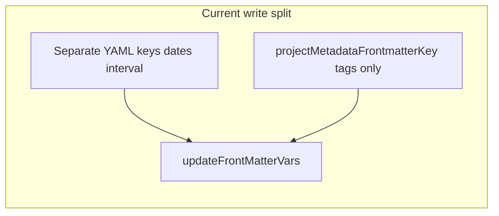

# Remove combined single-key metadata (keep tags-only key)

## Current architecture (what “combined key” means today)

- **Preference** `[projectMetadataFrontmatterKey](jgclark.Reviews/plugin.json)` names the YAML field used as the “combined” line; default `project`. A second preference, `**writeDateMentionsInCombinedMetadata`**, exists in settings and is referenced from persistence-related code paths (not from `[Project.generateMarkdownOutputLine](jgclark.Reviews/src/projectClass.js)`, which is for **markdown / project-list summary output** and must be left out of this metadata migration work).
- **Write path**: `[Project.updateProjectMetadata](jgclark.Reviews/src/projectClass.js)` builds separate keys for dates/interval/nextReview, then sets `attrs[singleKeyName] = this.getCombinedProjectTagsFrontmatterValue(singleKeyName)` so the named key holds **only hashtags** (invariant comment ~957).
- **Read path**: `[Project` constructor](jgclark.Reviews/src/projectClass.js) uses `readRawFrontmatterField` / `getFrontmatterAttribute` on that same key to detect “has frontmatter metadata” (~~447), derive `primaryProjectTag` (~~488–494), and **back-compat** parses embedded `@mentions` from the combined string (~531–570).
- **Helpers**: `[reviewHelpers.js](jgclark.Reviews/src/reviewHelpers.js)` — `getReviewSettings` syncs both prefs (~~227–238); `[isProjectNoteIsMarkedSequential](jgclark.Reviews/src/reviewHelpers.js)` reads sequential tag from that attribute (~~346–351); `[getProjectMetadataLineIndex](jgclark.Reviews/src/reviewHelpers.js)` still locates a pseudo-paragraph line inside YAML for `project:` / configurable key / `metadata:` (~~491–498); `[migrateProjectMetadataLineCore](jgclark.Reviews/src/reviewHelpers.js)` merges body metadata into `primaryKey` with tags via `extractTagsOnly` and dates into separate keys (~~560–631), then replaces the body line with `[PROJECT_METADATA_MIGRATED_MESSAGE](jgclark.Reviews/src/reviewHelpers.js)` (~~633–636); `[Project.updateProjectMetadata](jgclark.Reviews/src/projectClass.js)` scans the body to clear that placeholder (~~982–1017); `[updateMetadataCore](jgclark.Reviews/src/reviewHelpers.js)` / `[deleteMetadataMentionCore](jgclark.Reviews/src/reviewHelpers.js)` rewrite that frontmatter line and use `populateSeparateDateKeysFromCombinedValue` + `extractTagsOnly` (~728–775, ~872–908).
- **Other reads**: `[buildAllProjectTags](jgclark.Reviews/src/projectClass.js)` ~816–821; `[generateNextActionComments](jgclark.Reviews/src/projectClass.js)` ~1228–1232 — both use the same key for hashtag content.
- **Tests**: `[projectClass.frontmatterParsing.test.js](jgclark.Reviews/src/__tests__/projectClass.frontmatterParsing.test.js)`, `[projectClass.embeddedCombinedMentions.test.js](jgclark.Reviews/src/__tests__/projectClass.embeddedCombinedMentions.test.js)`, `[getMetadataLineIndexFromBody.test.js](jgclark.Reviews/src/__tests__/getMetadataLineIndexFromBody.test.js)`, etc.

## Target behavior (per your direction)

- **Keep** `[projectMetadataFrontmatterKey](jgclark.Reviews/plugin.json)` as the **single place for project-related hashtags** (default `project`).
- **Remove** the “combined metadata string” concept: no dates or other `@mentions` in that field; remove `**writeDateMentionsInCombinedMetadata`** and all code that writes or **parses** embedded mentions from that key.
- **Structured data** stays in the existing separate keys (already derived from mention prefs in constructor / `updateProjectMetadata`).
- **Body migration**: keep existing behavior—after merging body metadata into frontmatter, the anchor body line becomes `[PROJECT_METADATA_MIGRATED_MESSAGE](jgclark.Reviews/src/reviewHelpers.js)`; later saves clear it. **Conflict rule**: if the same date/interval `@mention` exists in both body and frontmatter, **prefer the value already in frontmatter** (do not overwrite FM from body); still remove that mention from the body so it does not linger as a duplicate.
- **Multi-line body metadata**: migration must treat a **block** of consecutive early-body paragraphs as one logical metadata region when users split hashtags and `@mentions` across lines (see **Body metadata migration** below)—and remove absorbed `@mention` lines (or strip mentions) from the body after merge.

## Migration path: single tags key with embedded date mentions → multiple YAML keys

This is the intended **one-time** (or first-touch) transition when a note still has dates or intervals **inside** the value of `projectMetadataFrontmatterKey` (e.g. `project: "#project @start(2026-01-01) @due(2026-02-01) @review(1w)"`) instead of only hashtags.

1. **Read the raw tags-key value** (the string after `project:` / configured key), without requiring the user to edit the note manually.
2. **Scan for embedded `@mention(...)` tokens** in that string (same family as body metadata: start, due, reviewed, completed, cancelled, next review date, review interval—names come from plugin mention prefs).
3. **Map each token to the correct separate frontmatter key** using `[getDateMentionNameToFrontmatterKeyMap](jgclark.Reviews/src/reviewHelpers.js)` / the same key names used in `[Project.updateProjectMetadata](jgclark.Reviews/src/projectClass.js)` (`start`, `due`, `reviewed`, … derived from prefs). Write ISO dates or interval strings **only** into those keys via `[updateFrontMatterVars](/Users/jonathan/GitHub/NP-plugins/helpers/NPFrontMatter.js)` (and `[removeFrontMatterField](/Users/jonathan/GitHub/NP-plugins/helpers/NPFrontMatter.js)` when a value should be cleared).
4. **Normalize the tags key** to **hashtags only**: strip all `@...(...)` segments from that value and rewrite the key using `[extractTagsOnly](jgclark.Reviews/src/reviewHelpers.js)` (or equivalent logic in `[getCombinedProjectTagsFrontmatterValue](jgclark.Reviews/src/projectClass.js)`) so the invariant “tags key = project hashtags only” holds.
5. **Where this runs today (keep these as the migration path)**:
  - `**[populateSeparateDateKeysFromCombinedValue](jgclark.Reviews/src/reviewHelpers.js)`** — shared implementation for step 3–4 from a **value-only** substring; must remain available for legacy combined strings.
  - `**[migrateProjectMetadataLineCore](jgclark.Reviews/src/reviewHelpers.js)`** — when merging **body** metadata (single- or **multi-line block**; see **Body metadata migration** below) into frontmatter: builds separate keys from mention tokens, sets tags key via `extractTagsOnly`, applies **FM wins** for duplicate mentions, strips/removes body mention lines, then replaces the anchor body line with `PROJECT_METADATA_MIGRATED_MESSAGE`.
  - `**[updateMetadataCore](jgclark.Reviews/src/reviewHelpers.js)` / `[deleteMetadataMentionCore](jgclark.Reviews/src/reviewHelpers.js)`** — when the “metadata line” is the **in-YAML** pseudo-paragraph for the tags key: they call `populateSeparateDateKeysFromCombinedValue` before rewriting `fmAttrs[singleMetadataKeyName]` to tags-only so embedded dates are not lost.
  - **Constructor / first open** (optional hardening): if step 3 is removed from the constructor for steady-state reads, ensure **either** a dedicated first-open normalizer **or** the above paths still run once so old notes get rewritten before the tags key is read-only for mentions.

After migration, the note has **multiple** YAML keys for structured fields plus **one** key (still named by `projectMetadataFrontmatterKey`) whose value is **only** hashtags.

## Body metadata migration (multi-line blocks and FM-vs-body conflicts)

Today `[findFirstMetadataBodyLine](jgclark.Reviews/src/reviewHelpers.js)` / `[migrateProjectMetadataLineCore](jgclark.Reviews/src/reviewHelpers.js)` effectively assume a **single** first matching paragraph. Extend migration to support the common variants:

1. **Single-line** (majority): one paragraph, e.g. `#project #test @review(1m) @reviewed(2024-07-30)`.
2. **Multi-line block**: e.g. first line `#project #test`, following lines `@review(1m)` and `@reviewed(2024-07-30)` (possibly with blank lines only between—define rules explicitly in code, e.g. absorb consecutive paragraphs after the anchor while each line is “metadata-shaped”: only hashtags, only `@mention(...)`, whitespace, or combinations that do not look like normal note content; stop at a heading, list item, or non-metadata line).

**Merge behavior**

- Build one **synthetic merged string** (e.g. join absorbed paragraphs with spaces) for the same tokenization used today (`mentionTokens`, `extractTagsOnly`, etc.).
- When writing separate frontmatter keys from body mentions, **for each structured field** (start, due, reviewed, interval, next review, …): if frontmatter **already has a valid non-empty value** for that key, **keep the frontmatter value** and do not replace it from the body; **do not** add a duplicate mention back into the body—**delete or strip** the corresponding `@mention` tokens from every absorbed body paragraph as part of cleanup.
- After successful merge, **remove migrated content from the body**: at minimum strip all date/interval mentions that were imported or intentionally skipped (FM won); collapse or delete continuation paragraphs so `@review` / `@reviewed` lines do not remain. Replace the **anchor** line with `PROJECT_METADATA_MIGRATED_MESSAGE` as today; continuation lines in the block should be **removed** (or cleared and paragraphs removed) so the note does not leave orphan `@mention` lines below the placeholder.

**Implementation touchpoints** (extend, do not replace, the existing placeholder pipeline)

- `[findFirstMetadataBodyLine](jgclark.Reviews/src/reviewHelpers.js)` → return either a range `{ startIndex, endIndex }` or a list of paragraph indices plus merged content string.
- `[migrateProjectMetadataLineCore](jgclark.Reviews/src/reviewHelpers.js)` → iterate `updateParagraph` / `removeParagraph` (or equivalent) for the full block; apply FM-wins when building `fmAttrs`.
- `[Project` constructor](jgclark.Reviews/src/projectClass.js) paths that call migration when “body only” should trigger the same block-aware behavior.

## Implementation plan

1. **Remove the preference and UI**
  - Delete `writeDateMentionsInCombinedMetadata` from `[plugin.json](jgclark.Reviews/plugin.json)` (and any `settings.json` template if present in repo).
  - Remove from `ReviewConfig` and from `[getReviewSettings](jgclark.Reviews/src/reviewHelpers.js)` the load/sync of that field (~84–85, ~237–238).
  - Update `[plugin.lastUpdateInfo` / setting descriptions in `script.js](jgclark.Reviews/script.js)` only if you normally edit bundled script in this workflow (otherwise note for your Rollup build).
2. **Exclude `Project.generateMarkdownOutputLine` from this work**
  - This function (formerly `generateMetadataOutputLine`) produces **summary / markdown output** for projects; it does **not** define how note YAML is updated. **Do not** treat it as a metadata-write path or fold `writeDateMentionsInCombinedMetadata` cleanup into it.
  - After step 1 removes the setting from `plugin.json` / `getReviewSettings`, strip any remaining references to `writeDateMentionsInCombinedMetadata` from **persistence paths only** (`updateProjectMetadata`, constructor, `reviewHelpers`, tests). Leave `generateMarkdownOutputLine` unchanged unless a later pass explicitly refactors summary formatting.
3. **Remove steady-state read of embedded mentions in the tags key (coordinate with migration)**
  - Delete or narrow the constructor block ~531–570 that scans `getFrontmatterAttribute(note, singleKeyName)` for embedded `@...(...)`, **only if** separate keys + `[populateSeparateDateKeysFromCombinedValue](jgclark.Reviews/src/reviewHelpers.js)` / first-touch normalization (see **Migration path** above) still populate `Project` fields before any code relies on them.
  - Keep reading **hashtags** from that key for `primaryProjectTag` / `hasFrontmatterMetadata` as today.
4. **Rename / clarify in code (optional but reduces confusion)**
  - Rename `getCombinedProjectTagsFrontmatterValue` → something like `getProjectTagsFrontmatterValue` and update JSDoc to state it is **tags-only** for `projectMetadataFrontmatterKey` (not “combined metadata”).
  - Update comments in `updateProjectMetadata`, `migrateProjectMetadataLineCore`, and `getProjectMetadataLineIndex` that still say “combined” where they mean “tags key” or “legacy `metadata:` alias”.
5. **Tighten `reviewHelpers` mutation paths (keep one-time migration)**
  - **Keep** `[populateSeparateDateKeysFromCombinedValue](jgclark.Reviews/src/reviewHelpers.js)` and all call sites that serve **legacy** notes whose tags-key value still embeds date/interval `@mentions`—especially `[migrateProjectMetadataLineCore](jgclark.Reviews/src/reviewHelpers.js)`, `[updateMetadataCore](jgclark.Reviews/src/reviewHelpers.js)`, and `[deleteMetadataMentionCore](jgclark.Reviews/src/reviewHelpers.js)`. That is the **one-time migration path** from “single string with mentions” to “separate keys + tags-only key”; do not remove it as part of tightening.
  - You may still **reduce redundant calls** in steady-state paths where the value is provably already tags-only and separate keys are already populated—**provided** migration entry points above remain unchanged and tested.
6. **Body metadata line: keep `PROJECT_METADATA_MIGRATED_MESSAGE`; extend migration**
  - **Do not remove or replace** the `[PROJECT_METADATA_MIGRATED_MESSAGE](jgclark.Reviews/src/reviewHelpers.js)` constant, the body-line replacement in `[migrateProjectMetadataLineCore](jgclark.Reviews/src/reviewHelpers.js)`, or the placeholder-clearing loops in `[Project.updateProjectMetadata](jgclark.Reviews/src/projectClass.js)` / `[Project.updateMetadataAndSave](jgclark.Reviews/src/projectClass.js)`—keep this behavior as-is unless a future, explicitly scoped change says otherwise.
  - **Multi-line body metadata**: implement the **Body metadata migration** section—block detection, merged string for parsing, **remove continuation paragraphs** (or strip mentions) so date mentions do not remain in the body, anchor line still becomes the migration message.
  - **Frontmatter wins on duplicates**: when building `fmAttrs` from body tokens, skip overwriting any separate FM key that already has a valid value; still strip those body mentions during cleanup.
  - **Constructor** (`[Project` constructor](jgclark.Reviews/src/projectClass.js) ~447–463): retain “both FM + body → drop body” and “body only → migrate then cache” behavior that flows through the existing migration helpers, updated to use block-aware migration.
  - **Indexing helpers**: where the plan called for simplifying `[getMetadataLineIndexFromBody](jgclark.Reviews/src/reviewHelpers.js)` / `[getProjectMetadataLineIndex](jgclark.Reviews/src/reviewHelpers.js)`, do so only in ways **compatible** with notes that still have a body metadata line or a placeholder paragraph after partial migration.
  - Audit call sites of `getProjectMetadataLineIndex` / `getMetadataLineIndexFromBody` across `[jgclark.Reviews/src](jgclark.Reviews/src)` for assumptions about `metadataParaLineIndex` / `NaN` (multi-line may mean “first line of block” vs entire block for callers—document or adjust).
7. **Detection and sequential / paused**
  - `[isProjectNoteIsMarkedSequential](jgclark.Reviews/src/reviewHelpers.js)` and `[generateNextActionComments](jgclark.Reviews/src/projectClass.js)`: continue reading the **hashtag** key (`projectMetadataFrontmatterKey`); ensure no code path still expects date mentions there.
  - Revisit `**hasFrontmatterMetadata`** (~447): today it is “combined field non-empty”. With tags-only, consider treating “any structured project frontmatter present” (e.g. `review` interval key or any date key) as true so empty `project:` does not force body migration incorrectly—adjust logic and tests accordingly.
8. **Tests**
  - Update `[projectClass.frontmatterParsing.test.js](jgclark.Reviews/src/__tests__/projectClass.frontmatterParsing.test.js)` only where tests assert **metadata persistence / frontmatter** behavior tied to `writeDateMentionsInCombinedMetadata`; leave tests for `generateMarkdownOutputLine` summary behavior unchanged unless the pref removal forces a trivial import-only fix.
  - Update or replace `[projectClass.embeddedCombinedMentions.test.js](jgclark.Reviews/src/__tests__/projectClass.embeddedCombinedMentions.test.js)`: either delete tests for embedded mentions in the tags key, or convert them to assert **migration** strips mentions into separate keys and leaves tags-only.
  - Keep tests that cover `**PROJECT_METADATA_MIGRATED_MESSAGE`** and body→frontmatter migration; adjust only if helper signatures or indexing behavior changes.
  - Add migration tests: **multi-line** body metadata (hashtags + `@mentions` on following lines) merges into FM and **removes** those `@mention` lines from the body; **duplicate** date mention in body and FM keeps **frontmatter** value and still strips the body mention.
  - Run Jest for `jgclark.Reviews/src/__tests__` with `--no-watch`.
9. **CHANGELOG**
  - Per repo rules, add a short entry under the current version’s first H2 in `[jgclark.Reviews/CHANGELOG.md](jgclark.Reviews/CHANGELOG.md)`: removed `writeDateMentionsInCombinedMetadata`; tags key is hashtags-only for new writes; document **one-time migration** from embedded mentions in the tags key to separate YAML keys (see migration path section); note placeholder/body migration behavior **unchanged** unless implementation later alters it; call out **multi-line body metadata** migration and **frontmatter wins** when body duplicates a date mention.

## Out of scope / non-goals

- `**Project.generateMarkdownOutputLine`** — summary/list markdown only; not part of this metadata migration.
- Removing the `**metadata:`** alias matching in `[getProjectMetadataLineIndex](jgclark.Reviews/src/reviewHelpers.js)` — optional cleanup for legacy notes; not required to drop “combined string” semantics.

