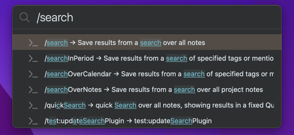
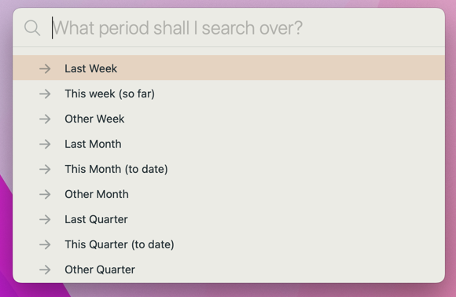
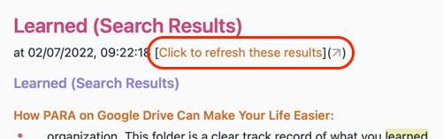
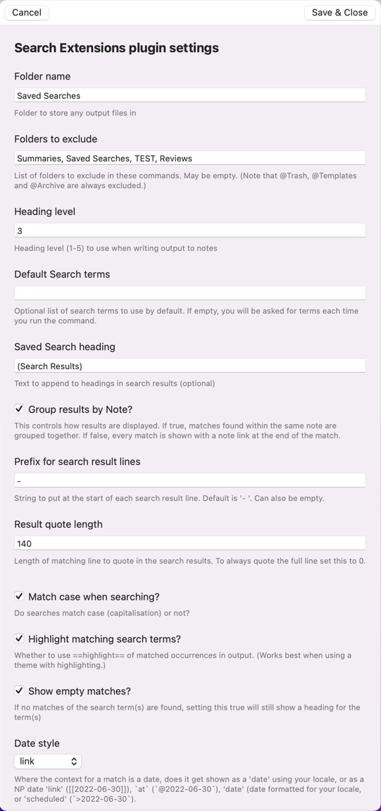

# 🔎 Search Extensions plugin
NotePlan can search over your notes, but it is currently not very flexible or easy to use; in particular it's difficult to navigate between the search results and any of the actual notes it shows.  This plugin adds some extra power and usability to searching:
- lets you have keep special notes that lists all open tasks for @colleagueX that you can update in place!
- extends the search syntax
- by default the search runs and **saves the results in a note that it opens as a split view** next to where you're working.


There are the /commands available through NotePlan's command bar:

 <!--@@@-->

1. **/quickSearch** searches across **all notes** (both calendar and regular notes), saving to a pre-set 'Quick Search Results' note. (Alias: **/qs**.)
2. **/search** searches across **all notes**  (both calendar and regular notes). (Alias: **/ss**.)
3. **/searchOpenTasks** searches just across **open tasks** in all notes.
4. **/searchOverNotes** searches across **all regular** (non-calendar) notes.
5. **/searchOverCalendar** searches across **all calendar**  notes.
6. **/searchResultsInPeriod**: searches over the **calendar and weekly notes of the time period you select**: 

## Results Display
The results are always **saved to a note** with the search terms as its title (apart from /quickSearch), in a "Saved Searches" folder (which is created if necessary). If the same search terms are used again they will *update* the same note.  But you also are given the option of saving to the current note, or to the plugin console.

As the results are saved to a note, the following sorts of uses are then possible:
- keep a note with all open tasks for a particular `@person` -- as live tasks that can be ticked off
- keep track of all the great `@win`s or clever `#idea`s you noted down
- show all the things you had `Gratitude:` for in your daily journal

There are two **display styles**: 
1. '**NotePlan**': all results are shown as the usual NotePlan style of tasks, bullets, quotes or just notes. **Note**: Where a task is an open one, then a sync'd copy of it is shown, to stop duplication of tasks in NotePlan. This makes it a good way of having a special note that you can easily refresh that lists all open tasks for @personX.
2. '**Simplified**': all results are shown as bullets, and can be reduced in length if required using the 'Result quote length' setting. 

You can also set:
- 'Highlight matching search terms?' in the results. For this you need to use an appropriate theme: see below. Note: This is disabled if the search result is a "Synced Line" using that Labs feature.
- a 'Group results by Note?' setting, where matches found within the same note are grouped together ('true' by default).
- Where the match is in a calendar note, 'Date style' setting lets you choose where that link is shown as a 'date' using your locale, or as a NP date 'link' ([[2022-06-30]]), `at` (`@2022-06-30`), 'date' (date formatted for your locale, or 'scheduled' (`>2022-06-30`).
- the ordering of the results by the title, created date or changed date of the note the search term is found in.
- the commands to automatically decides the name of the note to save the search results to based on the search term, which avoids the final prompt, by the 'Automatically save?' setting.

### Refreshing Results
Each results note has a ` [🔄 Refresh results for ...]` pseudo-button under the title of the note. Clicking that runs the search again, and replaces the earlier set of results. (Thanks to @dwertheimer for the suggestion, which is a good use of the x-callback mechanism -- see below.)



This is shown in the demo above.

## Extended search syntax (from v1.0)
- put a `+`  and `-` search operator on the front of terms that **must** appear, and **must not** appear, respectively.  For example `+must may could -cannot"` has 4 search terms, the first must be present, the last mustn't be present, and the middle two (may, could) can be.
- the test for + and - is done per line in notes. If you wish to ignore the whole note that has a term, you can use the ! operator, e.g. `+must_have_me !no_way_jose`. (thanks @dwertheimer for this suggestion)
- you can also use older search style: for example searching for terms X or Y using `X, Y` or `X OR Y`
- the searches are simple ones, matching on whole or partial words, not using fuzzy matching or regular expressions
- the searches aren't case sensitive (i.e. `SPIRIT` will match `spirit` or `Spirit`)
- you can set default search terms in the 'Default Search terms' setting; if set you can still always override them.
- all notes in the special folders (@Archive, @Templates and @Trash) are ignored.  Others can be exluded too using the 'Folders to exclude' setting. If a folder is excluded, then so are its sub-folders.
- multi-word search phrases in quotes (e.g. `"Holy Spirit"`) aren't supported by the underlying API, but instead they will be treated as `+Holy +Spirit`, which means a match will only happen if they are at least on the same line.

## Settings
To change the default **settings**, click the gear button on the 'Search Extensions' line in the Plugin Preferences panel to configure this plugin. Each setting has an explanation.



## Results highlighting
To see **highlighting** of matching terms in Simplified-style output, you'll need to be using a theme that highlights lines using `==this syntax==`. You can [customise an existing theme](https://help.noteplan.co/article/44-customize-themes) by adding something like:

```jsonc
{
  ...
    "highlighted": {
      "regex": "(==)([^\\s].+)(==)",
      "backgroundColor": "#55D2D21B",
      "order": 35,
      "matchPosition": 2,
      "isRevealOnCursorRange": true
    },
    "highlighted-left-marker": {
      "regex": "(==)([^\\s].+)(==)",
      "color": "#AA45A2E5",
      "backgroundColor": "#7745A2E5",
      "isMarkdownCharacter": true,
      "isHiddenWithoutCursor": true,
      "isRevealOnCursorRange": true,
      "matchPosition": 1
    },
    "highlighted-right-marker": {
      "regex": "(==)([^\\s].+)(==)",
      "color": "#AA45A2E5",
      "backgroundColor": "#7745A2E5",
      "isMarkdownCharacter": true,
      "isHiddenWithoutCursor": true,
      "isRevealOnCursorRange": true,
      "matchPosition": 3
    },
  ...
}
```

### Using from x-callback calls
It's possible to call these commands from [outside NotePlan using the **x-callback mechanism**](https://help.noteplan.co/article/49-x-callback-url-scheme#runplugin). The URL calls all take the same form:
```
noteplan://x-callback-url/runPlugin?pluginID=jgclark.SearchExtensions&command=<encoded command name>&arg0=<encoded string>&arg1=<encoded string>
```
Notes:
- the number and order of arguments you pass is important
- where an argument isn't valid, don't include it
- as with all x-callback URLs, all the arguments (including the command name) need to be URL encoded. For example, spaces need to be turned into '%20'.

| Command | x-callback start | arg0 | arg1 | arg2 |
|-----|-----------|----------|----------|----------|
| /quickSearch | `noteplan://x-callback-url/runPlugin?pluginID=jgclark.SearchExtensions&command=quickSearch&` | search term(s) (separated by commas) | terms to filter by paragraph type (separated by commas) | noteTypesToInclude either 'project','calendar' or 'both' |
| /search | `noteplan://x-callback-url/runPlugin?pluginID=jgclark.SearchExtensions&command=saveSearch&` | search term(s) (separated by commas) | terms to filter by paragraph type (separated by commas) |  |
| /searchOverCalendar | `noteplan://x-callback-url/runPlugin?pluginID=jgclark.SearchExtensions&command=searchOverCalendar&` | search term(s) (separated by commas) | terms to filter by paragraph type (separated by commas) |  |
| /searchOverNotes | `noteplan://x-callback-url/runPlugin?pluginID=jgclark.SearchExtensions&command=searchOverNotes&` | search term(s) (separated by commas) | terms to filter by paragraph type (separated by commas) |  |
| /searchInPeriod | `noteplan://x-callback-url/runPlugin?pluginID=jgclark.SearchExtensions&command=searchInPeriod&` | search term(s) (separated by commas) | start date to search over (YYYYMMDD or YYYY-MM-DD format). If not given, then defaults to 3 months ago. | end date to search over (YYYYMMDD or YYYY-MM-DD format). If not given, then defaults to today. |

## Future work
In time I hope to be able to support searching for phrases such as `Bob Smith`, meaning that exact two-word phrase. However, the underlying API doesn't make this at all easy.

## Support
If you find an issue with this plugin, or would like to suggest new features for it, please raise a [Bug or Feature 'Issue'](https://github.com/NotePlan/plugins/issues).

If you would like to support my late-night work extending NotePlan through writing these plugins, you can through

[](https://www.buymeacoffee.com/revjgc)

Thanks!

## History
Please see the [CHANGELOG](CHANGELOG.md).
