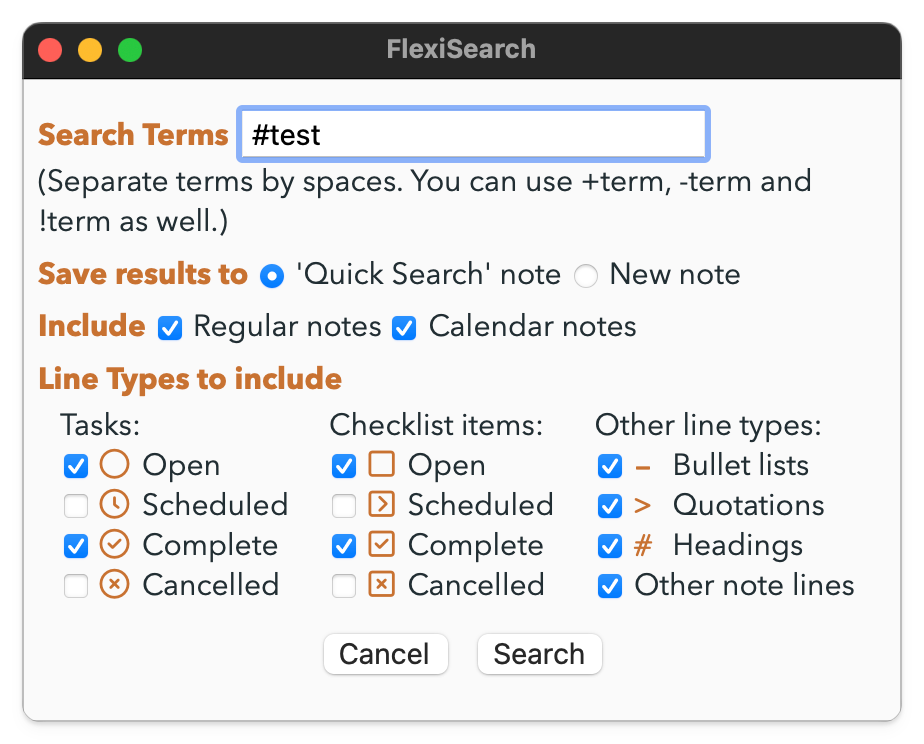
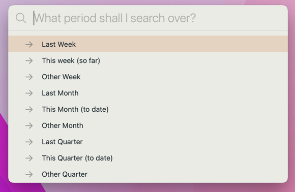

# 🔎 Search Extensions plugin

This plugin extends NotePlan searching: **save results** to a note you can re-run in one click (or automatically on open), optionally **sync open tasks** into that note, and run **search-and-replace** across notes.

**Requires NotePlan v3.18.1+.** It always uses [NotePlan’s advanced search syntax](https://help.noteplan.co/article/269-advanced-search) - operators such as `source:`, `is:`, `date:`, `path:`, `OR`, and grouped negatives - while writing and managing saved result notes and refresh links for you.


## What’s new in v3

| Area | Behaviour |
|------|-----------|
| Engine | **Native** NotePlan advanced search (minimum NP 3.18.1) |
| Operators | NP syntax: `source:`, `is:`, `date:`, `path:`, `heading:`, `sort:`, `OR`, `-(a OR b)`, quotes for whole words |
| Specialised commands | Still available as convenience wrappers (`/searchOpenTasks`, `/searchOverNotes`, …); you can often do the same with operators alone |
| Re-run | Results include a **[🔄 Re-run search]** link under the metadata line |
| Auto-refresh | `onOpen` trigger re-runs the search when you open the saved note |
| Replace | Single **/replace** command (calendar/notes scope via `source:` in the search string) |
| Destinations | `newnote`, `quick`, `current`, `log` (see [Destinations](#destinations)) |

**Not supported** (older plugin-only features that are not part of NotePlan advanced search):

- Plugin-only `!term` (must not appear **anywhere** in the note; not just the matching line)
- Plugin wildcards `*` / `?` (not re-applied after the native search call)

If you still have saved v2-style queries with `+term` or `!term`, rewrite them to NP syntax (table below).

## The Search commands

- **/flexiSearch** (alias **/fs**) - dialog for search terms, note types, line types, case sensitivity, full-word matching, and where to save.

  

  On iPhone/iPad, after the search runs you may need to close the dialog with the **X** in the corner.

- **/quickSearch** (alias **/qs**) - search all notes into a fixed **Quick Search Results** note (title configurable).
- **/search** (alias **/ss**) - search all notes; save to a term-named note (or prompt for destination).
- **/searchOpenTasks** (alias **/sot**) - search **open** tasks and checklists (and, with **NotePlan** result style, **sync** those lines with block IDs so you can tick them in the results note).
- **/searchOverNotes** (alias **/son**) - regular (project) notes only.
- **/searchOverCalendar** (alias **/soc**) - calendar notes only.
- **/searchInPeriod** (alias **/sip**) - calendar notes over a **time period** you pick (or pass as dates / use `date:` operators):

  

The special **Trash** folder is always ignored. Other folders can be excluded via **Folders to exclude** (subfolders excluded with a parent; use `/` for top-level root).

Optional **Default Search terms** pre-fill the search prompt; you can always override them.

### Convenience commands vs native operators

The specialised commands remain useful shortcuts, but you can usually express the same scope in **/search** or **/flexiSearch**:

| Instead of | You can use (native syntax) |
|------------|-----------------------------|
| `/searchOpenTasks` | `is:open` (or `is:open,checklist`, etc.) - **Note:** blockID syncing still needs this command (or NotePlan-style output from open-task results), not merely the `is:` operator alone |
| `/searchOverCalendar` | `source:calendar` |
| `/searchOverNotes` | `source:notes` |
| `/searchInPeriod` | `date:…` ranges, or the period picker in `/sip` |

## Destinations

Where results are written:

| Token | Meaning |
|-------|---------|
| `newnote` | Saved Searches note named from the terms (internal name: `searchSpecificNote`) |
| `quick` | Fixed Quick Search Results note |
| `current` | Section in the note currently open in the Editor |
| `log` | Plugin console only |
| `refresh` | Used by re-run callbacks: rewrite the same place as when the results were last saved |

If **Automatically save** is on, interactive runs skip the destination chooser and use the saved-search note (`newnote`). **quickSearch** always uses `quick`.

## Results display

Results are normally **written to a note** in the **Saved Searches** folder (created if needed). Repeating the same terms **updates** that note. You can also choose the current note, console log, or (for quickSearch) the fixed quick note.

Typical uses:

- Live list of open tasks for `@colleague` (NotePlan style + sync)
- Collect all `@win` or `#idea` lines
- Review journal lines such as `Gratitude:`

**Display styles** (setting **Display style for search result lines**):

1. **NotePlan** - tasks, bullets, quotes as usual. For **open** matches without a block ID yet, the plugin can add a **synced line** (block ID) so ticking in the results note updates the source. Required for the full power of **/searchOpenTasks**.
2. **Simplified** - bullet-style quotes; optional length via **Result quote length**.

Further output options:

- **Highlight matching search terms?** (`==term==`) - needs a theme that styles highlights (see below). May not apply cleanly on already-synced lines.
- **Group results by Note?** (default on)
- **Date style** for calendar note links: `date` (locale), `link` (`[[…]]`), `at` (`@…`), or `scheduled` (`>…`)
- **Sort order** (title, folder, created/updated, ascending or descending). With a native `sort:asc` / `sort:desc` operator in the query, the plugin keeps NotePlan’s result order for that run.
- **Result set size limit** (default 500)
- **Automatically save** / **Folder name** / **Quick Search note title** / **Saved Search heading**

Result notes get a magnifying-glass icon coloured from the title text.

### Re-running results manually

Each results note includes a metadata line with **[🔄 Re-run search]** (older notes may still say **Refresh …**). That link re-invokes the same plugin command and arguments.

### Refreshing automatically

To re-run whenever you open the note: **/add trigger**, choose **🔎 Search Extensions: 'onOpen'**. Remove the frontmatter line starting `triggers: onOpen` to turn it off. (Older docs named the function `refreshSavedSearch`; the command registered for the trigger is **onOpen**.)

## Search syntax

The plugin always uses the [app advanced search article](https://help.noteplan.co/article/269-advanced-search). In short:

- Terms may match **partial** words unless quoted for a full word: `"sun"` vs `sun`
- Boolean-style: space = AND; `OR`; negative `-term` or `-(a OR b)`
- Leading operators (examples):  
  `source:notes|calendar|…` · `is:open|done|…|not-task` · `date:today|past|2025-01|…` · `date:2025-01-01-2025-01-31` · `path:Projects/Work` · `heading:Projects` · `sort:asc|desc` · `show:` / `hide:`
- **Case sensitive searching** - global setting (and FlexiSearch); filter applied after the API search
- **Match only on full words?** - setting (quotes all terms for the API), or put individual terms in `"…"` yourself

Example migrations from older plugin v2 terms:

| Plugin v2 style (no longer supported) | Native style (approx.) |
|--------------------------------------|-------------------------|
| `+must may could -cannot` | `must (may OR could) -cannot` |
| `+meeting -work -meetup` | `meeting -(work meetup)` |

Operators you type can override note-type / para-type filters from the command for that run (e.g. `source:calendar`).

## The Replace command

**/replace** (aliases **/repl**, **/search and replace**):

1. Enter (or pass) a search string - may include **search operators** (`source:calendar`, `is:open`, `path:…`, etc.).
2. Enter (or pass) replacement text.
3. Confirm after a count of matches (detail in the plugin log). **There is no easy multi-note undo** - use each note’s Versions menu if needed.

Case sensitivity follows the plugin setting. Prefer careful, narrow queries first.

## Settings

**macOS:** gear on the plugin line in Plugin Preferences.

**iOS / unified UI:** command **/Search: update plugin settings**.

Highlights from settings:

- Case sensitive / full word
- Folders to exclude
- Auto-save, folder, quick-search title, saved-search heading text
- Result style, limit, heading level, sort, group, prefix, quote length, highlight, date style
- Default search terms (debug section also has log level)

## Results highlighting

For `==highlighted==` terms in Simplified (and where highlighting is applied), use a theme that styles that markdown. Built-in themes often do; or [customise a theme](https://help.noteplan.co/article/44-customize-themes), for example:

```jsonc
{
  ...
    "highlighted": {
      "regex": "(==)([^\\s].+)(==)",
      "backgroundColor": "#55D2D21B",
      "order": 35,
      "matchPosition": 2,
      "isRevealOnCursorRange": true
    },
    "highlighted-left-marker": {
      "regex": "(==)([^\\s].+)(==)",
      "color": "#AA45A2E5",
      "backgroundColor": "#7745A2E5",
      "isMarkdownCharacter": true,
      "isHiddenWithoutCursor": true,
      "isRevealOnCursorRange": true,
      "matchPosition": 1
    },
    "highlighted-right-marker": {
      "regex": "(==)([^\\s].+)(==)",
      "color": "#AA45A2E5",
      "backgroundColor": "#7745A2E5",
      "isMarkdownCharacter": true,
      "isHiddenWithoutCursor": true,
      "isRevealOnCursorRange": true,
      "matchPosition": 3
    },
  ...
}
```

## Using from x-callback URLs

[runPlugin x-callbacks](https://help.noteplan.co/article/49-x-callback-url-scheme#runplugin):

```
noteplan://x-callback-url/runPlugin?pluginID=jgclark.SearchExtensions&command=<encoded command name>&arg0=<...>&arg1=<...>
```

Notes:

- Argument **order** matters; encode every value (including the command name). Spaces → `%20`.
- Use the **command name** below (not internal JS names like `searchOverAll` / `searchPeriod`).
- **Note types:** `notes`, `calendar`, or `both` (where accepted).
- **Paragraph types** (comma-separated, or empty for no filter):  
  `open`, `done`, `scheduled`, `cancelled`, `checklist`, `checklistDone`, `checklistScheduled`, `checklistCancelled`, `title`, `quote`, `list`, `text`, …  
  Also special token `non-task` (maps to ordinary non-task lines).
- **Destination:** `newnote` (or `searchSpecificNote`), `quick`, `current`, `log`. Re-run links use `refresh`.
- **Tip:** Link Creator’s **/Get x-callback-url** builds encoded URLs for you.

| Command (UI) | `command=` value | arg0 | arg1 | arg2 | arg3 | arg4 | arg5 |
|--------------|------------------|------|------|------|------|------|------|
| /replace | `replace` | search string | replacement | note types (`both` / `notes` / `calendar`) | paragraph types (optional) | | |
| /flexiSearch | `flexiSearch` | *(none - opens dialog)* | | | | | |
| /quickSearch | `quickSearch` | search terms | note types | paragraph types | destination (optional; usually `quick`) | | |
| /search | `search` | search terms | note types *(ignored)* | paragraph types | destination | | |
| /searchOverCalendar | `searchOverCalendar` | search terms | note types *(ignored)* | paragraph types | destination | | |
| /searchOverNotes | `searchOverNotes` | search terms | note types *(ignored)* | paragraph types | destination | | |
| /searchOpenTasks | `searchOpenTasks` | search terms | note types | paragraph types *(ignored; always open tasks)* | destination | | |
| /searchInPeriod | `searchInPeriod` | search terms | **paragraph types** | note types *(ignored; always calendar)* | destination | start date `YYYYMMDD` or `YYYY-MM-DD` | end date |

`/quickSearch` with no args: only `command=quickSearch` - prompts for terms.

X-callback runs are largely non-interactive (except where the command must prompt, e.g. missing terms or destination chooser if auto-save is off).

## Support

Issues and ideas: [GitHub Issues](https://github.com/NotePlan/plugins/issues). Please include NotePlan version, plugin version, whether native search is on, and the exact search string.

If you find this useful, you can support ongoing work:

[](https://www.buymeacoffee.com/revjgc)

Thanks!

## History

See the [CHANGELOG](CHANGELOG.md).
