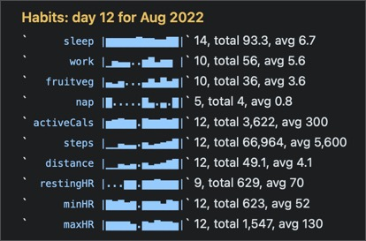

# 🗃 Summaries plugin

This plugin lets you do the following sorts of things with your daily (calendar) notes:
- automatically add your progress this week against your goal of getting an average 8 hours `@sleep()` when you generate your daily note
- count every time you've noted you've visited  `#family` this month
- count the times you've met with staff member `@alice` this year so far
- sum the length of your `@run()`s last quarter

And also:
- make a Map of Content (MOC) note for a search term

(Note: the /savedSearch commands now live in the separate [SearchExtensions plugin](https://github.com/NotePlan/plugins/tree/main/jgclark.SearchExtensions/).)

## Commands
This Plugin provides commands that generate several different sorts of **summaries** and **basic stats from your daily notes**, that are saved back into special NotePlan notes in the Summaries folder. Most start by asking for the time period you wish to operate over:


Each command is considered in turn. 
**Please note** that in each of these: 
- all notes in the special folders (@Archive, @Templates and @Trash) are **ignored**.  Others can be exluded too using the `foldersToExclude` setting (see below).
- the **searches** are simple ones, matching on whole words, not using fuzzy matching or regular expressions.
- now that NP doesn't force all #hashtags and @mentions to be lower-case, the searching by default now doesn't match case ("case insensitive"). The new setting 'Match case when searching?' allows you to change this if you wish.
- these commands require **some setup**, so it knows what you want to summarise. Do this in the Plugin Preferences panel by clicking the gear button on the 'Summaries' line. Each setting has an explanation, and they are grouped into relevant sections.

### /insertProgressUpdate
This command helps show progress within the current week or month against items you track (e.g. `@work(9)`, `@run(5.3)` or `#pray`). It does this by generating stats for the configured hashtags or mentions over either the week to date or month to date. If the progress update section already exists, it will be updated, rather than be repeated.

For example, it produces for me: 


(The leading @ or # is removed in the output, to avoid double-counting problems.)

The **settings** for this command are:
- Where to write the progress update? Write to 'current' note, or to the current 'daily' or 'weekly' note. 
- Progress Heading: e.g. 'Progress Update'  (this is overriden by a heading parameter if given)
- Included #hashtags for Progress: e.g. '#pray'
- Included @mentions for Progress: e.g. '@sleep, @work, @fruitveg, @run'
- 'Include sparkline graphs?' true or false

It is primarily designed to be used from a **Template** (particularly a "Daily Note Template") by including the command tag
```
<%- progressUpdate({interval: 'wtd', heading: 'Habits', showSparklines: true}) %>
```
in a Template. This takes two possible parameters:
1. `interval`: time period: 'wtd' (week to date) or 'mtd' (month to date)
2. the `heading` to use before the results
3. `showSparklines`: true (default) or false.

But it can be used on demand through the  /insertProgressUpdate command.

#### Sparkline graphs
The little "**sparkline**" graphs are a simple in-line visualisation of the recorded activity for each item you're tracking. A dot `.` indicates there's no data for that day; the height of the bar indicates the value of that day, relative to the maximum in that time period. The mimimum is always 0, not the lowest value.

To display them requires your font to have the necessary characters (`▁▂▃▄▅▆▇█`). All of NotePlan's built-in themes have the characters, and I have tested with Menlo and Cascadia Code fonts as well.  See [NotePlan help on how to set fonts in themes](https://help.noteplan.co/article/44-customize-themes#fonts).

In particular it uses the `code` attribute of the theme (if set). Here's an example from one of my themes:
```json
	"code": {
		"font": "Menlo-Regular",
		"color": "#3B3AB2",
        "backgroundColor": "#F4F4FB"
    },
```

Note: According to [several](https://wiki.mobileread.com/wiki/List_of_fonts_included_with_each_device) [sources](http://iosfonts.com/) the only monospace fonts on iPhone/iPad are forms of Courier (e.g. `Courier-Bold`) and Menlo (e.g. `Menlo-Regular`).

<!-- more on the other types, starting with YesNo -->

### /countsInPeriod
This command generates some simple counts and other statistics of #hashtags or @mentions that you specify. For example:
- **count** every time you've noted you've visited  `#family` this month
- **count** the times you've met with staff member `@alice` this year so far
- **sum** the length of your `@run(...)`s last quarter (where e.g. `@run(7.5)` means a run of 7.5km/miles)
- automatically add your progress this week against your goal of getting an **average** 8 hours `@sleep()` when you generate your daily note

For example, it produces for me:

```markdown
# Jan 2022
## #hashtag counts (to 2022-01-14)
#article	1
#bankholiday	1
#closedrings	4
#covidtest	3
...
## @mention counts (to 2022-01-14)
@fruitveg	10	(total 40	average 4.0)
@run	2	(total 10.4	average 5.2)
@sleep	14	(total 103	average 7.4)
...
```

It asks where to save its output: to screen, to the Plugin Console, or to a specially-created note in the Summaries folder.
From NotePlan v3.6 it will also offer to write to the current Weekly note if the selected time period is 'Week (to date)'.
It  updates the previous note for that same time period, if it already exists.

The settings for this command are:
- Folder name: e.g. 'Summaries'
- Folders to exclude: e.g. 'Summaries', 'TEST'
- Heading level: e.g. 2
- Hashtag counts heading: e.g. '#hashtag counts',
- Mention counts heading: e.g. '@mention counts'
- Show hashtag or mention as links?
- Include Hashtags: e.g. '#holiday','#jog','#commute','#review', '#webinar'
- Exclude Hashtags: e.g. ''
- Include Mentions: e.g. '@work','@fruitveg','@water', '@sleep'
- Exclude Mentions: e.g. '@done', '@repeat'

(Why use `@run(...)` rather than `#run(...)`? Well, it just felt more right to use `@run()` as there are already `@done(...)` and `@repeat(...)` mentions in use in NotePlan. And in NotePlan, hashtags that end with a decimal number (e.g. `#run/5.3` ignore the `.3`.)

### /weeklyStats
This is a very niche command! It generates stats for the specified mentions and hashtags over a period of consecutive weeks, and write out as a CSV table to 'Summaries/weekly_stats'. This is designed for plotting using the third-party gnuplot tool.

The relevant settings for this command are:
- Folder name: e.g. 'Summaries'
- Weekly Stats Duration (in weeks): e.g. 26

## To do
- if/when NotePlan makes this possible, show proper graphs of numeric summaries. (The 'ASCII art' sparklines are hopefully an interim step towards this.)

## Support
If you find an issue with this plugin, or would like to suggest new features for it, please raise a [Bug or Feature 'Issue'](https://github.com/NotePlan/plugins/issues).

If you would like to support my late-night work extending NotePlan through writing these plugins, you can through:


Thanks!

## History
Please see the [CHANGELOG](CHANGELOG.md).

## Thanks
Thanks to GitHub user zz85 whose code for [ASCII art sparklines](https://github.com/zz85/ascii-graphs.js) I adapted in v0.12.
