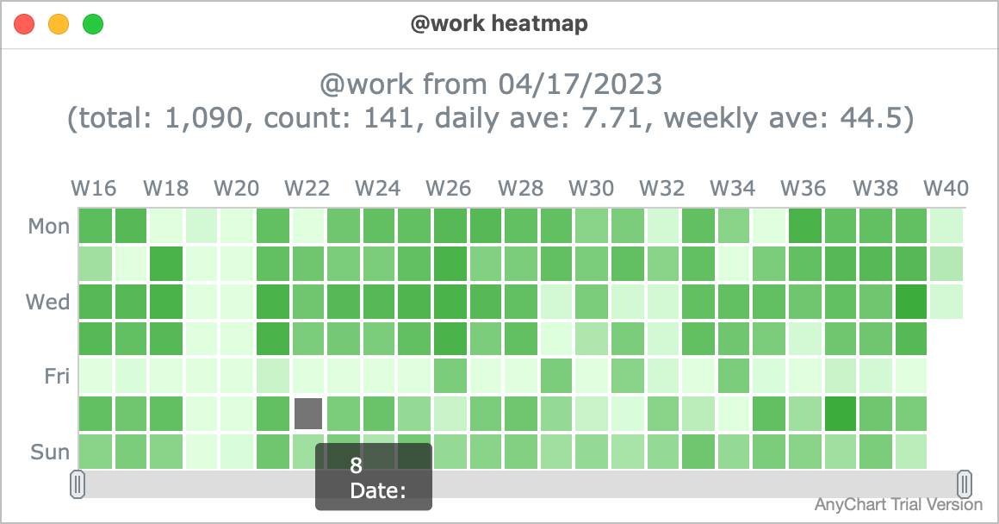
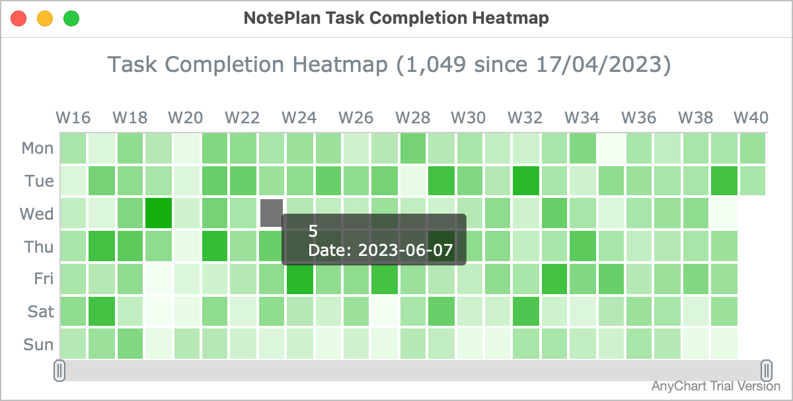
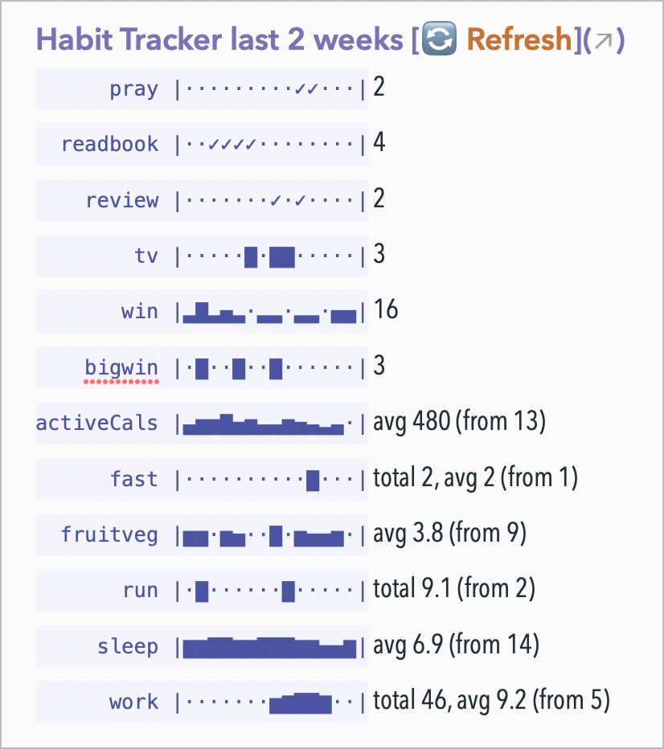
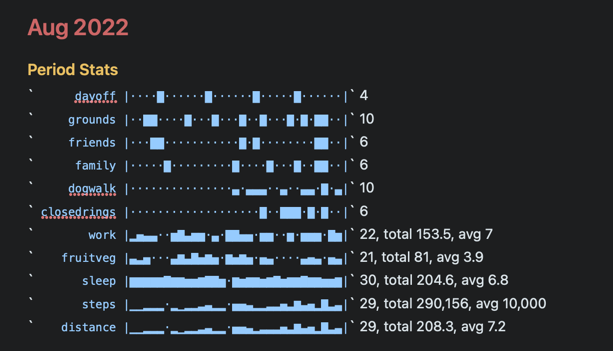
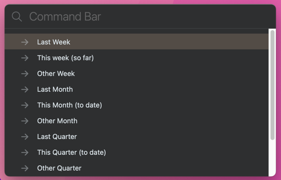

# ⏱ Habits and Summaries plugin

This Plugin lets you do the following sorts of things:
- track habits: for example, show when this week I've managed to `#closedmyrings` or `#tookMeds`?

  

- show your progress over the last 2 weeks against your goal of getting an average 8 hours `@sleep`
- show your total Calorie count from different mentions in your daily note
- count every time you've noted you've visited  `#family` or watched `#tv` this month
- count the times you've met with staff member `@alice` this year so far
- sum the length of your `@run`s in the last quarter
- get a breakdown of how you're spending your week by tracking minutes across various areas (e.g. in a daily note - `@email(30)`; `@email(10)`; `@coding(45)`; `@writing(30)` or `#words/90`)
- show a heatmap chart of your `@sleep` stats

  

- show a heatmap chart of how many tasks you've completed recently

  

**What do you need to do?** Add tags like #closedmyrings or @habit(_number_) in your daily notes. In my case a day might include:
```md
@sleep(5.3) @activeCals(400) @steps(3800) @distance(2.7) @minHR(50) @maxHR(161) @restingHR(66) @fruitveg(4)
@work(10) #readbook
Remember: #visit to new CFL premises in Festival Place #prayer #win #filmvideo
```

You might find a simple 'Shortcut' for use on iOS/macOS helpful to make it quicker to add items like this to the daily note. Sean O'Kana has [shared a shortcut to do this](https://www.icloud.com/shortcuts/a5943c80c0f845eda6e70c811724de6e)  which you can add and customise.

**What does the plugin do?** It provides commands, each described in more detail below, that read these tags and generates several different sorts of summaries and basic stats from your daily notes.

**When to use the command**: It's up to you! I run  /appendProgressUpdate as part of my daily note (see [Calling from a Template](#calling-from-a-template) below), but you might want to do it at the end of a day/week/month in those notes.

All these commands require **some setup**, so it knows what you want to summarise. Do this in the Plugin Preferences panel by clicking the gear button on the 'Summaries' line. Each setting has an explanation (below), and they are grouped into relevant sections.

The command output can include little **"sparkline" graphs**, as a simple in-line visualisation of the recorded activity for each item you're tracking, where the time period is a month or less. A dot `.` indicates there's no data for that day; the height of the bar indicates the value of that day, relative to the maximum in that time period. The minimum is always 0, not the lowest value, and that is always shown as an empty space.

To display them requires your font to have the necessary characters (`▁▂▃▄▅▆▇█`). All of NotePlan's built-in themes have the characters, and I have tested with Menlo and Cascadia Code monospace fonts as well.  See [NotePlan help on how to set fonts in themes](https://help.noteplan.co/article/44-customize-themes#fonts).

In particular it uses the `code` attribute of the theme (if set). Here's an example from one of my themes:
```json
	"code": {
		"font": "Menlo-Regular",
		"color": "#3B3AB2",
        "backgroundColor": "#F4F4FB"
    },
```

Note: According to [several](https://wiki.mobileread.com/wiki/List_of_fonts_included_with_each_device) [sources](http://iosfonts.com/) the only monospace fonts on iPhone/iPad are forms of Courier (e.g. `Courier-Bold`) and Menlo (e.g. `Menlo-Regular`).

All notes in the special folders (@Archive, @Templates and @Trash) are **ignored**.  Others can be excluded too using the `foldersToExclude` setting.

Note: **Why use `@run(...)` (mentions) rather than `#run(...)` (hashtags)**? Well, it just felt more right to use `@run(...)` as there are already `@done(...)` and `@repeat(...)` mentions in use in NotePlan that include a value in the brackets. And in NotePlan, hashtags that end with a number ignore the fractional part (e.g. `#run/5.3` ignores the `.3`) but they are not ignored inside `@run(5.3)`.  However, you _can_ use a `#hashtag/value` if you don't mind this limitation.

## 'heatmap for complete tasks' command
This displays a 'heatmap' chart of many tasks you've completed on each day (see example above). It uses the `@done(...)` dates in all daily, weekly and project notes over the number of weeks you specify to look back (via the 'Chart Duration (in weeks)' setting). If you set this to 0, the plugin will generate a sensible longish period between 6 and 12 months.  It also counts completed tasks without `@done(...)` dates on Calendar notes, and assumes the tasks were completed on the day or start of week in question.

(NotePlan automatically appends a 'completion date' to completed tasks if you have the Preferences > Todo > Append Completion Date setting turned on.)

Note: This is a first attempt at generating heatmaps, and I want to make it much more flexible in future. But this will probably require rolling my own charts, rather than using one from AnyChart, which should be licensed if you rely on it.

## 'heatmap for tag' command
This displays a 'heatmap' chart of a tag's values for each day (see example for '@work' above). It asks which tag/mention to use, and then charts what it finds in all daily notes over the number of weeks you specify to look back (via the 'Chart Duration (in weeks)' setting). If you set this to 0, the plugin will generate a sensible longish period between 6 and 12 months.

Note: There aren't many options for this; I'm deliberately keeping it simple while I work on a more comprehensive charting solution.

But you can change the colour scheme, by starting the heatmap with the following x-callback call:
`noteplan://x-callback-url/runPlugin?pluginID=jgclark.Summaries&command=heatmap%20for%20tag&arg0=` plus a URL and JSON encoded string of the object definition.
This is best explained by way of an example (not yet encoded):
```
{
  "tagName":"@sleep",
  "intervalType":"day",
  "colorScaleRange":"['#FFFFFF', '#23A023']",
  "fromDateStr":"2023-01-01",
  "toDateStr":"2023-03-31",
  "numberIntervals":90
}
```
Notes on these definitions:
- intervalType: currently this can only be `day`
- colorScaleRange: an array of two RGB values that specify the colour gradient to use for the data. The example above is from light green to dark green. The charting library then scales the data between these two colours from low values to high values.  Unfortunately the charting library doesn't distinguish an item with no data from one with data value 0, so I suggest the first value is always '#FFFFFF'.
- numberIntervals: the number of days in this interval

The complete encoded string for this example would be `noteplan://x-callback-url/runPlugin?pluginID=jgclark.Summaries&command=heatmap%20for%20tag&arg0=%7B%0A%20%20%22tagName%22%3A%22%40sleep%22%2C%0A%20%20%22intervalType%22%3A%22day%22%2C%0A%20%20%22colorScaleRange%22%3A%22%5B'%23FFFFFF'%2C%20'%2323A023'%5D%22%2C%0A%20%20%22fromDateStr%22%3A%222023-01-01%22%2C%0A%20%20%22toDateStr%22%3A%222023-03-31%22%2C%0A%20%20%22numberIntervals%22%3A%2090%0A%7D`

## 'appendProgressUpdate' (alias 'insertProgressUpdate' or 'habitTracker') command
As NotePlan is such a flexible app, there are [various ways people use it to track habits](https://help.noteplan.co/article/144-habit-tracking).

This Plugin command helps show progress for items you track (e.g. `@work(9)`, `@run(5.3)` or `#prayed`) over various time periods. It does this by generating stats for the configured #hashtags or @mentions over the time interval you select, and inserts it as a section into the destination note. If the progress update section already exists in the destination note -- if for example you have it set to insert in the weekly note -- it will be updated, rather than be repeated.

For example, it produces for me:

  

Note:
- The statistics are shown according to whether you have selected count, average or total for that tag in the settings (see below)
- The leading @ or # is removed in the output, to avoid double-counting problems.

There are now 3 ways of running this: as the "/appendProgressUpdate" command; through [templates](#calling-from-a-template), or by [x-callback call](#calling-by-x-callback). The various settings are common, but how they are applied differ depending which method is used to invoke it. The settings and their meaning are introduced next, and differences in how they're applied are described in the following sections.

### Settings for appendProgressUpdate
The many **settings** for this command are set in the Plugin Preference pane:

- What time period should the Progress update cover? Pick one of the options: 'wtd' or 'userwtd' (two week-to-date options), 'last7d' (last 7 days), 'mtd' (month to date), 'last2w' (last 2 weeks), 'last4w' (last 4 weeks). Note: `wtd` and `userwtd` behave slightly differently to each other:
  - `wtd` is the week to date using ISO standard (Monday)
  - `userwtd` is week to date using whatever you've set the start of week to be in NotePlan's 'Calendars' Preferences pane.
- Where to write the progress update? The destination note is either the 'current'ly open note, or the current 'daily' or 'weekly' note.
- Progress heading: this is the heading to go before the output, to which is added the period that's covered. However, if it contains the string '{{PERIOD}}, then the covered period will be inserted in place of this string wherever you want in the heading.
- 'Include sparkline graphs?' true or false
- **Yes/No items**: Comma-separated list of #hashtags and/or @mentions to track by 'did I do it this day or not?'. e.g. '#closedrings, #prayed, #tookMeds'
- #hashtags to **count**: e.g. '#tv, #podcast' -- the simple count of all such tags is displayed
- #mentions to **total**: e.g. '#steps' -- these are counted and displayed as a total
- #mentions to **average**: e.g. '#fruitveg' -- these are counted and displayed as an average (to 3 significant figures)

- @mentions to **count**: e.g. '@work' -- the simple count of all such tags is displayed
- @mentions to **total**: e.g. '@distance, @run' -- these are counted and displayed as a total
- @mentions to **average**: e.g. '@sleep, @fruitveg' -- these are counted and displayed as an average (to 3 significant figures)
- Yes/No characters: sets the pair of characters to use as Yes and No in output of "Yes/No items". The first is for Yes, the second for No. Here are some you might like to use for Yes: ✓✔■⧫▉ and for No: ·◦✕✖◌□. (You can use emojis, such as ✅🟢❌👎🔴, but they are likely to mess up the horizontal spacing.)
- Exclude today's entries? Whether to exclude today's entries in progress updates. Can be enabled if you tend to run the progress update as part of a start-of-day routine, and only add the updates later in the day.

### Calling from a Template
This command can be used in any Template, but is particularly designed to be used from a "Daily Note Template" by including a '**progressUpdate(...)**' command tag in a template such as:
```
<%- progressUpdate({period: 'wtd', progressHeading: 'Habits', showSparklines: true}) %>
```
or
```
<%- progressUpdate({period: '2022-02-15', excludeToday: true, progressHeading: 'Post-Birthday Habits', showSparklines: true}) %>
```
You can add many parameters, _which if present override all the main settings described above_. The main ones are:
1. `period` (alias `interval`): time period to run report for, e.g. 'wtd' or 'userwtd' (week to date), 'mtd' (month to date), 'last7d', 'last2w', or 'last4w' or give a specific ISO8601 date to report since (e.g. '2022-10-25')
2. `progressHeading` to use before the results.
3. `showSparklines`: true (default) or false.
4. `excludeToday`: false (default) or true (applies when you set a date for period and you don't want to include today in the visualization -- e.g. if you use this template as part of your /dayStart routine and you haven't had time to do the habit yet!)

Each must be a `key:"value"` pair, with following pairs separated by commas, and all enclosed in curly brackets (i.e. in [JSON5 format](https://json5.org)). The 'key' names of the other possible settings are found in the `plugin.json` file installed as part of the plugin.

Note: if you specify any of the settings that take hashtags or mentions, then _only those ones will be used_. E.g. `{... progressYesNo:"#read,#pray,#exercise", ...}` will not use any of the usual '#hashtags or count' or '@mentions to count', but only show Yes/No for each of those 3 tags.

### Calling by x-callback
This is similar to the Template above: create a JSON5 version of `key:"value"` pairs for parameters that are different from the normal saved settings, and then prefix with the string `noteplan://x-callback-url/runPlugin?pluginID=jgclark.Summaries&command=progressUpdate&arg0=`

For example:
```
noteplan://x-callback-url/runPlugin?pluginID=jgclark.Summaries&command=progressUpdate&arg0={"period": "2022-02-15", "excludeToday": true, "progressHeading": "Post-Birthday Habits", "showSparklines": true}
```

Note: Any string-based value part must be enclosed in **double quote marks** to make it valid JSON5.

Note: The JSON parts needs to be **URL-encoded** before it can be used. (For help with this, see the **Get-X-Callback-URL command** from the "Link Creator" Plugin. Select RUN a Plugin command > progressUpdate ...)

## 'today progress' command (alias: 'tp')
Sometimes you want to have a summary of progress on something within a day -- for example `@carlories(...)` or `@exercise(...)`. To summarise these from today's daily note use **/today progress**, which works in the same way as **/append progress update**.

When run by the user directly, it adds the output onto the current note, and uses the following settings from the plugin pane:
- #hashtags and @mentions to total: a comma separated list of the terms to total from today's note
- Today Progress heading: optional heading to insert before the results.

Or you can run it from an **x-callback**  using the form `noteplan://x-callback-url/runPlugin?pluginID=jgclark.Summaries&command=todayProgress&arg0=?&arg1=?` where
- `arg0` is the comma separated list of items to summarise
- `arg1` is the optional heading to use before the results

For example:
```
noteplan://x-callback-url/runPlugin?pluginID=jgclark.Summaries&command=todayProgress&arg0=@exercise,@calories&arg1=Post-Birthday%20Habits
```

You can also run it as part of a **template**; for example use in a "Daily Note Template" by including a line like the following: `<%- todayProgressFromTemplate({todayProgressItems: '@calories, @exercise', todayProgressHeading: 'Progress Today'}) %>`. (Note the slightly different 'command name', and that this time the parameters need to be given as a JSON5 object of key:'value' pairs.)

## 'periodStats' command (aliases: 'statsPeriod', 'stp')
This command generates some simple counts and other statistics of #hashtags or @mentions that you specify, and saves them into notes in a special 'Summaries' folder. For example:
- **count** every time you've noted you've visited  family this month -- i.e. counts the number of times `#family` is mentioned in calendar notes this month
- **count** the times you've met with staff member Alice this year so far -- i.e. counts the number of times `@alice` is mentioned in calendar notes this year
- **sum** and **average** the length of your runs last quarter -- i.e. stats on all the mentions of `@run(N)` mentions (where, for example, `@run(7.5)` means a run of 7.5km/miles)
- automatically add your progress this week against your goal of getting an **average** 8 hours `@sleep(N)` when you log that each day.

Here's an example of what it shows with sparklines:



and without:

```markdown
# August 2022
**dayoff**: 4
**grounds**: 10
**friends**: 6
**family**: 6
**dogwalk**: 10
**closedrings**: 6
**distance**:  total 208.3 (from 29)
**fruitveg**:  avg 3.9 (from 21)
**run**:  total 24 (from 4)
**sleep**:  avg 6.8 (from 30)
**work**:  total 153.5, avg 7 (from 22)
```

It starts by asking for the time period you wish to operate over:



It asks where to save its output: to a specially-created note in the Summaries folder, or to the current note.


It also offers to write to the current Weekly / Monthly / Quarterly / Yearly notes if you have them enabled in the preferences.

It  updates the previous note for that same time period, if it already exists.

The settings for this command are:
- Folder for output: e.g. 'Summaries'
- Folders to exclude: e.g. 'Summaries', 'TEST'
- Heading level: e.g. 2
- Hashtag counts heading: e.g. '#hashtag counts',
- Mention counts heading: e.g. '@mention counts'
- Show hashtag or mention as links?
- Include sparkline graphs?
- **Yes/No items**: Comma-separated list of #hashtags and/or @mentions to track by 'did I do it this day or not?'. e.g. '#closedrings, #prayed, #tookMeds'
- #hashtags to **count**: e.g. '#tv, #podcast'
- #hashtags to **average**: e.g. '#maxHeartRate' -- these are counted and displayed as an average
- #hashtags to **total**: e.g. '#distance' -- these are counted and displayed as a total
- @mentions to **count**: e.g. '@work' -- these are counted and displayed with count, total and average
- @mentions to **average**: e.g. '@sleep, @fruitveg' -- these are counted and displayed as an average
- @mentions to **total**: e.g. '@distance, @run' -- these are counted and displayed as a total

> **Why use `@run(...)` rather than `#run(...)`**? Well, it just felt more right to use `@run()` as there are already `@done(...)` and `@repeat(...)` mentions in use in NotePlan that include a value in the brackets. And in NotePlan, hashtags that end with a decimal number ignore the fractional part (e.g. `#run/5.3` ignores the `.3`) but they are not ignored inside for `@run(5.3)`.  _However, you can use a `#hashtag/value` if you don't mind this limitation._

Note: sparklines won't show for periods of time greater than 31 days -- they just get too wide for most devices.

### Calling by x-callback
You can run this from an **x-callback**  using the form `noteplan://x-callback-url/runPlugin?pluginID=jgclark.Summaries&command=periodStats&arg0=?&arg1=?&arg2=?` where
- `arg0` is the calendar period code (`year`,`quarter`, `month`, `week`, `today`, or an `YYYY-MM-DD` date)",
- `arg1` is the number within the calendar type (ignored for `today` or `YYYY-MM-DD`)
- `arg2` is the `YYYY` year number to use (ignored for `YYYY-MM-DD`)

For example the following will add stats for Dec 2023 to the end of the current note:
```
noteplan://x-callback-url/runPlugin?pluginID=jgclark.Summaries&command=periodStats&arg0=month&arg1=12&arg2=2023
```

## weeklyStatsToCSV command
This is a niche command! It generates stats for the specified mentions and hashtags over a period of consecutive weeks, and write out as a CSV file to 'Plugins/data/jgclark.Summaries/weekly_stats.csv'. This is designed to be used by third-party graphing tools.

The relevant settings for this command are:
- Chart Duration (in weeks): e.g. 26. If this is set to 0, the plugin will generate a sensible longish period up to 1 year. Note, that this is the number of completed weeks. Normally, the current incomplete week will be added.
- Items to Chart: Comma-separated list of @mentions or #hashtags to chart.

## To do
- now NotePlan has begun to make HTML content possible, I wish to create proper charts/graphs of numeric summaries. (The 'ASCII art' sparklines were an interim step towards this.)

## Support
If you find an issue with this plugin, or would like to suggest new features for it, please raise a [Bug or Feature 'Issue'](https://github.com/NotePlan/plugins/issues).

If you would like to support my late-night work extending NotePlan through writing these plugins, you can through:

[](https://www.buymeacoffee.com/revjgc)

Thanks!

## History
Please see the [CHANGELOG](CHANGELOG.md).

## Thanks
Thanks to GitHub user @zz85 whose code for the [ASCII art sparklines](https://github.com/zz85/ascii-graphs.js) I adapted and improved in v0.12.
