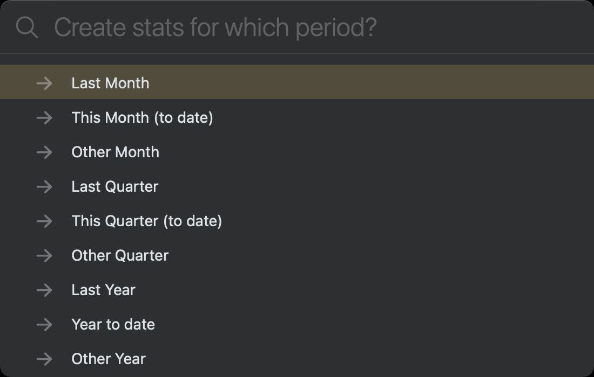

# 🗃 Summaries plugin

This plugin lets you do the following with your daily (calendar) notes:
- lists out all the great `@win`s or clever `#idea`s you noted down
- shows all the things you had `Gratitude:` for in your journal
- count every time you've noted you've visited  `#family` this month
- summed the length of your `@run(n)`s last quarter
- counted all the times you've met with staff member `@alice` this year so far.
<!-- - save the results of a search term given at run time -->

You can also save results of any search over all notes.

## About
This Plugin provides commands that generate several different sorts of **summaries from your daily notes**, that are saved back into special NotePlan notes in the Summaries folder. They all start by asking for the time period you wish to operate over:



- **`/saveSearchResults`** searches across all notes (both calendar and projects) for a text string you give. It asks where to save its output: to the curre note, to the Plugin Console, or to a specially-created note in the Summaries folder.  (If the latter, it will update the previous note with that same title, if it exists.)
- 
- **`/countsInPeriod`** generates some simple counts and other statistics of #hashtags or @mentions that you specify. It asks where to save its output: to screen, to the Plugin Console, or to a specially-created note in the Summaries folder.  (If the latter, it will update the previous note for that same time period, if it exists.)

- **`/occurrencesInPeriod`** generates all occurences of one or more search terms (from the settings) found in the daily notes of the time period you select.

**Please note** that in each of these: 
- all notes in the special folders Templates, Summaries, Archive and Trash are ignored.  This can be customised (see below).
- the search is a simple one, not using fuzzy matching or regular expressions.

## Configuration
These commands require configuration; the first time either is run it should detect it doesn't have configuration, and offer to write some to the first configuration block of the `Templates/_configuration` note (as used by the Templates system). 
Alternatively, in that note, include the following settings you want in its first code block. This is the annotated list of settings, with their defaults:

```jsonc
{
  ...
  summaries: {
    folderToStore: 'Summaries', // folder to store any output files in
    foldersToExclude: ['📋 Templates', 'Summaries'], // list of folders to exlude in these commands. Note that @Trash and @Archive are always excluded
    headingLevel: 2, // use level 1-5 headings when writing output to notes
    // settings for 'countsInPeriod':
    hashtagCountsHeading: '#hashtag counts',
    mentionCountsHeading: '@mention counts',
    showAsHashtagOrMention: true, // if false hide the # or @ symbols
    // In the following the includes (if specified) takes precedence over any excludes.
    // Items in the list need to be included in quotes, separated by commas.
    includeHashtags: [], // e.g. ['#holiday','#jog','#commute','#webinar']
    excludeHashtags: [],
    includeMentions: [], // e.g. ['@work','@fruitveg','@water', '@sleep']
    excludeMentions: ['@done', '@repeat'],
  // settings for 'occurrencesInPeriod':
    occurrencesHeading: 'Occurrences',
    occurrencesToMatch: ['idea', '@review', '#question'],
    highlightOccurrences: false, // use ==highlight== of matched occurrences in output
    showEmptyOccurrences: false, // if no occurrences found of this string to match, make this clear
    dateStyle: 'link', // where the context for an occurrence is a date, does it get appended as a 'date' using your locale, or as a NP date 'link' (`>date`) or 'none'
  },
  ...
}
```
(This example fragment is in JSON5 format: ensure there are commas at the end of all that lines that need them.)

To see **highlighting** of matching terms in the occurrences output, you'll need to be using a theme that includes highlighting using `==this syntax==`. You can also customise an existing one, adding something like:
```jsonc
{
  ...
    "highlighted": {
      "regex": "(==)([^\\s].+)(==)",
      "backgroundColor": "#55D2D21B",
      "order": 35,
      "matchPosition": 2,
      "isRevealOnCursorRange": true
    },
    "highlighted-left-colon": {
      "regex": "(==)([^\\s].+)(==)",
      "color": "#AA45A2E5",
      "backgroundColor": "#7745A2E5",
      "isMarkdownCharacter": true,
      "isHiddenWithoutCursor": true,
      "isRevealOnCursorRange": true,
      "matchPosition": 1
    },
    "highlighted-right-colon": {
      "regex": "(==)([^\\s].+)(==)",
      "color": "#AA45A2E5",
      "backgroundColor": "#7745A2E5",
      "isMarkdownCharacter": true,
      "isHiddenWithoutCursor": true,
      "isRevealOnCursorRange": true,
      "matchPosition": 3
    },
  ...
}
```

## To do
- test allowing regular expressions as search terms.

## History
NB: `countsInPeriod` command started life as `/stp` (stats for time period) in the Statistics plugin.

Please see the [CHANGELOG](CHANGELOG.md).
