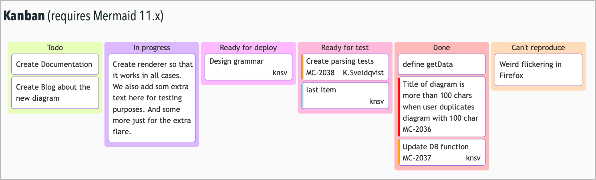

# 🖥️ Preview Plugin
This plugin provides the **/preview note** and **/start live preview** commands that renders the current note to HTML including:
- standard Markdown conversion (including referenced images)
- [Mermaid diagrams](https://mermaid.js.org) (e.g. flowcharts, gantt charts, sequence diagrams ...)
- [MathJax](https://www.mathjax.org/) fragments or lines (for mathematical equations and notation)
- all open task and checklist types (according to user's Markdown settings) render as open tasks (using basic GFM rendering)
- some non-standard Markdown conversion (e.g. strikethrough, footnotes, tasklists and tables)
- it renders frontmatter slightly differently

It adds a 'Print (opens in system browser)' button to the preview window (on macOS). Clicking this opens the note in your default browser, where you can then select to print it. (There are limitations in the API that prevent me from making this a single button press, sorry.)

[This example NotePlan note](https://noteplan.co/n/EA936BC2-A6C1-43F7-9C34-E2C31CF96AC6) includes examples of these different capabilities.

## Limitations
This is designed to be a temporary solution while we wait for similar functionality to get baked into the NotePlan app itself. To that end, I don't intend to be making many improvements to this.  In particular I'm aware that:

-  there are bugs in the rendering of frontmatter arising from one of the third-party libraries this uses.

## Automatic updating
Use the **/start live preview** command to open the Preview window, _and enable near-live update for this note_. Under the hood this works by adding a **trigger** on the note so that the window will automatically refresh when you edit the note. This is the line it adds to the note's frontmatter block:
```yaml
triggers: onEditorWillSave => np.Preview.updatePreview
```

It deliberately updates the Preview window without giving it focus, so that you can continue editing.

## Mermaid charts

Mermaid is a third-party library that makes a wide variety of diagrams (including Flowcharts, Gantt, Kanban, state transition etc.) and some simple charts, using markdown-ish definitions. These definitions are placed in one or more fenced code blocks, like this:

```
``` mermaid
... chart definition
lines  ...
```  .
```
(Please ignore the closing period; it's just there to make this render in HTML.)

Please see [Mermaid's own Tutorials](https://mermaid.js.org/config/Tutorials.html).

Note: The current version of Mermaid it uses is v11.x, and is loaded each time from the CDN that Mermaid uses.  _It may therefore not work if you are offline._

Note: If and when Mermaid releases v12, you can search the plugin's `script.js` file, and modify the line that includes
`"https://cdn.jsdelivr.net/npm/mermaid@11/dist/mermaid.esm.min.mjs"`
to be whatever the new URL is.

### Theming Mermaid
The plugin automatically sets the Mermaid chart to use their 'default' or 'dark' theme according to the type of the current NotePlan theme. But you can [override the theme](https://mermaid.js.org/config/theming.html) for individual diagrams by including the following directive at the start of a Mermaid definition:

`%%{init: {'theme':'forest'}}%%`

## MathJax rendering
This provides a way to include complex mathematical expressions either inline or in separate paragraphs, as this example shows:
```md
When \\(a \ne 0\\), there are two solutions to \\(ax^2 + bx + c = 0\\), and they are:
$$x = {-b \pm \sqrt{b^2-4ac} \over 2a}.$$
```

## Thanks
To the people who've spend the time to create and maintain [Mermaid](https://mermaid.js.org), [MathJax](https://www.mathjax.org/) and the [showdown library](https://github.com/showdownjs/showdown).

## Support
If you find an issue with this plugin, or would like to suggest new features for it, please raise a [Bug or Feature 'Issue'](https://github.com/NotePlan/plugins/issues).

If you would like to support my late-night work extending NotePlan through writing these plugins, you can through

[](https://www.buymeacoffee.com/revjgc)

Thanks!

## Changes
Please see the [CHANGELOG](CHANGELOG.md).
