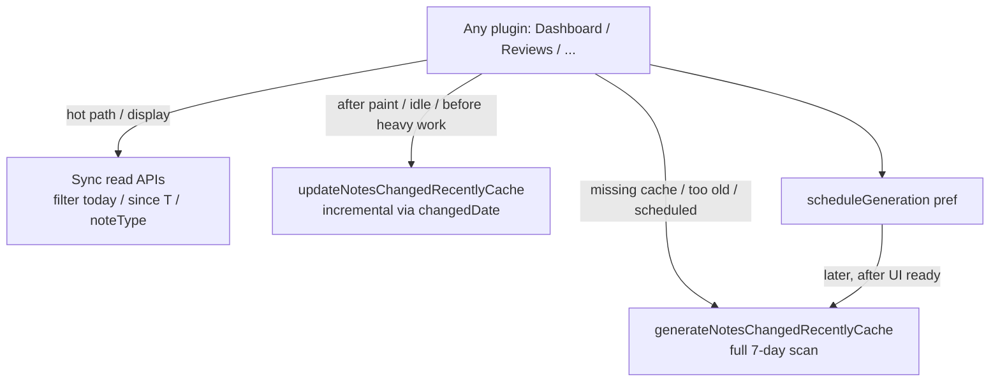

# Plan: Shared recent-notes-changed cache (`np.Shared`)

Status: **design only -- not implemented** (plan of record for this work)  
Date: 2026-09-18  

**Supersedes** the deprecated Reviews-only sketch [`jgclark.Reviews/PLAN-notes-changed-today-incremental-refresh.md`](../jgclark.Reviews/PLAN-notes-changed-today-incremental-refresh.md) (today-scoped, Dashboard done-count file as the change index). Locked Reviews decisions carried forward: fast path for Refresh **and** Dashboard-triggered regen; full project-list scan at least every 24h; shared API (here in `np.Shared`).

---

## One-sentence summary

Put a **rolling 7-day list of notes that changed** in `np.Shared`, so Dashboard, Reviews, and other plugins can **read** it cheaply and **any of them** can **refresh** it -- instead of each plugin re-scanning the vault with `getNotesChangedInInterval`.

---

## Why

| Consumer | Need today | Pain |
|----------|------------|------|
| **Dashboard** | Notes changed **today** → done-count map / header total | Owns `todaysChangedNoteList.json`; pays ~1s+ scan; schema mixes "who changed" with "done counts" |
| **Reviews Refresh** | Which **project** notes changed since last list build | Walks **all** in-scope project notes every Refresh |
| **Reviews weekly progress** | Which notes might have new `@done` in the recent window | Full folder scan every run; no `changedDate` gate |
| **Others** (Tidy, Filer, tagMentionCache) | Various "changed in last N days" scans | Duplicate `getNotesChangedInInterval` cost |

A shared cache answers only: **which notes changed recently?**  
Domain work (done counts, `Project` construction, weekly CSV) stays in each plugin.

---

## Design principles

1. **One job** -- store recent change membership (and timestamps), not plugin-specific metrics.
2. **Live in `np.Shared`** -- same pattern family as `tagMentionCache`: Shared owns files + API; plugins trigger work and read.
3. **Fixed window: 7 calendar days** (today + 6 prior), inclusive of current day. Readers who need "today only" or "since timestamp T" filter in memory.
4. **Any client may update or rebuild** -- no single owner plugin required at runtime.
5. **Cheap sync reads; explicit async updates** -- never hide a vault scan inside a "get" that looks free.
6. **Prefer clarity over cleverness** -- simple JSON, few prefs, obvious full vs incremental paths.

---

## What is stored

### Files (under NotePlan plugin data)

| Path | Role |
|------|------|
| `../../data/np.Shared/notesChangedRecently.json` | Cache body |
| *(optional)* `../../data/np.Shared/notesChangedRecently.meta.json` | Only if we need per-plugin "I use this" registration; see below |

Use fully qualified Shared paths so any plugin context can load/save (same convention as tagMentionCache).

### Cache body (proposed shape)

```json
{
  "generatedAt": "2026-09-18T14:00:00.000Z",
  "lastUpdated": "2026-09-18T15:30:00.000Z",
  "windowDays": 7,
  "notes": [
    {
      "filename": "Areas/Finance.md",
      "noteType": "Notes",
      "changedAt": "2026-09-18T12:10:00.000Z"
    },
    {
      "filename": "20260918.md",
      "noteType": "Calendar",
      "changedAt": "2026-09-18T09:00:00.000Z"
    }
  ]
}
```

- **`notes`**: one row per note that has `changedDate` within the window at last update.
- **`changedAt`**: from `note.changedDate` when indexed (ISO).
- **No done counts, tags, or project fields** -- keep the file small and stable.
- On each update: drop rows older than the window; upsert rows for notes touched since `lastUpdated`.

### Preferences

| Pref key | Role |
|----------|------|
| `np.Shared.notesChangedRecently.lastUpdated` | Mirror of `lastUpdated` (file mtime is unreliable for plugin data) |
| `np.Shared.notesChangedRecently.regenerate` | Boolean: full rebuild scheduled |

Keep pref + JSON timestamps in sync after every write (lesson from tagMentionCache).

---

## Relationship to `getNotesChangedInInterval`

**`generateNotesChangedRecentlyCache()` does not replace `getNotesChangedInInterval()`.**

| Layer | Role |
|-------|------|
| `getNotesChangedInInterval(n)` in `helpers/NPnote.js` | Low-level vault scan: load note list, filter by `changedDate`. **Stays.** |
| `generateNotesChangedRecentlyCache()` / `updateNotesChangedRecentlyCache()` | **Call** that helper (or a clearer wrapper) to fill/refresh Shared JSON. |
| Sync getters (`getFilenamesChangedToday`, etc.) | Cheap reads of the JSON. Hot paths use these so they do **not** each re-scan. |

Day-to-day Dashboard/Reviews code should prefer Shared **reads**, and only trigger generate/update when the cache is missing or stale. Other code that needs a one-off scan and does not care about the Shared file can still call `getNotesChangedInInterval` directly.

### Why `getNotesChangedInInterval(6)` for a 7-day window

The helper's `numDays` is "how many days **back from start of today**," not "how many calendar days in the result":

| Call | Start of window | Calendar days covered |
|------|-----------------|------------------------|
| `getNotesChangedInInterval(0)` | Start of **today** | **1** (today only) |
| `getNotesChangedInInterval(1)` | Start of **yesterday** | **2** |
| `getNotesChangedInInterval(6)` | Start of day **6 days ago** | **7** (today + 6 prior) |

That off-by-one is easy to misread. Prefer a named wrapper used by Shared generate, e.g. `getNotesChangedInLastCalendarDays(7)`, that documents "7 days including today → interval arg `6`," so callers never have to remember the mapping.

---

## Public API (indicative names)

All in something like `np.Shared/src/notesChangedRecentlyCache.js`, exported for Rollup import by client plugins.

Note: Where the API has the term `ChangedRecently` it means within the cache window (7 days), not an unbounded "recent." The `ChangedSince` string on an API requires a `since` Date.

### Read (sync, never scans the vault)

| Function | Returns |
|----------|---------|
| `isNotesChangedRecentlyCacheAvailable()` | `boolean` -- file exists and parses |
| `getNotesChangedRecently(options?)` | `{ filename, noteType, changedAt }[]` from disk |
| `getFilenamesChangedRecently(options?)` | `Array<string>` |
| `getFilenamesChangedSince(sinceDate, options?)` | `Array<string>` -- filter by `changedAt` |
| `getFilenamesChangedToday(options?)` | `Array<string>` -- calendar today only |

`options` (all optional): `{ noteTypes?: ['Notes' \| 'Calendar'] }`.

If the cache is missing or corrupt, read APIs return `[]` and do **not** start a scan. Callers that need data should `update` / `generate` / schedule explicitly.

### Write / maintain (async where they scan)

| Function | Role |
|----------|------|
| `generateNotesChangedRecentlyCache(reason?)` | Full rebuild via the 7-calendar-day scan; replace `notes`; set `generatedAt` + `lastUpdated`. Vault scan on main thread; build/prune on async thread when available. |
| `updateNotesChangedRecentlyCache()` | Incremental: notes with `changedDate` ≥ last run; upsert; prune outside window; bump `lastUpdated`. If missing/corrupt → **generate immediately**. |
| `updateNotesChangedRecentlyCacheIfTooOld(maxAgeHours?)` | Run incremental if stale (default e.g. 1 hour); generate immediately if cache missing |
| `scheduleNotesChangedRecentlyCacheGeneration()` | Set regen pref only |
| `isNotesChangedRecentlyCacheGenerationScheduled()` | Read regen pref |
| `clearNotesChangedRecentlyGenerationSchedule()` | Clear pref after successful generate |

### Registration (keep minimal)

Unlike tagMentionCache, **all consumers want the same data** (recently changed notes). There is no per-plugin "wanted tags" union.

**Recommendation:** skip item registration. Optionally maintain a simple `consumers: Array<string>` (plugin IDs) written by `registerNotesChangedRecentlyConsumer(pluginId)` only for diagnostics and "someone still cares" docs -- **not** required for the cache to work.

If we skip registration entirely, that is fine: any plugin that calls update/generate keeps the cache alive.

---

## Full vs incremental (who does what)



**Rules (borrowed from tagMentionCache, simplified):**

- Shared **never** self-timers; clients must call update/generate.
- Do **not** start a full generate inside a trivial register/read.
- Prefer: schedule full rebuild → run it **after** UI paint (Dashboard already does this pattern).
- Incremental if cache exists and `lastUpdated` is known; if file missing → **generate immediately** (do not invent a partial file from one incremental pass alone).
- In-process guard against overlapping generate (same session).

**Window math:** use a clear positive day count for "7 calendar days including today" (document as `numDaysBack = 6` with `getNotesChangedInInterval`, or a dedicated helper). Avoid signed `diff` pitfalls from tagMentionCache's update path.

---

## How each plugin uses it

### Dashboard

1. **Replace discovery** inside `updateDoneCountsFromChangedNotes`:  
   `getFilenamesChangedToday({ noteTypes: ['Notes', 'Calendar'] })` (after ensuring cache is fresh enough), then existing per-note done-count breakdown.
2. Keep **done-count persistence** in Dashboard's own file (`todaysChangedNoteList.json` or a renamed done-counts-only file). That file becomes **metrics**, not the change index.
3. On incremental Dashboard refresh (after paint): `updateNotesChangedRecentlyCacheIfTooOld()` then recount from today's filenames.
4. Long term: stop treating done-count JSON as the cross-plugin change list.

### Reviews -- list Refresh / Dashboard-triggered regen

1. Ensure cache reasonably fresh (`updateIfTooOld` or await update before regen).
2. Incremental list rebuild: intersect `getFilenamesChangedSince(lastListGeneration)` (or today) with project-note scope; rebuild only those rows; keep rest of `allProjectsList.json`.
3. Force **full** project-list regenerate at least every **24h** (Reviews policy), independent of this cache's 7-day window.
4. Same gate for user Refresh **and** `generateProjectListsAndRenderIfOpen`.

Details of Reviews merge logic can live in a short follow-on note; they are **consumers** of this cache, not owners.

### Reviews -- weekly project progress

1. Optional fast path: only scan notes in `getFilenamesChangedRecently({ noteTypes: ['Notes'] })` ∩ target folders when the user wants a **quick** refresh of the current week.
2. Keep a **full** folder scan for authoritative CSV / heatmap rebuilds (historical `@done` in untouched notes).
3. Document both modes in the command UX or settings if both ship.

### tagMentionCache / Tidy / Filer (later)

Can switch discovery to Shared reads where a 7-day (or filtered) set is enough, reducing duplicate vault scans. Not required for v1.

---

## Relationship to existing pieces

| Existing | After this design |
|----------|-------------------|
| `getNotesChangedInInterval` in `helpers/NPnote.js` | Still the **engine** inside Shared generate/update; plugins prefer Shared reads on hot paths |
| Dashboard `todaysChangedNoteList.json` | Shrinks to **done counts for today**; change discovery moves to Shared |
| Reviews `noteChangedAtMs` on list rows | Remains useful inside rebuild candidates |
| Reviews `PLAN-notes-changed-today-incremental-refresh.md` | **Deprecated** -- superseded by this document; keep only as historical context |
| `tagMentionCache` | Sibling Shared cache; do not merge -- different question ("has tag?" vs "changed recently?") |

---

## Freshness policy (suggested defaults)

| Situation | Action |
|-----------|--------|
| Cache missing / corrupt | Schedule or run **generate** |
| `lastUpdated` older than ~1 hour | Client should **update** before relying on it for Refresh / done counts |
| `generatedAt` older than ~7 days (or window drift / clock weirdness) | Schedule **generate** |
| Day rollover | Incremental prune handles rows outside 7-day window; no special "empty the world" unless generate |

Consumers that need stronger guarantees (Reviews 24h full project list) enforce that in **their** code, not by widening this cache's job.

---

## Implementation phases

### Phase A -- Shared core

**Done (v1.3.0):** module + JSON schema + prefs; `generate` / `update` / sync getters; unit tests; README section; helper `getNotesChangedInLastCalendarDays`.

### Phase B -- Dashboard adopts for discovery

- Done-count path reads Shared "today" filenames
- Dashboard still writes its done-count file
- After-paint: update Shared cache, then recount

### Phase C -- Reviews list Refresh

**Done (Reviews v2.3.0):** Incremental `allProjectsList` via Shared filenames + local `changedDate` backstop; 24h full-scan pref; gate inside `generateAllProjectsList` (covers Refresh + `generateProjectListsAndRenderIfOpen`). Settings rebuild forces full generate.

### Phase D -- Weekly progress (optional fast path)

**Done (Reviews v2.3.0):** `/weeklyProjectsProgress` upserts the weekly note only, using Shared changed-recently ∩ Area/Project folders (full folder fallback if cache unavailable). `/heatmaps for weekly Projects Progress` always full-scans, writes CSVs, then shows charts.

### Phase E -- Migrate other callers (optional)

- Tidy / Filer / documentation pointing at Shared instead of raw interval scans where appropriate

---

## Non-goals

- Replacing `getNotesChangedInInterval` -- it remains the scan engine; Shared generate/update call it (or a clearer calendar-days wrapper)
- Storing done counts, project metadata, or tag lists in this cache
- Replacing `tagMentionCache`
- Shared owning timers or opening Dashboard/Reviews windows
- Guaranteeing Reviews list correctness from Shared alone without Reviews' fingerprint / 24h full-scan rules

---

## Open choices (small)

1. **Exact day API for generate:** keep calling `getNotesChangedInInterval(6)` with a comment, vs add `getNotesChangedInLastCalendarDays(7)` in helpers (preferred for readability).
2. **Consumer registration:** omit vs optional plugin-ID list for diagnostics only.
3. **Bootstrap:** first incremental with empty file allowed only after a generate, or allow incremental to seed from a full 7-day scan once (that *is* a generate -- prefer naming it generate).

---

## Success criteria

- Hot paths in Dashboard and Reviews can get "who changed?" without each calling a full vault interval scan.
- One on-disk change index, 7-day window, readable by any plugin.
- Done counts and project list data remain in their own files with clear ownership.
- A new contributor can understand the design from this doc in one sitting.

---

## Do not implement until asked

Design of record for the Shared recent-notes cache. Implementation starts only when explicitly requested.
