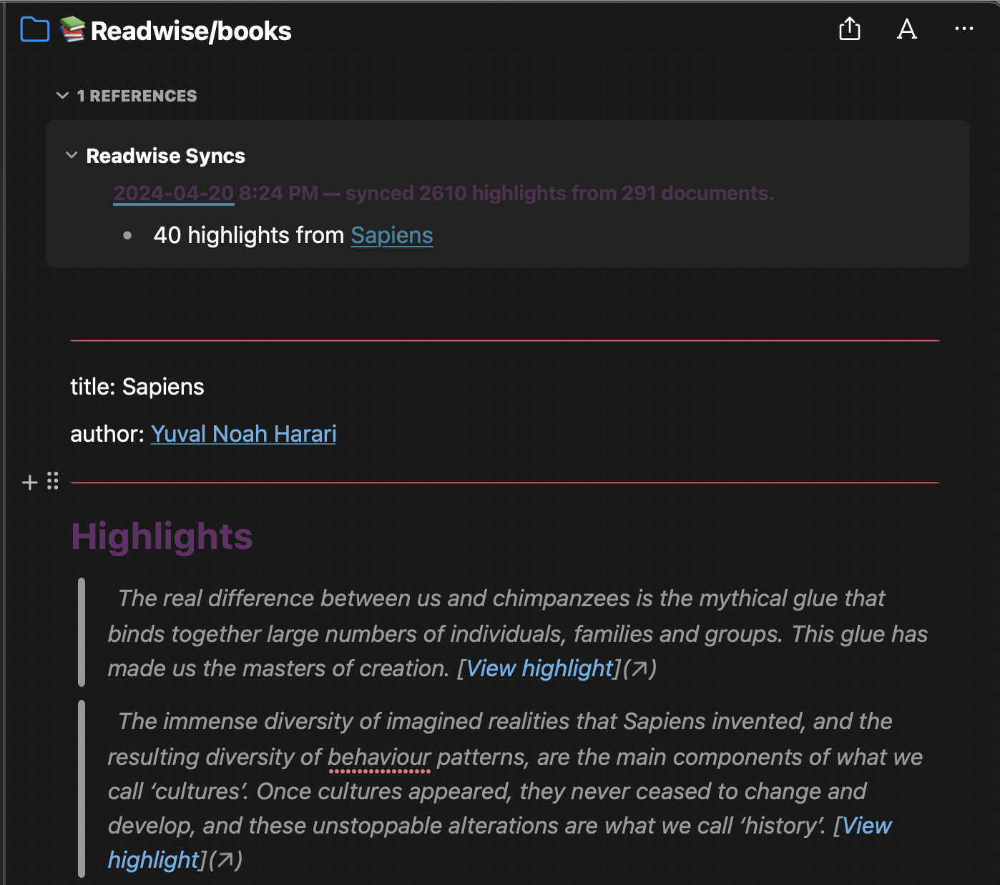
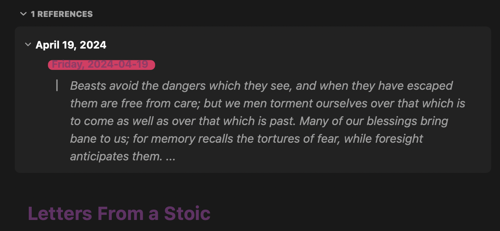
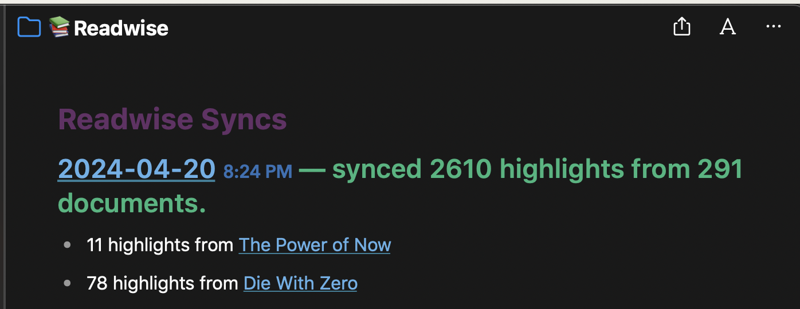

# Readwise Unofficial Noteplan Plugin

## About This Plugin

A sync engine for readwise

### Features

- Daily review's via templates
- Full highlight download
- Highlight updates
- Tags
- Group be content type
- Set download folder
- Front matter support
- NotePlan tags



### Todo

- Index note
- Image support (needs Noteplan API update)

### Known issues

- Using heading as metadata does not support tag updates
- Images are not handled gracefully

## Commands

### //Readwise sync

Downloads new highlights since last sync

### //Readwise rebuild

**Only needs to be used if highlights are deleted**
Downloads all highlights (if they already exist they will be duplicated)

### //Readwise Daily review

Downloads daily reviews (does not mark as read) with links to note and author.
Can be added to a note with templates using

``` javascript
<%- await DataStore.invokePluginCommandByName("Readwise Daily Review","aaronpoweruser.ReadwiseUnofficial") %>
```



## Settings

These commands require configuration.

### Access Token (*required*)

1. Go to the [Readwise](readwise.io/access_token).
2. Copy and paste that token to plugin settings.

### Note Folder

This setting specifies the folder to which this plugin will create a note.

### Tag Prefix (optional)

This setting specifies the prefix of the tag imported from Readwise.

### Metadata format

FrontMatter will store the metadata in the front matter of the note. Heading will store the metadata in a heading at the start of the note.

### Group by type

Group all highlights in under the readwise folder or having them separated by content type ie readwise/books, readwise/articles.

### Group supplemental highlights separately

**Ignored if group by type is disabled**
Group all highlights together or keep supplemental (readwise generated) highlights separate.

### Sync log

A note that has all highlights synced during a sync with dated references.



## Latest Updates

See [CHANGELOG](https://github.com/NotePlan/plugins/blob/main/aaronpoweruser.ReadwiseUnofficial/CHANGELOG.md) for latest updates/changes to this plugin.
