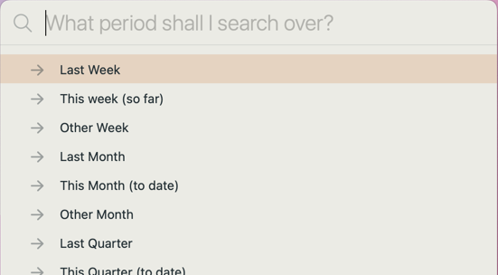

# 🔎 Search Extensions plugin
NotePlan can search over your notes, but it is currently not very flexible or easy to use; in particular it's difficult to navigate between the search results and any of the actual notes it shows.  This plugin adds some extra power and usability to searching. It:
- lets you have keep special notes that lists all open tasks for @colleagueX that you can update in place!
- extends the search syntax to allow much more control, including wildcards
- by default the search runs and **saves the results in a note that it opens as a split view** next to where you're working.
- these saved searches can be refreshed automatically when you open the note to consult it.


## The search commands

- **/flexiSearch** presents a dialog box which allows you to select all available options, without needing to know which of the following specific commands to call.

Note: when /flexiSearch is run on iPhone or iPad you will need to close the dialog box by pressing the X in the top right-hand corner after the search has run. (I'm trying to find a way around this limitation.)

- **/quickSearch** searches across **all notes** (both calendar and regular notes), saving to a pre-set 'Quick Search Results' note. (Alias: **/qs**.)
- **/search** searches across **all notes**  (both calendar and regular notes). (Alias: **/ss**.)
- **/searchOpenTasks** searches just across **open tasks** in all notes.
- **/searchOverNotes** searches across **all regular** (non-calendar) notes.
- **/searchOverCalendar** searches across **all calendar**  notes.
- **/searchInPeriod**: searches over the **calendar (daily, weekly etc.) notes of the time period you select**: 

## Results Display
The results are always **saved to a note** with the search terms as its title in a "Saved Searches" folder (which is created if necessary). If the same search terms are used again they will *update* the same note.  You also are given the option of saving to the current note, or to the plugin console.  _The exception is /quickSearch, which always saves to the same "Quick Search Results" note._

As the results are saved to a note, the following sorts of uses are then possible:
- keep a note with all open tasks for a particular `@person` -- as live tasks that can be ticked off
- keep track of all the great `@win`s or clever `#idea`s you noted down
- show all the things you had `Gratitude:` for in your daily journal

There are two **display styles**:
1. '**NotePlan**': all results are shown as the usual NotePlan style of tasks, bullets, quotes or just notes. **Note**: Where a task is an open one, then a sync'd copy of it is shown, to stop duplication of tasks in NotePlan. This makes it a good way of having a special note that you can easily refresh that lists all open tasks for @personX.
2. '**Simplified**': all results are shown as bullets, and can be reduced in length if required using the 'Result quote length' setting.

There are further display options you can set:
- 'Highlight matching search terms?' in the results. For this you need to use an appropriate theme: see below. Note: This is disabled if the search result is a 'Synced Line'.
- 'Group results by Note?', where matches found within the same note are grouped together ('true' by default).
- Where the match is in a calendar note, 'Date style' setting lets you choose where that link is shown as:
  - a '**date**' formatted for your locale
  - as a NP date '**link**' (`[[2022-06-30]]`)
  - an '**at**' date (`@2022-06-30`)
  - a '**scheduled**' date (`>2022-06-30`).
- the ordering of the results by the title, created date or changed date of the note the search term is found in.
- the commands to automatically decides the name of the note to save the search results to based on the search term, which avoids the final prompt, by the 'Automatically save?' setting.

### Refreshing Results
Each results note has a ` [🔄 Refresh results for ...]` pseudo-button under the title of the note. Clicking that runs the search again, and replaces the earlier set of results:


From v1.3, a saved search can be **automatically refreshed when opening it**. To enable this, run "/add trigger" on the saved search note, and select "🔎 Search Extensions: 'refreshSavedSearch'" from the list.  To turn this off again, just remove the line starting `triggers: onOpen` from the frontmatter.

## Extended search syntax
- put a `+`  and `-` search operator on the front of terms that **must** appear, and **must not** appear, respectively.  For example `+must may could -cannot"` has 4 search terms, the first must be present, the last mustn't be present, and the middle two (may, could) can be.
- the test for + and - is done per line in notes. If you wish to ignore the whole note that has a term, you can use the ! operator, e.g. `+must_have_me !no_way_jose`. (thanks @dwertheimer for this suggestion)
- the searches ignore case of words (i.e. `SPIRIT` will match `spirit` or `Spirit`)
- the searches are simple ones, matching on whole or partial words (e.g. `wind` matches `Windings` and `unwind`)
- however from v1.3.0 you can also use two **wildcard** operators:
  -  `*` in a term means "match any number of characters (including none)" -- e.g. `pos*e` matches "possible", "posie" and "pose".
  -  `?` in a term means "match any single character" -- e.g. `poli?e` matches "polite" and "police".
- currently, a search term must have at least two alphanumeric characters to be valid.
- all notes in the special Trash folder are ignored.  Others can be excluded too using the 'Folders to exclude' setting. If a folder is excluded, then so are its sub-folders.
- you can use an empty search term (from v1.1), which might be useful in flexiSearch to find all open tasks. It will warn you first that this might be a lengthy operation.
- (from v1.2) to search for an exact multi-word phrases, put it in double quotes (e.g. `"Holy Spirit"`)
- you can set default search terms in the 'Default Search terms' setting; if set you can still always override them.

## Settings
To change the default **settings** on **macOS** click the gear button on the 'Search Extensions' line in the Plugin Preferences panel to configure this plugin. Each setting has an explanation.


On **iOS** run the command "/Search: update plugin settings" which provides a multi-step equivalent to the more convenient macOS settings window.

## Results highlighting
To see **highlighting** of matching terms in Simplified-style output, you'll need to be using a theme that highlights lines using `==this syntax==`. The build-in themes now include this, but you can [customise an existing theme](https://help.noteplan.co/article/44-customize-themes) by adding something like:

```jsonc
{
  ...
    "highlighted": {
      "regex": "(==)([^\\s].+)(==)",
      "backgroundColor": "#55D2D21B",
      "order": 35,
      "matchPosition": 2,
      "isRevealOnCursorRange": true
    },
    "highlighted-left-marker": {
      "regex": "(==)([^\\s].+)(==)",
      "color": "#AA45A2E5",
      "backgroundColor": "#7745A2E5",
      "isMarkdownCharacter": true,
      "isHiddenWithoutCursor": true,
      "isRevealOnCursorRange": true,
      "matchPosition": 1
    },
    "highlighted-right-marker": {
      "regex": "(==)([^\\s].+)(==)",
      "color": "#AA45A2E5",
      "backgroundColor": "#7745A2E5",
      "isMarkdownCharacter": true,
      "isHiddenWithoutCursor": true,
      "isRevealOnCursorRange": true,
      "matchPosition": 3
    },
  ...
}
```

Note: I have reported a small layout bug with this highlighting that was introduced about v.3.9.9.

## Using from x-callback calls
It's possible to call these commands from [outside NotePlan using the **x-callback mechanism**](https://help.noteplan.co/article/49-x-callback-url-scheme#runplugin). The URL calls all take the same form:
```
noteplan://x-callback-url/runPlugin?pluginID=jgclark.SearchExtensions&command=<encoded command name>&arg0=<encoded string>&arg1=<encoded string>
```
Notes:
- the number and order of arguments you pass is important
- where an argument isn't valid, don't include it
- as with all x-callback URLs, all the arguments (including the command name) need to be URL encoded. For example, spaces need to be turned into '%20'.
- the available 'paragraph types' are from the API: 'open', 'done', 'scheduled', 'cancelled', 'checklist', 'checklistDone', 'checklistScheduled', 'checklistCancelled', 'title', 'quote', 'list', 'empty', 'text', 'code', 'separator'.
- **Tip**: use the Link Creator Plugin's "/Get x-callback-url" command to do the fiddly work for you ...

| Command | x-callback start | arg0 | arg1 | arg2 | arg3 | arg4 |
|-----|-----------|----------|----------|----------|----------|----------|
| /flexiSearch | `noteplan://x-callback-url/runPlugin?pluginID=jgclark.SearchExtensions&command=flexiSearch`<br />(this takes no args: use this just to display the dialog box) | | | | | |
| /quickSearch | `noteplan://x-callback-url/runPlugin?pluginID=jgclark.SearchExtensions&command=quickSearch&` | search term(s) ¶ (separated by commas) | paragraph types to filter by (separated by commas) | noteTypesToInclude either 'project','calendar' or 'both' | | |
| /search | `noteplan://x-callback-url/runPlugin?pluginID=jgclark.SearchExtensions&command=search&` | search term(s) (separated by commas) | paragraph types to filter by (separated by commas) | | | |
| /searchOverCalendar | `noteplan://x-callback-url/runPlugin?pluginID=jgclark.SearchExtensions&command=searchOverCalendar&` | search term(s) (separated by commas) | paragraph types to filter by (separated by commas) | | | |
| /searchOverNotes | `noteplan://x-callback-url/runPlugin?pluginID=jgclark.SearchExtensions&command=searchOverNotes&` | search term(s) (separated by commas) | paragraph types to filter by (separated by commas) |  | | |
| /searchInPeriod | `noteplan://x-callback-url/runPlugin?pluginID=jgclark.SearchExtensions&command=searchInPeriod&` | search term(s) (separated by commas) | start date to search over (YYYYMMDD or YYYY-MM-DD format). If not given, then defaults to 3 months ago. | end date to search over (YYYYMMDD or YYYY-MM-DD format). If not given, then defaults to today. | optional paragraph types to filter by (separated by commas) | optional output destination indicator: 'current', 'newnote', or 'log' |

¶ Note: /quickSearch can be called without any parameters (`noteplan://x-callback-url/runPlugin?pluginID=jgclark.SearchExtensions&command=quickSearch`); run this way it will prompt for search terms.

## Support
If you find an issue with this plugin, or would like to suggest new features for it, please raise a [Bug or Feature 'Issue'](https://github.com/NotePlan/plugins/issues).

I have spent several weeks of my free time on this plugin. If you would like to support my late-night work extending NotePlan through writing these plugins, you can through

[](https://www.buymeacoffee.com/revjgc)

Thanks!

## History
Please see the [CHANGELOG](CHANGELOG.md).
