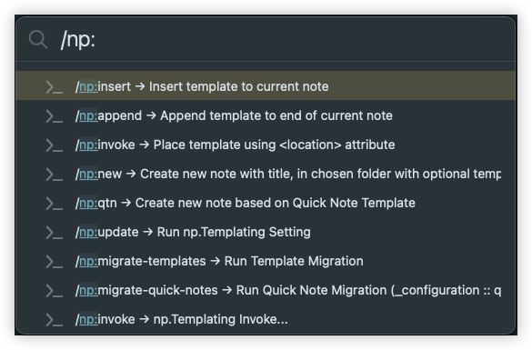

<h1 align="center">
    
</h1>

# 🧩 np.Templating templating plugin for Noteplan

**np.Templating** is a template language plugin for NotePlan that lets you insert variables and method results into your notes. It will also let you execute custom JavaScript constructed in the templates providing a rich note taking system.

## Documentation
📖 This README provides a quick overview of np.Templating, visit [np.Templating website](https://nptemplating-docs.netlify.app/) for comprehensive documention.

## Commands
All commands can be invoked using the _NotePlan Command Bar_ (`Command-J` then ` / `) which NotePlan has reserved for plugin activation. Or by selecting `🧩 np.Templating` from the **Plugins** menu)

<h1 align="center">
    
</h1>

Once the command bar is displayed, you can continue typing any of the following commands to invoke the appropriate plugin command.  In some case where specifically noted, you can alternately invoke the plugin command at the current insertion pointer within your document.

📖 Visit [np.Templating website](https://nptemplating-docs.netlify.app/) for comprehensive documention

| Command                 | Available Inline | Description                                                                                        |
| ----------------------- | ----------------- | ------------------------------------------------------------------------------------------------- |
| np:append               | Yes               | Appends selected template at end of current note (will show list of all available templates)      |
| np:insert               | Yes               | Insert selected template at cursor (will show list of all available templates)                    |
| np:invoke               | Yes               | Invoke Template Command, using `location` key in template to determine injected template          |
|                         |                   | contents into current                                                                             |
| np:new                  | Yes               | Creates a new note from selected template and supplied note name                                  |
| np:qtn                  | Yes               | Invokes Quick Note Generation (displays list of all `type: quick-note`)                           |
| np:update               | Yes               | Invokes settings update method                                                                    |
| np:version              | Yes               | Displays current np.Templating version                                                            |

## License

Copyright &copy; 2022 Mike Erickson
Released under the MIT license

## Credits

**Codedugeon Toolbox for NotePlan** written by **Mike Erickson**

E-Mail: [codedungeon@gmail.com](mailto:codedungeon@gmail.com)

Support: [https://github.com/NotePlan/plugins/issues](https://github.com/NotePlan/plugins/issues)

Twitter: [@codedungeon](http://twitter.com/codedungeon)

Website: [codedungeon.io](http://codedungeon.io)
